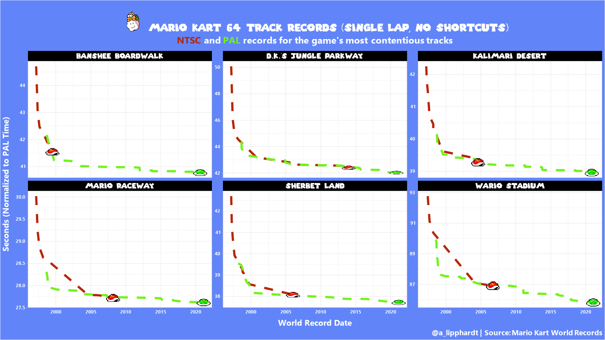

# TidyTuesday
Weekly submissions for the #TidyTuesday challenge. Click each image to view the RMarkdown codebook and plot(s)

## Week 25 - Du Bois Challenge and Juneteenth Revisited

## Week 24 - Great Lakes Fish

## Week 23 - Survivor TV Show

## Week 22 - Mario Kart 64 World Records

## Week 21 - Ask-a-Manager Survey

## Week 20 - Broadband Availability and Usage

## Week 19 - Water Sources

## Week 18 - Reasons for CEO Departure

## Week 17 - Netflix Titles

