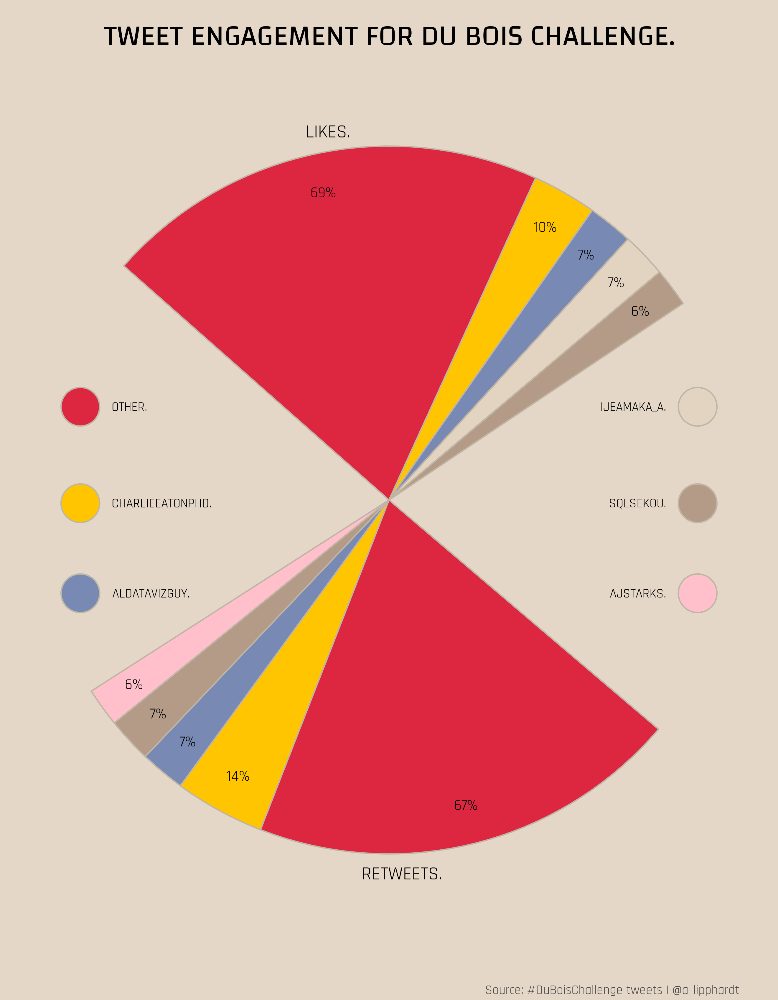

# TidyTuesday
Weekly submissions for the #TidyTuesday challenge. Click each image to view the RMarkdown codebook and plot(s)

## Week 31 - Olympic Medals

## Week 30 - U.S. Droughts

## Week 29 - Scooby Doo Episodes

## Week 28 - Independence Days

## Week 27 - Animal Rescues
[![There were 3,649 cat incidents between 2009 and 2021. Cats may often become trapped in areas of the house such as under the floor boards, in the washing machine, on window ledges, or in cars. There were 1,530 bird incidents between 2009 and 2021. Birds may often become trapped when their legs become stuck in netting or wire. Common locations include underneath railway bridges or rooftops. Incidents incldue both domesticated and wild birds.
There were 1,194 dog incidents between 2009 and 2021. Dogs may often become trapped when their head, leg, or paw become stuck in items near the household such as gates, fences, railways, or fox and rabbit holes. ](animal-rescues/animal_rescues_bigrams.png)](https://github.com/alipphardt/TidyTuesday/tree/main/animal-rescues)

## Week 26 - Park Access

## Week 25 - Du Bois Challenge and Juneteenth Revisited

## Week 24 - Great Lakes Fish

## Week 23 - Survivor TV Show

## Week 22 - Mario Kart 64 World Records

## Week 21 - Ask-a-Manager Survey

## Week 20 - Broadband Availability and Usage

## Week 19 - Water Sources

## Week 18 - Reasons for CEO Departure

## Week 17 - Netflix Titles

