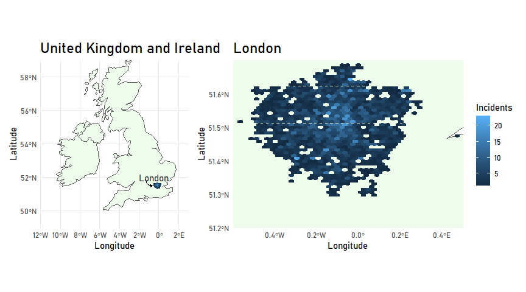
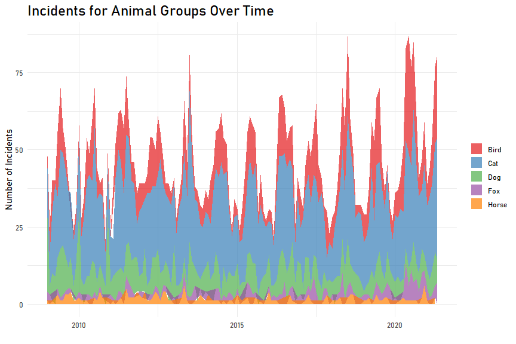
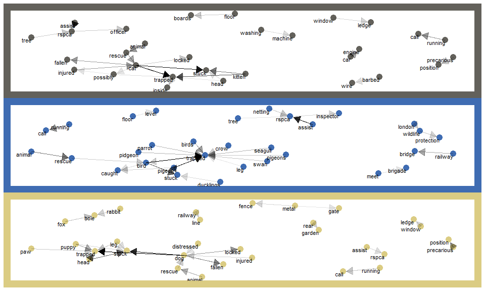

Animal Rescues
================
Developed by Anthony Lipphardt

# TidyTuesday

Join the R4DS Online Learning Community in the weekly
[\#TidyTuesday](https://github.com/rfordatascience/tidytuesday) event\!

Every week we post a raw dataset, a chart or article related to that
dataset, and ask you to explore the data.

While the dataset will be “tamed”, it will not always be tidy\! As such
you might need to apply various R for Data Science techniques to wrangle
the data into a true tidy format.

The goal of TidyTuesday is to apply your R skills, get feedback, explore
other’s work, and connect with the greater \#RStats community\!

As such we encourage everyone of all skills to participate\!

``` r
knitr::opts_chunk$set(echo = TRUE)

library(tidytuesdayR)
library(tidyverse)

library(sf)
library(rnaturalearth)
library(rnaturalearthdata)

library(scales)
library(glue)
library(ggtext)
library(Cairo)
library(extrafont)

library(patchwork)

library(lubridate)

library(tidytext)
library(igraph)    
library(ggraph)      

library(grid)
library(png)

loadfonts(device = "win", quiet = TRUE)
```

# Loading the Weekly Dataset

Download the weekly data and make it available in the `animal_rescues`
object.

[Animal
Rescues](https://github.com/rfordatascience/tidytuesday/blob/master/data/2021/2021-06-29/readme.md)

``` r
# Loading Data for the First Time
# tuesdata <- tidytuesdayR::tt_load(2021, week = 27)
# animal_rescues <- tuesdata$animal_rescues
# write_csv(animal_rescues, 'animal_rescues.csv')

animal_rescues <- read_csv('animal_rescues.csv') 
```

    ## 
    ## -- Column specification --------------------------------------------------------
    ## cols(
    ##   .default = col_character(),
    ##   incident_number = col_double(),
    ##   cal_year = col_double(),
    ##   hourly_notional_cost = col_double(),
    ##   easting_rounded = col_double(),
    ##   northing_rounded = col_double()
    ## )
    ## i Use `spec()` for the full column specifications.

# Sample Data

Take an initial look at the format of the data available.

``` r
head(glimpse(animal_rescues), 10)
```

    ## Rows: 7,544
    ## Columns: 31
    ## $ incident_number               <dbl> 139091, 275091, 2075091, 2872091, 355309~
    ## $ date_time_of_call             <chr> "01/01/2009 03:01", "01/01/2009 08:51", ~
    ## $ cal_year                      <dbl> 2009, 2009, 2009, 2009, 2009, 2009, 2009~
    ## $ fin_year                      <chr> "2008/09", "2008/09", "2008/09", "2008/0~
    ## $ type_of_incident              <chr> "Special Service", "Special Service", "S~
    ## $ pump_count                    <chr> "1", "1", "1", "1", "1", "1", "1", "1", ~
    ## $ pump_hours_total              <chr> "2", "1", "1", "1", "1", "1", "1", "1", ~
    ## $ hourly_notional_cost          <dbl> 255, 255, 255, 255, 255, 255, 255, 255, ~
    ## $ incident_notional_cost        <chr> "510", "255", "255", "255", "255", "255"~
    ## $ final_description             <chr> "Redacted", "Redacted", "Redacted", "Red~
    ## $ animal_group_parent           <chr> "Dog", "Fox", "Dog", "Horse", "Rabbit", ~
    ## $ originof_call                 <chr> "Person (land line)", "Person (land line~
    ## $ property_type                 <chr> "House - single occupancy", "Railings", ~
    ## $ property_category             <chr> "Dwelling", "Outdoor Structure", "Outdoo~
    ## $ special_service_type_category <chr> "Other animal assistance", "Other animal~
    ## $ special_service_type          <chr> "Animal assistance involving livestock -~
    ## $ ward_code                     <chr> "E05011467", "E05000169", "E05000558", "~
    ## $ ward                          <chr> "Crystal Palace & Upper Norwood", "Woods~
    ## $ borough_code                  <chr> "E09000008", "E09000008", "E09000029", "~
    ## $ borough                       <chr> "Croydon", "Croydon", "Sutton", "Hilling~
    ## $ stn_ground_name               <chr> "Norbury", "Woodside", "Wallington", "Ru~
    ## $ uprn                          <chr> "NULL", "NULL", "NULL", "1.00021E+11", "~
    ## $ street                        <chr> "Waddington Way", "Grasmere Road", "Mill~
    ## $ usrn                          <chr> "20500146", "NULL", "NULL", "21401484", ~
    ## $ postcode_district             <chr> "SE19", "SE25", "SM5", "UB9", "RM3", "RM~
    ## $ easting_m                     <chr> "NULL", "534785", "528041", "504689", "N~
    ## $ northing_m                    <chr> "NULL", "167546", "164923", "190685", "N~
    ## $ easting_rounded               <dbl> 532350, 534750, 528050, 504650, 554650, ~
    ## $ northing_rounded              <dbl> 170050, 167550, 164950, 190650, 192350, ~
    ## $ latitude                      <chr> "NULL", "51.39095371", "51.36894086", "5~
    ## $ longitude                     <chr> "NULL", "-0.064166887", "-0.161985191", ~

    ## # A tibble: 10 x 31
    ##    incident_number date_time_of_call cal_year fin_year type_of_incident
    ##              <dbl> <chr>                <dbl> <chr>    <chr>           
    ##  1          139091 01/01/2009 03:01      2009 2008/09  Special Service 
    ##  2          275091 01/01/2009 08:51      2009 2008/09  Special Service 
    ##  3         2075091 04/01/2009 10:07      2009 2008/09  Special Service 
    ##  4         2872091 05/01/2009 12:27      2009 2008/09  Special Service 
    ##  5         3553091 06/01/2009 15:23      2009 2008/09  Special Service 
    ##  6         3742091 06/01/2009 19:30      2009 2008/09  Special Service 
    ##  7         4011091 07/01/2009 06:29      2009 2008/09  Special Service 
    ##  8         4211091 07/01/2009 11:55      2009 2008/09  Special Service 
    ##  9         4306091 07/01/2009 13:48      2009 2008/09  Special Service 
    ## 10         4715091 07/01/2009 21:24      2009 2008/09  Special Service 
    ## # ... with 26 more variables: pump_count <chr>, pump_hours_total <chr>,
    ## #   hourly_notional_cost <dbl>, incident_notional_cost <chr>,
    ## #   final_description <chr>, animal_group_parent <chr>, originof_call <chr>,
    ## #   property_type <chr>, property_category <chr>,
    ## #   special_service_type_category <chr>, special_service_type <chr>,
    ## #   ward_code <chr>, ward <chr>, borough_code <chr>, borough <chr>,
    ## #   stn_ground_name <chr>, uprn <chr>, street <chr>, usrn <chr>,
    ## #   postcode_district <chr>, easting_m <chr>, northing_m <chr>,
    ## #   easting_rounded <dbl>, northing_rounded <dbl>, latitude <chr>,
    ## #   longitude <chr>

# Wrangling and Exploration

Checking unique values for categoricals. \* **incident\_type** shows the
dataset only contains incidents from the London Fire Brigade categorized
as ‘Special Services’ which are animal rescues or assistance. \*
**final\_description** contains the detailed description of the reason
for the distress call, which could be interesting for text mining. \*
**animal\_group\_parent** includes the type of animal involved for the
distress call. It could be interesting to look at the types of rescues
for different types of animals (dog vs cat vs bird) \*
**originof\_call** lists whether the distress call was placed by a
person or emergency responder. \* **property\_type** contains detailed
information on the property where the incident occurred \*
**property\_category** is a broader category that the property\_type
falls into \* **special\_service\_type\_category** lists whether the
service was assistance or rescue and whether the rescue occurred from
height, below ground, or water. \* **special\_service\_type** provides
more detailed information on the service type such as whether the animal
was domesticated or wild. \* **ward** and **borough** are location
specific information and has very high cardinality.

``` r
unique_categoricals = function(column){
  column %>% as_tibble() %>% count(value, sort = TRUE)
}

animal_rescues %>%
  select(type_of_incident,
         final_description,
         animal_group_parent,
         originof_call,
         property_type,
         property_category,
         special_service_type_category,
         special_service_type,
         ward,
         borough,
         ) %>%
  map(unique_categoricals)
```

    ## $type_of_incident
    ## # A tibble: 1 x 2
    ##   value               n
    ##   <chr>           <int>
    ## 1 Special Service  7544
    ## 
    ## $final_description
    ## # A tibble: 4,556 x 2
    ##    value                                   n
    ##    <chr>                               <int>
    ##  1 Redacted                              994
    ##  2 SMALL ANIMAL RESCUE                   152
    ##  3 BIRD TRAPPED IN CHIMNEY                78
    ##  4 ASSIST RSPCA WITH CAT UP TREE          50
    ##  5 BIRD TRAPPED IN NETTING                50
    ##  6 CAT STUCK ON ROOF                      46
    ##  7 CAT STUCK UP TREE                      38
    ##  8 ASSIST RSPCA WITH CAT ON ROOF          37
    ##  9 ASSIST RSPCA WITH CAT STUCK UP TREE    36
    ## 10 PIGEON TRAPPED IN NETTING              33
    ## # ... with 4,546 more rows
    ## 
    ## $animal_group_parent
    ## # A tibble: 28 x 2
    ##    value                                n
    ##    <chr>                            <int>
    ##  1 Cat                               3649
    ##  2 Bird                              1530
    ##  3 Dog                               1194
    ##  4 Fox                                349
    ##  5 Horse                              193
    ##  6 Unknown - Domestic Animal Or Pet   191
    ##  7 Deer                               130
    ##  8 Unknown - Wild Animal               89
    ##  9 Squirrel                            65
    ## 10 Unknown - Heavy Livestock Animal    49
    ## # ... with 18 more rows
    ## 
    ## $originof_call
    ## # A tibble: 8 x 2
    ##   value                     n
    ##   <chr>                 <int>
    ## 1 Person (mobile)        4249
    ## 2 Person (land line)     3106
    ## 3 Police                  131
    ## 4 Other FRS                49
    ## 5 Person (running call)     3
    ## 6 Ambulance                 2
    ## 7 Coastguard                2
    ## 8 Not known                 2
    ## 
    ## $property_type
    ## # A tibble: 180 x 2
    ##    value                                                 n
    ##    <chr>                                             <int>
    ##  1 House - single occupancy                           1950
    ##  2 Purpose Built Flats/Maisonettes - 4 to 9 storeys    624
    ##  3 Purpose Built Flats/Maisonettes - Up to 3 storeys   621
    ##  4 Tree scrub                                          335
    ##  5 Animal harm outdoors                                289
    ##  6 Converted Flat/Maisonettes - 3 or more storeys      268
    ##  7 Car                                                 249
    ##  8 Domestic garden (vegetation not equipment)          232
    ##  9 Converted Flat/Maisonette - Up to 2 storeys         216
    ## 10 Park                                                189
    ## # ... with 170 more rows
    ## 
    ## $property_category
    ## # A tibble: 7 x 2
    ##   value                 n
    ##   <chr>             <int>
    ## 1 Dwelling           3843
    ## 2 Outdoor            2014
    ## 3 Non Residential     791
    ## 4 Outdoor Structure   577
    ## 5 Road Vehicle        292
    ## 6 Other Residential    24
    ## 7 Boat                  3
    ## 
    ## $special_service_type_category
    ## # A tibble: 4 x 2
    ##   value                               n
    ##   <chr>                           <int>
    ## 1 Other animal assistance          3653
    ## 2 Animal rescue from height        2721
    ## 3 Animal rescue from below ground   770
    ## 4 Animal rescue from water          400
    ## 
    ## $special_service_type
    ## # A tibble: 24 x 2
    ##    value                                                          n
    ##    <chr>                                                      <int>
    ##  1 Animal rescue from height - Domestic pet                    1689
    ##  2 Assist trapped domestic animal                              1552
    ##  3 Animal rescue from height - Bird                             942
    ##  4 Animal assistance involving livestock - Other action         635
    ##  5 Assist trapped wild animal                                   630
    ##  6 Animal rescue from below ground - Domestic pet               610
    ##  7 Animal assistance involving domestic animal - Other action   433
    ##  8 Animal rescue from water - Domestic pet                      236
    ##  9 Animal assistance involving wild animal - Other action       143
    ## 10 Wild animal rescue from height                                87
    ## # ... with 14 more rows
    ## 
    ## $ward
    ## # A tibble: 1,255 x 2
    ##    value             n
    ##    <chr>         <int>
    ##  1 LEA BRIDGE       26
    ##  2 GOOSHAYS         23
    ##  3 St. Peter's      23
    ##  4 Lea Bridge       22
    ##  5 Woodside         22
    ##  6 Old Kent Road    21
    ##  7 Chislehurst      20
    ##  8 Gooshays         20
    ##  9 Mile End         20
    ## 10 Fairfield        19
    ## # ... with 1,245 more rows
    ## 
    ## $borough
    ## # A tibble: 71 x 2
    ##    value              n
    ##    <chr>          <int>
    ##  1 ENFIELD          177
    ##  2 Croydon          170
    ##  3 Enfield          164
    ##  4 Southwark        160
    ##  5 Lambeth          159
    ##  6 Tower Hamlets    156
    ##  7 Waltham Forest   153
    ##  8 BARNET           152
    ##  9 Barnet           151
    ## 10 CROYDON          147
    ## # ... with 61 more rows

Given that we have location information, it might also be interesting to
see the level of coverage on a map. We’ll start with a hexbin map to see
where calls are concentrated. Of the 7544 incidents, there are 3699
locations that appear to have valid latitude and longitude data. We can
see from the hexbin map there is fairly good coverage within London. So
this may be a good candidate for visualization.

``` r
rescue_locations = animal_rescues %>%
  select(latitude, longitude) %>%
  filter(latitude != "NULL" & longitude != "NULL") %>%
  mutate(latitude = as.numeric(latitude),
         longitude = as.numeric(longitude)) %>% 
  filter(latitude > 0)


world <- ne_countries(scale = "medium", returnclass = "sf")


uk_map = ggplot(data = world %>% filter(name %in% c("United Kingdom", "Ireland"))) +
  geom_sf(fill = "#EEFCEB") +
  coord_sf(xlim = c(-12,3), ylim = c(49, 59), expand = FALSE) + 
  theme_minimal() + 
  geom_hex(data = rescue_locations, aes(x=longitude, y=latitude), bins = 40, show.legend = FALSE) +
  labs(title = "United Kingdom and Ireland",
       x = "Longitude",
       y = "Latitude") + 
  
  annotate(
    geom = "text",
    x = -2,
    y = 52,
    hjust = 0,
    label = "London",
    color = "#333333",
    size = 4,
    family = "Bahnschrift"
  ) + 
  
  annotate(
    geom = "curve",
    size = 0.7,
    x = -1.3,
    xend = -0.6,    
    y = 51.85,
    yend = 51.5,
    colour = "black",
    arrow = arrow(angle = 30, length = unit(0.02,"npc"), type = "closed", ends = "last"),
    lty = 1
  ) +
  
  theme(text = element_text(family = "Bahnschrift"),
        plot.title = element_text(size = 18))

zoom_in = ggplot(data = world %>% filter(name %in% c("United Kingdom", "Ireland"))) +
  geom_sf(fill = "#EEFCEB") +
  coord_sf(xlim = c(-0.6, 0.5), ylim = c(51.2, 51.7), expand = FALSE) + 
  theme_minimal() + 
  geom_hex(data = rescue_locations, aes(x=longitude, y=latitude), bins = 40, show.legend = TRUE) +
  labs(title = "London",
       x = "Longitude",
       y = "Latitude",
       fill = "Incidents") +
  
  theme(text = element_text(family = "Bahnschrift"),
        plot.title = element_text(size = 18))


uk_map + zoom_in
```

<!-- -->

Looking at incidents over time. There definitely appears to be a
seasonality in the number of incidents reports.

``` r
animal_rescues %>%
  mutate(date_time_of_call=dmy_hm(date_time_of_call)) %>%
  select(date_time_of_call, animal_group_parent) %>%
  group_by(year = year(date_time_of_call), month = month(date_time_of_call), animal_group_parent) %>%
  count() %>%
  mutate(date = as.Date(glue("{month}/1/{year}"), format = "%m/%d/%Y")) %>%
  filter(animal_group_parent %in% c("Cat", "Bird", "Dog", "Fox", "Horse")) %>%
  ggplot(aes(x=date, y=n)) +
  geom_area(aes(fill = animal_group_parent), size = 1.25, alpha = 0.7) +
  theme_minimal() +
  scale_fill_brewer(palette = "Set1") + 
  labs(title = "Incidents for Animal Groups Over Time",
       x = "",
       y = "Number of Incidents",
       fill = "") +
  theme(text = element_text(family = "Bahnschrift"),
        plot.title = element_text(size = 18))
```

<!-- -->

Let’s take a closer look at the **final\_description** field. It might
be useful to look at most frequent bigrams to determine common word
pairs in this field. Network graphs are a useful visualization to show
relationships in ngrams.

``` r
visualize_bigrams = function(tbl, animal, color){

  set.seed(2021)
  
  animal_bigrams = animal_rescues %>%
    filter(animal_group_parent == animal,
           final_description != "NULL") %>%
    select(final_description) %>%
    unnest_tokens(bigram, final_description, token = "ngrams", format="text", n=2) %>%
    filter(!is.na(bigram)) 
  
  bigram_graph = animal_bigrams %>%
    count(bigram, sort = TRUE) %>%
    select(bigram, n) %>%
    separate(bigram, c("word1","word2"), sep = " ") %>%
    distinct() %>%
    filter(!word1 %in% stop_words$word, !word2 %in% stop_words$word,
           !is.na(word1)) %>%
    slice_max(n = 25, n) %>%
    arrange(desc(n)) %>%
    mutate(n = log10(n)) %>%
    graph_from_data_frame()
  
  
  ggraph(bigram_graph, layout = "fr") +
      theme_void() +
      geom_node_point(color = color, 
                    size = 4) +
      geom_edge_link(aes(edge_alpha = n), 
                   show.legend = FALSE,
                   arrow = grid::arrow(type = "closed", length = unit(.15, "inches")), 
                   end_cap = circle(.07, 'inches')) +
      geom_node_text(aes(label = name), 
                   vjust = 1, 
                   hjust = 1,
                   size = 3) + 
    theme(plot.background = element_rect(fill = color, color = color),
          plot.margin = margin(t = 10, l = 10, r = 10, b = 10),
          panel.background = element_rect(fill = "white", color = color))
    
}


cat = animal_rescues %>% visualize_bigrams("Cat", "#63615B")
bird = animal_rescues %>% visualize_bigrams("Bird", "#3F6CB2")
dog = animal_rescues %>% visualize_bigrams("Dog", "#DBCC83")

cat / bird / dog
```

<!-- -->

# Visualization

Let’s put it all together into a cohesive visualization.

``` r
layout <- c(
        area(t = 1,
             b = 5,
             l = 1,
             r = 7),
        area(t = 1,
             b = 5,
             l = 8,
             r = 18))


#################################
#          CAT PLOT             #
#################################

cat_png = readPNG("cat.png")
cat_color = "#63615B"

cat_text = 
ggplot() + 
  geom_textbox(aes(x =  30, y = 45, label = "<span style='font-size: 36pt;'><strong>Cats</strong></span><br/><span style='font-size: 24pt;'>London Fire Brigade responded to <strong>3,649 incidents</strong> between 2009 and 2021. Cats are often trapped in areas of the house such as under the floor boards, in the washing machine, on window ledges, or in cars.</span>"), fill = cat_color, box.colour = cat_color, width = unit(400, "pt"), hjust = 0, vjust = 1, family = "Bahnschrift") +
  scale_x_continuous(limits = c(0,100)) +
  scale_y_continuous(limits = c(0,50)) +
  theme_void() +
  theme(plot.background = element_rect(fill = cat_color, color = cat_color),
        panel.background = element_rect(fill = cat_color, color = cat_color)) +
  
  annotation_custom(grob = rasterGrob(cat_png, 
                                     interpolate=TRUE,
                                     hjust = 0.5,
                                     vjust = 0.5), 
                   xmin = 0, xmax = 25, ymin = 0, ymax = 50) 


cat_plot = cat + cat_text  + plot_layout(design = layout)


#################################
#          BIRD PLOT            #
#################################

bird_png = readPNG("bird.png")
bird_color = "#3F6CB2"

bird_text = ggplot() + 
  geom_textbox(aes(x =  30, y = 45, label = "<span style='font-size: 36pt;'><strong>Birds</strong></span><br/><span style='font-size: 24pt;'>London Fire Brigade responded to <strong>1,530 incidents</strong> between 2009 and 2021. Birds are often trapped when their legs become stuck in netting or wire. Common locations include underneath railway bridges or on rooftops. Incidents include both domesticated and wild birds.</span>"), fill = bird_color, box.colour = bird_color, width = unit(400, "pt"), hjust = 0, vjust = 1, family = "Bahnschrift", color  = "white") +
  scale_x_continuous(limits = c(0,100)) +
  scale_y_continuous(limits = c(0,50)) +
  theme_void() +
  theme(plot.background = element_rect(fill = bird_color, color = bird_color),
        panel.background = element_rect(fill = bird_color, color = bird_color)) +
  
  annotation_custom(grob = rasterGrob(bird_png, 
                                     interpolate=TRUE,
                                     hjust = 0.5,
                                     vjust = 0.5), 
                   xmin = 0, xmax = 25, ymin = 0, ymax = 50) 

bird_plot = bird + bird_text + plot_layout(design = layout)

#################################
#          DOG PLOT             #
#################################

dog_png = readPNG("dog.png")
dog_color = "#DBCC83"

dog_text = ggplot() + 
  geom_textbox(aes(x =  30, y = 45, label = "<span style='font-size: 36pt;'><strong>Dogs</strong></span><br/><span style='font-size: 24pt;'>London Fire Brigade responded to <strong>1,194 incidents</strong> between 2009 and 2021. Dogs are often trapped when their head, leg, or paw become stuck in items near the household such as gates, fences, railways, or fox and rabbit holes.</span>"), fill = dog_color, box.colour = dog_color, width = unit(400, "pt"), hjust = 0, vjust = 1, family = "Bahnschrift") +
  scale_x_continuous(limits = c(0,100)) +
  scale_y_continuous(limits = c(0,50)) +
  theme_void() +
  theme(plot.background = element_rect(fill = dog_color, color = dog_color),
        panel.background = element_rect(fill = dog_color, color = dog_color)) +
  
  annotation_custom(grob = rasterGrob(dog_png, 
                                     interpolate=TRUE,
                                     hjust = 0.5,
                                     vjust = 0.5), 
                   xmin = 0, xmax = 25, ymin = 0, ymax = 50) +
  labs(caption = "Source: London.gov | @a_lipphardt") +
  theme(plot.caption = element_markdown(family = "Bahnschrift", 
                                    size = 18, 
                                    margin = margin(t = 5, b = 5, r = 20)))


dog_plot = dog + dog_text + plot_layout(design = layout)


#################################
#          FINAL PLOT           #
#################################

final_plot = cat_plot / bird_plot / dog_plot
```

# Saving Image(s)

Save your image for sharing. Be sure to use the `#TidyTuesday` hashtag
in your post on twitter\!

``` r
ggsave(plot = cat_plot,
       filename = "cat_bigrams.png",
       width=15,
       height=5,
       type = "cairo",
       device = "png",
       dpi = 300)

ggsave(plot = bird_plot,
       filename = "bird_bigrams.png",
       width=15,
       height=5,
       type = "cairo",
       device = "png",
       dpi = 300)

ggsave(plot = dog_plot,
       filename = "dog_bigrams.png",
       width=15,
       height=5,
       type = "cairo",
       device = "png",
       dpi = 300)


ggsave(plot = final_plot,
       filename = "animal_rescues_bigrams.png",
       width=15,
       height=15,
       type = "cairo",
       device = "png",
       dpi = 300)
```

![There were 3,649 cat incidents between 2009 and 2021. Cats may often
become trapped in areas of the house such as under the floor boards, in
the washing machine, on window ledges, or in cars. There were 1,530 bird
incidents between 2009 and 2021. Birds may often become trapped when
their legs become stuck in netting or wire. Common locations include
underneath railway bridges or rooftops. Incidents incldue both
domesticated and wild birds. There were 1,194 dog incidents between 2009
and 2021. Dogs may often become trapped when their head, leg, or paw
become stuck in items near the household such as gates, fences,
railways, or fox and rabbit holes.](animal_rescues_bigrams.png)
