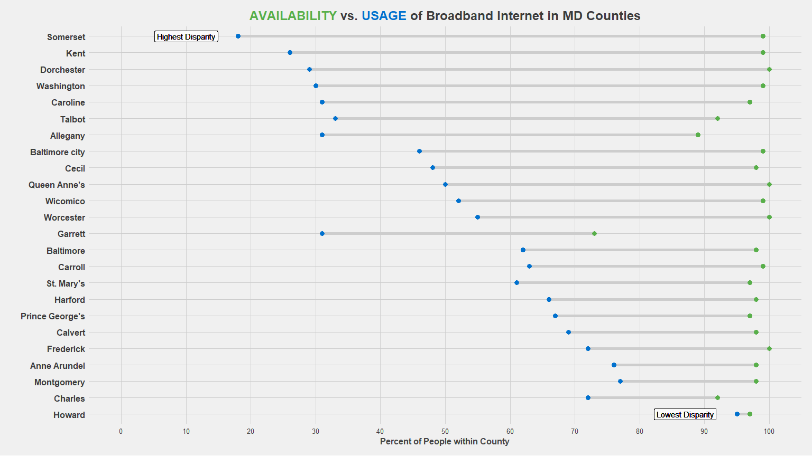

Broadband Internet Access
================
Developed by Anthony Lipphardt

# TidyTuesday

Join the R4DS Online Learning Community in the weekly
[\#TidyTuesday](https://github.com/rfordatascience/tidytuesday) event\!

Every week we post a raw dataset, a chart or article related to that
dataset, and ask you to explore the data.

While the dataset will be “tamed”, it will not always be tidy\! As such
you might need to apply various R for Data Science techniques to wrangle
the data into a true tidy format. The goal of TidyTuesday is to apply
your R skills, get feedback, explore other’s work, and connect with the
greater \#RStats community\! As such we encourage everyone of all skills
to participate\!

# Loading the Weekly Dataset

Download the weekly data and make available in the `broadband` object.

[Broadband](https://github.com/rfordatascience/tidytuesday/blob/master/data/2021/2021-05-11/readme.md)

``` r
# Loading Data for the First Time
# tuesdata <- tidytuesdayR::tt_load(2021, week = 20)
# broadband <- tuesdata$broadband
# write_csv(broadband, 'broadband.csv')

broadband <- read_csv('broadband.csv')
```

    ## 
    ## -- Column specification --------------------------------------------------------
    ## cols(
    ##   ST = col_character(),
    ##   `COUNTY ID` = col_double(),
    ##   `COUNTY NAME` = col_character(),
    ##   `BROADBAND AVAILABILITY PER FCC` = col_character(),
    ##   `BROADBAND USAGE` = col_character()
    ## )

# Sample Data

Take an initial look at the format of the data available.

``` r
head(glimpse(broadband), 10)
```

    ## Rows: 3,143
    ## Columns: 5
    ## $ ST                               <chr> "AL", "AL", "AL", "AL", "AL", "AL"...
    ## $ `COUNTY ID`                      <dbl> 1001, 1003, 1005, 1007, 1009, 1011...
    ## $ `COUNTY NAME`                    <chr> "Autauga County", "Baldwin County"...
    ## $ `BROADBAND AVAILABILITY PER FCC` <chr> "0.81", "0.88", "0.59", "0.29", "0...
    ## $ `BROADBAND USAGE`                <chr> "0.28", "0.30", "0.18", "0.07", "0...

    ## # A tibble: 10 x 5
    ##    ST    `COUNTY ID` `COUNTY NAME`   `BROADBAND AVAILABILITY P~ `BROADBAND USAG~
    ##    <chr>       <dbl> <chr>           <chr>                      <chr>           
    ##  1 AL           1001 Autauga County  0.81                       0.28            
    ##  2 AL           1003 Baldwin County  0.88                       0.30            
    ##  3 AL           1005 Barbour County  0.59                       0.18            
    ##  4 AL           1007 Bibb County     0.29                       0.07            
    ##  5 AL           1009 Blount County   0.69                       0.09            
    ##  6 AL           1011 Bullock County  0.06                       0.05            
    ##  7 AL           1013 Butler County   0.78                       0.11            
    ##  8 AL           1015 Calhoun County  0.93                       0.32            
    ##  9 AL           1017 Chambers County 0.82                       0.34            
    ## 10 AL           1019 Cherokee County 0.99                       0.10

# Wrangling

Explore the data and process it into prepared dataframes for
visualization.

``` r
md_bb = broadband %>% 
  filter(ST == 'MD') %>%
  rename(COUNTY_ID = `COUNTY ID`,
         COUNTY_NAME = `COUNTY NAME`,
         AVAILABILITY = `BROADBAND AVAILABILITY PER FCC`,
         USAGE = `BROADBAND USAGE`) %>%
  mutate(COUNTY_NAME = str_remove(COUNTY_NAME, " County"),
         AVAILABILITY = as.numeric(AVAILABILITY) * 100,
         USAGE = as.numeric(USAGE) * 100,
         DISPARITY = AVAILABILITY - USAGE,
         COUNTY_NAME = fct_reorder(COUNTY_NAME, desc(DISPARITY)))
```

# Visualization(s)

Using your processed dataset, create your unique visualization(s).

``` r
color1 <- "#58AF4A"
color2 <- "#0171CE"

md_title = glue("<span style='color:{color1}; font-weight:bold;'>AVAILABILITY</span> vs. <span style='color:{color2}'>USAGE</span> of Broadband Internet in {md_bb[1,]$ST} Counties")

highest = md_bb %>% slice_max(DISPARITY, n=1)
lowest = md_bb %>% slice_min(DISPARITY, n=1)

plot1 = md_bb %>% ggplot() +
  
  geom_segment(aes(y = COUNTY_NAME, yend = COUNTY_NAME, x = 0, xend = 100),
               color = "#CDCDCD",
               size = 0.2) +
  
  geom_dumbbell(aes(y = COUNTY_NAME, x = AVAILABILITY, xend = USAGE),
                size = 2, 
                color = "#CDCDCD",
                size_x = 3,
                size_xend = 3,
                colour_x = color1,
                colour_xend = color2,
                show.legend = TRUE) +
  
  labs(title = md_title,
       x = "Percent of People within County",
       y = "") +
  
  scale_x_continuous(breaks=seq(0,100,10), limits=c(0,100)) + 
  scale_y_discrete(limits=rev) +

  scale_color_fivethirtyeight() +
  theme_fivethirtyeight() +  
    
  theme(  
    axis.text.y = element_text(size = 12, face = "bold"),
    axis.title = element_text(size=12, face = "bold", color = "#444444"),
    plot.title = element_markdown(size = 18, hjust = 0.5)
    ) +
  
  geom_label(aes(y = highest$COUNTY_NAME, x = highest$USAGE, label = "Highest Disparity"), nudge_x = -8, alpha = 0.1) +
  geom_label(aes(y = lowest$COUNTY_NAME, x = lowest$USAGE, label = "Lowest Disparity"), nudge_x = -8, alpha = 0.1)
  
plot1
```

<!-- -->

# Saving Image(s)

Save your image for sharing. Be sure to use the `#TidyTuesday` hashtag
in your post on twitter\!

``` r
# This will save your most recent plot
ggsave(plot = plot1,
  filename = "broadband-disparities-md-counties.png",
  width=16,
  height=9,
  device = "png")
```
