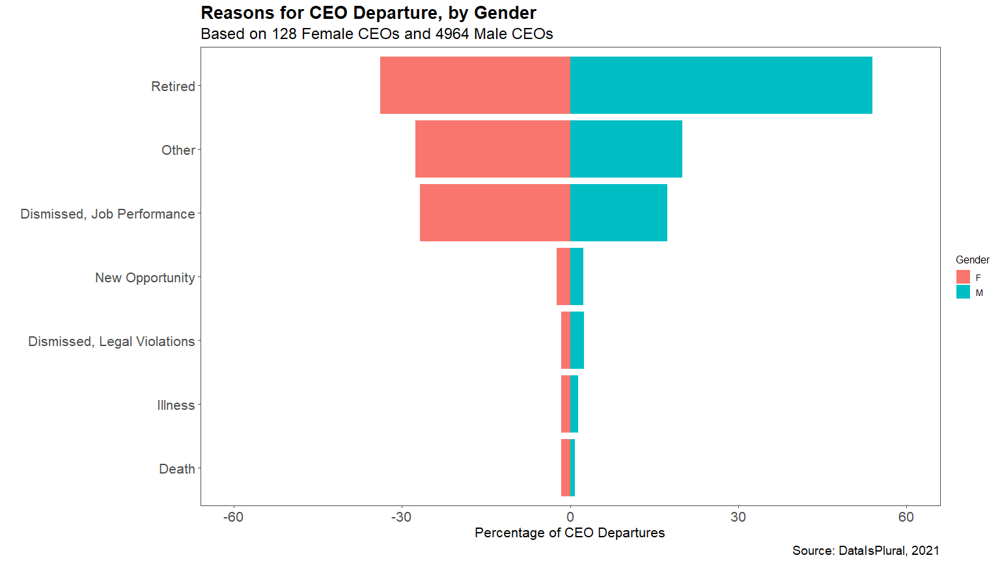

CEO Departures
================
Developed by Anthony Lipphardt

# TidyTuesday

Join the R4DS Online Learning Community in the weekly
[\#TidyTuesday](https://github.com/rfordatascience/tidytuesday) event\!

Every week we post a raw dataset, a chart or article related to that
dataset, and ask you to explore the data.

While the dataset will be “tamed”, it will not always be tidy\! As such
you might need to apply various R for Data Science techniques to wrangle
the data into a true tidy format. The goal of TidyTuesday is to apply
your R skills, get feedback, explore other’s work, and connect with the
greater \#RStats community\! As such we encourage everyone of all skills
to participate\!

# Loading the Weekly Dataset

Download the weekly data and make available in the `departures` object.

[CEO
Departures](https://github.com/rfordatascience/tidytuesday/blob/master/data/2021/2021-04-27/readme.md)

``` r
# Loading Data for the First Time
# tuesdata <- tidytuesdayR::tt_load('2021-04-27')
# write_csv(tuesdata$departures, "departures.csv")

departures <- read_csv('departures.csv')
```

    ## 
    ## -- Column specification --------------------------------------------------------
    ## cols(
    ##   dismissal_dataset_id = col_double(),
    ##   coname = col_character(),
    ##   gvkey = col_double(),
    ##   fyear = col_double(),
    ##   co_per_rol = col_double(),
    ##   exec_fullname = col_character(),
    ##   departure_code = col_double(),
    ##   ceo_dismissal = col_double(),
    ##   interim_coceo = col_character(),
    ##   tenure_no_ceodb = col_double(),
    ##   max_tenure_ceodb = col_double(),
    ##   fyear_gone = col_double(),
    ##   leftofc = col_datetime(format = ""),
    ##   still_there = col_character(),
    ##   notes = col_character(),
    ##   sources = col_character(),
    ##   eight_ks = col_character(),
    ##   cik = col_double(),
    ##   `_merge` = col_character()
    ## )

# Sample Data

Take an initial look at the format of the data available.

``` r
glimpse(head(departures, 10))
```

    ## Rows: 10
    ## Columns: 19
    ## $ dismissal_dataset_id <dbl> 559043, 12, 13, 31, 43, 51, 61, 63, 62, 65
    ## $ coname               <chr> "SONICBLUE INC", "AMERICAN AIRLINES GROUP INC"...
    ## $ gvkey                <dbl> 27903, 1045, 1045, 1078, 1161, 1177, 1194, 119...
    ## $ fyear                <dbl> 2002, 1997, 2002, 1998, 2001, 1997, 1993, 1997...
    ## $ co_per_rol           <dbl> -1, 1, 3, 6, 11, 16, 21, 22, 24, 28
    ## $ exec_fullname        <chr> "L. Gregory Ballard", "Robert L. Crandall", "D...
    ## $ departure_code       <dbl> 7, 5, 3, 5, 5, 5, 5, 7, 9, 5
    ## $ ceo_dismissal        <dbl> 0, 0, 1, 0, 0, 0, 0, 0, NA, 0
    ## $ interim_coceo        <chr> NA, NA, NA, NA, NA, NA, NA, NA, NA, NA
    ## $ tenure_no_ceodb      <dbl> 1, 1, 1, 1, 1, 1, 1, 1, 1, 1
    ## $ max_tenure_ceodb     <dbl> 1, 1, 1, 1, 1, 1, 1, 1, 1, 1
    ## $ fyear_gone           <dbl> 2003, 1998, 2003, 1998, 2002, 1997, 1993, 1998...
    ## $ leftofc              <dttm> 2003-03-21, 1998-05-20, 2003-04-24, 1998-12-3...
    ## $ still_there          <chr> NA, NA, NA, NA, NA, NA, NA, NA, NA, NA
    ## $ notes                <chr> "Ballard took over when the outgoing CEO said ...
    ## $ sources              <chr> "https://www.wsj.com/articles/SB10288576921909...
    ## $ eight_ks             <chr> "https://www.sec.gov/Archives/edgar/data/85051...
    ## $ cik                  <dbl> 850519, 6201, 6201, 1800, 2488, 1122304, 77166...
    ## $ `_merge`             <chr> "matched (3)", "matched (3)", "matched (3)", "...

# Wrangling

Explore the data and process it into prepared dataframes for
visualization.

``` r
male_pronouns = c("He", "he", "Him", "him", "His", "his", "Mr", "Mister")
female_pronouns = c("She", "she", "Her", "her", "Hers", "hers", "Miss", "Mrs", "Ms")

pronoun_regex = function(pronouns){
  results = stri_join_list(lapply(list(pronouns), 
                        FUN = function(pronoun){ 
                          return(paste0("\\b", pronoun, "\\b")) 
                          }), sep = "|")
  return(results)
}


departures %>%
  mutate(gender = case_when(
    str_detect(notes, regex(pronoun_regex(male_pronouns))) ~ 'M',
    str_detect(notes, regex(pronoun_regex(female_pronouns))) ~ 'F',
    TRUE ~ 'NA'
  )) %>%
  filter(gender != 'NA', !is.na(departure_code)) %>%
  group_by(gender) %>%
  summarize(count = n()) 
```

    ## # A tibble: 2 x 2
    ##   gender count
    ## * <chr>  <int>
    ## 1 F        127
    ## 2 M       4964

``` r
departure_by_gender = departures %>%
  mutate(gender = case_when(
    str_detect(notes, regex(pronoun_regex(male_pronouns))) ~ 'M',
    str_detect(notes, regex(pronoun_regex(female_pronouns))) ~ 'F',
    TRUE ~ 'NA'
  )) %>%
  filter(gender != 'NA', !is.na(departure_code)) %>%
  group_by(gender, departure_code) %>%
  summarize(count = n()) %>%
  mutate(gender_percent = count/sum(count)*100) %>%
  mutate(gender_percent = ifelse(gender == "M", gender_percent,-1*gender_percent)) %>%
  filter(departure_code < 8) %>%
  mutate(departure_code = case_when(
    departure_code == 1 ~ "Death",
    departure_code == 2 ~ "Illness",
    departure_code == 3 ~ "Dismissed, Job Performance",
    departure_code == 4 ~ "Dismissed, Legal Violations",
    departure_code == 5 ~ "Retired",
    departure_code == 6 ~ "New Opportunity",
    departure_code == 7 ~ "Other",
    departure_code == 8 ~ "Missing",
    departure_code == 9 ~ "Error"
  ))
```

    ## `summarise()` has grouped output by 'gender'. You can override using the `.groups` argument.

# Visualization(s)

Using your processed dataset, create your unique visualization(s).

``` r
plot1 = departure_by_gender %>%
  arrange(desc(gender_percent)) %>%
  mutate(departure_code = factor(departure_code, levels=departure_code)) %>%
  ggplot(aes(x=departure_code, y=gender_percent, fill=gender)) +
  geom_bar(stat = "identity") +
  labs(title = "Reasons for CEO Departure, by Gender",
       subtitle = "Based on 128 Female CEOs and 4964 Male CEOs",
       caption = "Source: DataIsPlural, 2021",
       x = "",
       y = "Percentage of CEO Departures",
       fill = "Gender") +   
  ylim(-60,60) +
  coord_flip() +
  theme_few() + 
  scale_color_few() +  
  theme(plot.title = element_text(size=20, face="bold"),
        plot.subtitle = element_text(size=18),
        plot.caption= element_text(size=14),
        axis.text.x = element_text(size=16),
        axis.title.x = element_text(size=16),
        axis.text.y = element_text(size=16),
        axis.title.y = element_text(size=16),
        )

plot1
```

<!-- -->

# Saving Image(s)

Save your image for sharing. Be sure to use the `#TidyTuesday` hashtag
in your post on twitter\!

``` r
# This will save your most recent plot
ggsave(plot = plot1,
  filename = "reasons-for-ceo-departure-by-gender.png",
  width=16,
  height=9,
  device = "png")
```
