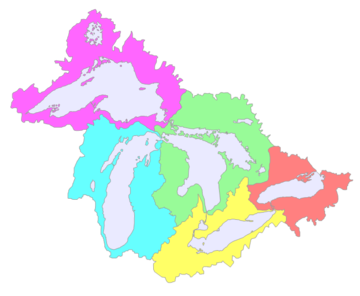

Great Lakes Fish
================
Developed by Anthony Lipphardt

# TidyTuesday

Join the R4DS Online Learning Community in the weekly
[\#TidyTuesday](https://github.com/rfordatascience/tidytuesday) event\!

Every week we post a raw dataset, a chart or article related to that
dataset, and ask you to explore the data.

While the dataset will be “tamed”, it will not always be tidy\! As such
you might need to apply various R for Data Science techniques to wrangle
the data into a true tidy format. The goal of TidyTuesday is to apply
your R skills, get feedback, explore other’s work, and connect with the
greater \#RStats community\! As such we encourage everyone of all skills
to participate\!

# Loading the Weekly Dataset

Download the weekly data and make it available in the `fishing` and
`stocked` objects.

[Great Lakes Fish
Data](https://github.com/rfordatascience/tidytuesday/blob/master/data/2021/2021-06-08/readme.md)

``` r
 # Loading Data for the First Time
# fishing <- readr::read_csv('https://raw.githubusercontent.com/rfordatascience/tidytuesday/master/data/2021/2021-06-08/fishing.csv')
# stocked <- readr::read_csv('https://raw.githubusercontent.com/rfordatascience/tidytuesday/master/data/2021/2021-06-08/stocked.csv')
# write_csv(fishing, 'fishing.csv')
# write_csv(stocked, 'stocked.csv')

 fishing <- read_csv('fishing.csv') %>% 
  rename("observed" = grand_total,
         "harvested" = values) %>%
  select(-comments)
```

    ## 
    ## -- Column specification --------------------------------------------------------
    ## cols(
    ##   year = col_double(),
    ##   lake = col_character(),
    ##   species = col_character(),
    ##   grand_total = col_double(),
    ##   comments = col_character(),
    ##   region = col_character(),
    ##   values = col_double()
    ## )

``` r
 stocked <- read_csv('stocked.csv')
```

    ## 
    ## -- Column specification --------------------------------------------------------
    ## cols(
    ##   .default = col_character(),
    ##   SID = col_double(),
    ##   YEAR = col_double(),
    ##   MONTH = col_double(),
    ##   DAY = col_double(),
    ##   LATITUDE = col_logical(),
    ##   LONGITUDE = col_logical(),
    ##   GRID = col_double(),
    ##   NO_STOCKED = col_double(),
    ##   YEAR_CLASS = col_double(),
    ##   AGEMONTH = col_double(),
    ##   MARK_EFF = col_double(),
    ##   TAG_NO = col_logical(),
    ##   TAG_RET = col_double(),
    ##   LENGTH = col_double(),
    ##   WEIGHT = col_double(),
    ##   CONDITION = col_double(),
    ##   VALIDATION = col_double()
    ## )
    ## i Use `spec()` for the full column specifications.

# Sample Data

Take an initial look at the format of the data available.

``` r
head(glimpse(fishing), 10)
```

    ## Rows: 65,706
    ## Columns: 6
    ## $ year      <dbl> 1991, 1991, 1991, 1991, 1991, 1991, 1992, 1992, 1992, 1992, ~
    ## $ lake      <chr> "Erie", "Erie", "Erie", "Erie", "Erie", "Erie", "Erie", "Eri~
    ## $ species   <chr> "American Eel", "American Eel", "American Eel", "American Ee~
    ## $ observed  <dbl> 1, 1, 1, 1, 1, 1, 0, 0, 0, 0, 0, 0, 0, 0, 0, 0, 0, 0, 0, 0, ~
    ## $ region    <chr> "Michigan (MI)", "New York (NY)", "Ohio (OH)", "Pennsylvania~
    ## $ harvested <dbl> 0, 0, 0, 0, 0, 1, 0, 0, 0, 0, 0, 0, 0, 0, 0, 0, 0, 0, 0, 0, ~

    ## # A tibble: 10 x 6
    ##     year lake  species      observed region            harvested
    ##    <dbl> <chr> <chr>           <dbl> <chr>                 <dbl>
    ##  1  1991 Erie  American Eel        1 Michigan (MI)             0
    ##  2  1991 Erie  American Eel        1 New York (NY)             0
    ##  3  1991 Erie  American Eel        1 Ohio (OH)                 0
    ##  4  1991 Erie  American Eel        1 Pennsylvania (PA)         0
    ##  5  1991 Erie  American Eel        1 U.S. Total                0
    ##  6  1991 Erie  American Eel        1 Canada (ONT)              1
    ##  7  1992 Erie  American Eel        0 Michigan (MI)             0
    ##  8  1992 Erie  American Eel        0 New York (NY)             0
    ##  9  1992 Erie  American Eel        0 Ohio (OH)                 0
    ## 10  1992 Erie  American Eel        0 Pennsylvania (PA)         0

``` r
head(glimpse(stocked), 10)
```

    ## Rows: 56,232
    ## Columns: 31
    ## $ SID        <dbl> 1, 2, 3, 4, 5, 6, 7, 8, 9, 10, 11, 12, 13, 14, 15, 16, 17, ~
    ## $ YEAR       <dbl> 1950, 1952, 1952, 1952, 1953, 1953, 1953, 1953, 1953, 1954,~
    ## $ MONTH      <dbl> NA, 4, 9, NA, 5, 10, NA, NA, NA, 6, 10, NA, NA, NA, NA, NA,~
    ## $ DAY        <dbl> NA, 29, 23, NA, 27, 10, NA, NA, NA, 8, 15, NA, NA, NA, NA, ~
    ## $ LAKE       <chr> "MI", "SU", "SU", "SU", "SU", "SU", "SU", "SU", "SU", "SU",~
    ## $ STATE_PROV <chr> "ON", "WI", "WI", "MI", "WI", "WI", "MI", "MI", "ON", "WI",~
    ## $ SITE       <chr> "PIE ISL-THUNDER CAPE", "APOSTLE ISLES", "APOSTLE ISLES", "~
    ## $ ST_SITE    <chr> "PIE", "APOSTLE", "APOSTLE", "LAUGHING FISH", "APOSTLE", "A~
    ## $ LATITUDE   <lgl> NA, NA, NA, NA, NA, NA, NA, NA, NA, NA, NA, NA, NA, NA, NA,~
    ## $ LONGITUDE  <lgl> NA, NA, NA, NA, NA, NA, NA, NA, NA, NA, NA, NA, NA, NA, NA,~
    ## $ GRID       <dbl> 519, NA, NA, 1531, NA, NA, 1531, 1529, 519, NA, NA, 1529, 1~
    ## $ STAT_DIST  <chr> "OS1", "WISC", "WISC", "MS4", "WISC", "WISC", "MS4", "MS4",~
    ## $ LS_MGMT    <chr> NA, "WI2", "WI2", "MI5", "WI2", "WI2", "MI5", "MI5", NA, "W~
    ## $ SPECIES    <chr> "LAT", "LAT", "LAT", "LAT", "LAT", "LAT", "LAT", "LAT", "LA~
    ## $ STRAIN     <chr> NA, NA, NA, NA, NA, NA, NA, NA, NA, NA, NA, NA, NA, NA, NA,~
    ## $ NO_STOCKED <dbl> 49888, 102097, 145000, 65366, 80137, 132980, 69439, 139073,~
    ## $ YEAR_CLASS <dbl> 1950, 1951, 1952, 1952, 1952, 1953, 1952, 1953, 1953, 1953,~
    ## $ STAGE      <chr> "ff", "y", "ff", "ff", "y", "ff", "y", "ff", "ff", "y", "ff~
    ## $ AGEMONTH   <dbl> NA, NA, NA, NA, NA, NA, NA, NA, NA, NA, NA, NA, NA, NA, NA,~
    ## $ MARK       <chr> "ADRP", "RP", "LP", "ADRV", "RP", "LP", "ADLV", "ADRV", "AD~
    ## $ MARK_EFF   <dbl> 99.9, NA, NA, NA, NA, NA, NA, NA, NA, NA, NA, NA, NA, NA, N~
    ## $ TAG_NO     <lgl> NA, NA, NA, NA, NA, NA, NA, NA, NA, NA, NA, NA, NA, NA, NA,~
    ## $ TAG_RET    <dbl> 99.9, NA, NA, NA, NA, NA, NA, NA, NA, NA, NA, NA, NA, NA, N~
    ## $ LENGTH     <dbl> 999.99, NA, NA, NA, NA, NA, NA, NA, NA, NA, NA, NA, NA, NA,~
    ## $ WEIGHT     <dbl> NA, 816.78, 870.00, 588.29, 1442.47, 664.90, 902.71, 695.37~
    ## $ CONDITION  <dbl> 0, 0, 0, 0, 0, 0, 0, 0, 0, 0, 0, 0, 0, 0, 0, 0, 0, 0, 0, 0,~
    ## $ LOT_CODE   <chr> "xxx", "AI-51W-BAY", "AI-52W-BAY", NA, "AI-52W-BAY", "AI-53~
    ## $ STOCK_METH <chr> "u", "u", "u", "u", "u", "u", "u", "u", "b", "u", "u", "u",~
    ## $ AGENCY     <chr> "OMNR", "WIDNR", "WIDNR", "USFWS", "WIDNR", "WIDNR", "USFWS~
    ## $ VALIDATION <dbl> 5, 5, 5, 5, 5, 5, 5, 5, 5, 5, 5, 5, 5, 5, 5, 5, 5, 5, 5, 5,~
    ## $ NOTES      <chr> NA, NA, NA, NA, NA, NA, NA, NA, NA, NA, NA, NA, NA, NA, NA,~

    ## # A tibble: 10 x 31
    ##      SID  YEAR MONTH   DAY LAKE  STATE_PROV SITE     ST_SITE  LATITUDE LONGITUDE
    ##    <dbl> <dbl> <dbl> <dbl> <chr> <chr>      <chr>    <chr>    <lgl>    <lgl>    
    ##  1     1  1950    NA    NA MI    ON         PIE ISL~ PIE      NA       NA       
    ##  2     2  1952     4    29 SU    WI         APOSTLE~ APOSTLE  NA       NA       
    ##  3     3  1952     9    23 SU    WI         APOSTLE~ APOSTLE  NA       NA       
    ##  4     4  1952    NA    NA SU    MI         LAUGHIN~ LAUGHIN~ NA       NA       
    ##  5     5  1953     5    27 SU    WI         APOSTLE~ APOSTLE  NA       NA       
    ##  6     6  1953    10    10 SU    WI         APOSTLE~ APOSTLE  NA       NA       
    ##  7     7  1953    NA    NA SU    MI         LAUGHIN~ LAUGHIN~ NA       NA       
    ##  8     8  1953    NA    NA SU    MI         MARQUET~ MARQUET~ NA       NA       
    ##  9     9  1953    NA    NA SU    ON         PIE ISL~ PIE      NA       NA       
    ## 10    10  1954     6     8 SU    WI         APOSTLE~ APOSTLE  NA       NA       
    ## # ... with 21 more variables: GRID <dbl>, STAT_DIST <chr>, LS_MGMT <chr>,
    ## #   SPECIES <chr>, STRAIN <chr>, NO_STOCKED <dbl>, YEAR_CLASS <dbl>,
    ## #   STAGE <chr>, AGEMONTH <dbl>, MARK <chr>, MARK_EFF <dbl>, TAG_NO <lgl>,
    ## #   TAG_RET <dbl>, LENGTH <dbl>, WEIGHT <dbl>, CONDITION <dbl>, LOT_CODE <chr>,
    ## #   STOCK_METH <chr>, AGENCY <chr>, VALIDATION <dbl>, NOTES <chr>

# Wrangling and Exploration

Get a list of all fish species. We can see that there is some cleaning
that needs to be done as there are species such as Catfish with multiple
spellings.

To pull a list of fish species with similar spellings, we can perform a
self-join and calculate the Levenshtein distance between each pair of
species name. From this, we can create a dataframe to perform cleanup to
standardize species name by joining with the fishing dataset.

``` r
types_of_fish = fishing %>%
  select(species) %>%
  unique()

types_of_fish
```

    ## # A tibble: 51 x 1
    ##    species                      
    ##    <chr>                        
    ##  1 American Eel                 
    ##  2 Blue Pike                    
    ##  3 Bowfin                       
    ##  4 Buffalo                      
    ##  5 Bullheads                    
    ##  6 Burbot                       
    ##  7 Carp                         
    ##  8 Channel Catfish              
    ##  9 Channel catfish              
    ## 10 Channel Catfish and Bullheads
    ## # ... with 41 more rows

``` r
distance_fish = types_of_fish %>% 
  mutate(join = 1) %>%
  inner_join(types_of_fish %>% mutate(join = 1), by = "join") %>%
  select(-join) %>%
  mutate(distance = stringdist(species.x, species.y)) %>%
  filter(distance > 0 & distance < 4)

distance_fish
```

    ## # A tibble: 18 x 3
    ##    species.x       species.y       distance
    ##    <chr>           <chr>              <dbl>
    ##  1 American Eel    Amercian Eel           1
    ##  2 Bullheads       Bullhead               1
    ##  3 Channel Catfish Channel catfish        1
    ##  4 Channel catfish Channel Catfish        1
    ##  5 Crappie         Crappies               1
    ##  6 Pacific Salmon  Pacific salmon         1
    ##  7 White Bass      White bass             1
    ##  8 Amercian Eel    American Eel           1
    ##  9 Cisco and Chubs Cisco and chubs        1
    ## 10 Cisco and Chubs Cisco and Chub         1
    ## 11 White bass      White Bass             1
    ## 12 Crappies        Crappie                1
    ## 13 Pacific salmon  Pacific Salmon         1
    ## 14 Cisco and chubs Cisco and Chubs        1
    ## 15 Cisco and chubs Cisco and Chub         2
    ## 16 Cisco and Chub  Cisco and Chubs        1
    ## 17 Cisco and Chub  Cisco and chubs        2
    ## 18 Bullhead        Bullheads              1

``` r
distance_fish = distance_fish[c(1,3,5,6,7,16,17,18),] %>%
  rename("preferred_name" = species.x, "mispelled_name" = "species.y") %>%
  select(-distance)

distance_fish
```

    ## # A tibble: 8 x 2
    ##   preferred_name  mispelled_name 
    ##   <chr>           <chr>          
    ## 1 American Eel    Amercian Eel   
    ## 2 Channel Catfish Channel catfish
    ## 3 Crappie         Crappies       
    ## 4 Pacific Salmon  Pacific salmon 
    ## 5 White Bass      White bass     
    ## 6 Cisco and Chub  Cisco and Chubs
    ## 7 Cisco and Chub  Cisco and chubs
    ## 8 Bullhead        Bullheads

``` r
fishing = fishing %>%
  left_join(distance_fish, by = c("species" = "mispelled_name")) %>%
  mutate(species = case_when(
    !is.na(preferred_name) ~ preferred_name,
    TRUE ~ species
  )) %>%
  select(-preferred_name)


types_of_fish = fishing %>%
  select(species) %>%
  unique()

print.data.frame(types_of_fish)
```

    ##                          species
    ## 1                   American Eel
    ## 2                      Blue Pike
    ## 3                         Bowfin
    ## 4                        Buffalo
    ## 5                       Bullhead
    ## 6                         Burbot
    ## 7                           Carp
    ## 8                Channel Catfish
    ## 9  Channel Catfish and Bullheads
    ## 10                         Cisco
    ## 11                       Crappie
    ## 12               Freshwater Drum
    ## 13                  Gizzard Shad
    ## 14                      Goldfish
    ## 15                 Lake Sturgeon
    ## 16                    Lake Trout
    ## 17                Lake Whitefish
    ## 18                       Minnows
    ## 19                 Northern Pike
    ## 20                Pacific Salmon
    ## 21                     Quillback
    ## 22                 Rainbow Smelt
    ## 23                     Rock Bass
    ## 24                        Sauger
    ## 25                       Suckers
    ## 26                       Sunfish
    ## 27                       Walleye
    ## 28         Walleye and Blue Pike
    ## 29                    White Bass
    ## 30                   White Perch
    ## 31                  Yellow Perch
    ## 32                         Chubs
    ## 33                Cisco and Chub
    ## 34               Round Whitefish
    ## 35         Lake Trout - siscowet
    ## 36                       Alewife
    ## 37                Chinook Salmon
    ## 38                   Coho Salmon
    ## 39                       Herring
    ## 40               Smallmouth Bass
    ## 41                          Drum
    ## 42         Rock Bass and Crappie
    ## 43                    Sheepshead

It would also be useful to learn more about the regions field since the
documentation notes some inconstency here. The Great Lakes is pictured
below and consists of:

  - Lake Superior (magenta)
  - Lake Michigan (cyan)
  - Lake Huron (green)
  - Lake Eerie (yellow)
  - Lake Ontario (red-orange)

The Great Lakes region of North America is a bi-national
Canadian–American region that includes portions of the eight U.S.
states of Illinois, Indiana, Michigan, Minnesota, New York, Ohio,
Pennsylvania and Wisconsin as well as the Canadian province of Ontario.

Source: [Wikipedia](https://en.wikipedia.org/wiki/Great_Lakes_region)



Looking at unique (lake, region) pairs, it looks like the dataset
provides both totals and subtotals for each lake. There are totals for
the U.S. and Canada, as well as subtotals for each state.

``` r
regions = fishing %>%
  select(lake, region) %>%
  unique() 

print.data.frame(regions)
```

    ##           lake                 region
    ## 1         Erie          Michigan (MI)
    ## 2         Erie          New York (NY)
    ## 3         Erie              Ohio (OH)
    ## 4         Erie      Pennsylvania (PA)
    ## 5         Erie             U.S. Total
    ## 6         Erie           Canada (ONT)
    ## 7      Ontario        U.S. Total (NY)
    ## 8      Ontario           Canada (ONT)
    ## 9        Huron U.S. Huron Proper (HP)
    ## 10       Huron  U.S. Saginaw Bay (SB)
    ## 11       Huron        U.S. Total (MI)
    ## 12       Huron      Huron Proper (HP)
    ## 13       Huron      Georgian Bay (GB)
    ## 14       Huron     North Channel (NC)
    ## 15       Huron     Total Canada (ONT)
    ## 16    Superior          Michigan (MI)
    ## 17    Superior         Wisconsin (WI)
    ## 18    Superior         Minnesota (MN)
    ## 19    Superior             U.S. Total
    ## 20    Superior           Canada (ONT)
    ## 21    Michigan         Green Bay (MI)
    ## 22    Michigan      Mich. Proper (MI)
    ## 23    Michigan         MI State Total
    ## 24    Michigan         Green Bay (WI)
    ## 25    Michigan      Mich. Proper (WI)
    ## 26    Michigan         WI State Total
    ## 27    Michigan          Illinois (IL)
    ## 28    Michigan           Indiana (IN)
    ## 29    Michigan             U.S. Total
    ## 30 Saint Clair        U.S. Total (MI)
    ## 31 Saint Clair           Canada (ONT)

To perform a sanity check, we can run a some tabulations by region for
each of the great lakes.

  - **Superior:**: U.S. Total is approx the total of Wisconsin (WI),
    Michigan (MI), and Minnesota (MN)

  - **Lake Michigan**: U.S. Total is approx the total of MI State Total
    and WI State Total. Wisconsin State Total is approx the total of
    Mich. Proper (WI) and Green Bay (WI). MI State Total is approx the
    total of Mich. Proper (MI) and Green Bay (MI).

  - **Lake Huron**: Total Canada is approx the total of Huron Proper
    (HP), Georgian Bay, and North Channel. U.S. Total (MI) is approx the
    total of U.S. Huron Proper (HP) and U.S. Saginaw Bay (SB)

  - **Lake Erie**: U.S. Total is approx the total of Ohio, Michigan,
    Pennsylvania, and New York subtotals.

  - **Lake Ontario**: Only U.S. Total (NY) and Canada (ONT) totals

  - **Saint Clair**: Only U.S. Total (MI) and Canada (ONT) totals

<!-- end list -->

``` r
region_totals = function(tbl, selected_lake, selected_year){
  tbl %>% 
      filter(lake == selected_lake, year == selected_year) %>%
    drop_na(harvested) %>%
    group_by(region) %>%
    summarize(yield = round(sum(harvested))) %>%
    arrange(desc(yield))
}

lakes = c('Superior', 'Michigan', 'Huron', 'Erie', 'Ontario')

for(lake in lakes){
  print(glue("\n\nTotals and Subtotals for Lake {lake}:\n"))
  print(fishing %>% region_totals(lake, 2015))
}
```

    ## 
    ## Totals and Subtotals for Lake Superior:
    ## # A tibble: 5 x 2
    ##   region         yield
    ##   <chr>          <dbl>
    ## 1 U.S. Total      4657
    ## 2 Wisconsin (WI)  2258
    ## 3 Michigan (MI)   2112
    ## 4 Canada (ONT)     682
    ## 5 Minnesota (MN)   285
    ## 
    ## Totals and Subtotals for Lake Michigan:
    ## # A tibble: 7 x 2
    ##   region            yield
    ##   <chr>             <dbl>
    ## 1 U.S. Total         3736
    ## 2 MI State Total     2431
    ## 3 Mich. Proper (MI)  1324
    ## 4 WI State Total     1304
    ## 5 Green Bay (MI)     1106
    ## 6 Mich. Proper (WI)   763
    ## 7 Green Bay (WI)      543
    ## 
    ## Totals and Subtotals for Lake Huron:
    ## # A tibble: 7 x 2
    ##   region                 yield
    ##   <chr>                  <dbl>
    ## 1 Total Canada (ONT)      2902
    ## 2 Huron Proper (HP)       2119
    ## 3 U.S. Total (MI)         2022
    ## 4 U.S. Huron Proper (HP)  1321
    ## 5 U.S. Saginaw Bay (SB)    701
    ## 6 Georgian Bay (GB)        393
    ## 7 North Channel (NC)       388
    ## 
    ## Totals and Subtotals for Lake Erie:
    ## # A tibble: 6 x 2
    ##   region            yield
    ##   <chr>             <dbl>
    ## 1 Canada (ONT)      24054
    ## 2 U.S. Total         5731
    ## 3 Ohio (OH)          4586
    ## 4 Michigan (MI)      1025
    ## 5 Pennsylvania (PA)   104
    ## 6 New York (NY)        15
    ## 
    ## Totals and Subtotals for Lake Ontario:
    ## # A tibble: 2 x 2
    ##   region          yield
    ##   <chr>           <dbl>
    ## 1 Canada (ONT)      281
    ## 2 U.S. Total (NY)    47

``` r
print(glue("\n\nTotals and Subtotals for Lake Saint Clair:\n"))
```

    ## 
    ## Totals and Subtotals for Lake Saint Clair:

``` r
print(fishing %>% region_totals('Saint Clair', 1896))
```

    ## # A tibble: 2 x 2
    ##   region          yield
    ##   <chr>           <dbl>
    ## 1 U.S. Total (MI)   503
    ## 2 Canada (ONT)      498

Based off of this information, it would be useful to create a variable
to indicate the ordering of regions. The **regions.csv** file contains
the order numbering for each (lake, region) pair. This is added to the
fishing dataset. We can also pair this with the modulo operator to only
pull grand totals for each Lake.

``` r
region_order = read_csv('regions.csv')
```

    ## 
    ## -- Column specification --------------------------------------------------------
    ## cols(
    ##   lake = col_character(),
    ##   region = col_character(),
    ##   region_order = col_double()
    ## )

``` r
fishing = fishing %>% 
  left_join(region_order) %>%
  select(year, lake, region, region_order, species, observed, harvested) %>%
  arrange(year, lake, region_order, species)
```

    ## Joining, by = c("lake", "region")

``` r
fishing %>% filter(region_order %% 1 == 0) %>% distinct(lake, region)
```

    ## # A tibble: 11 x 2
    ##    lake        region            
    ##    <chr>       <chr>             
    ##  1 Erie        U.S. Total        
    ##  2 Erie        Canada (ONT)      
    ##  3 Huron       U.S. Total (MI)   
    ##  4 Huron       Total Canada (ONT)
    ##  5 Ontario     U.S. Total (NY)   
    ##  6 Ontario     Canada (ONT)      
    ##  7 Superior    U.S. Total        
    ##  8 Superior    Canada (ONT)      
    ##  9 Saint Clair U.S. Total (MI)   
    ## 10 Saint Clair Canada (ONT)      
    ## 11 Michigan    U.S. Total

``` r
# Sample Pivot Table of Yields by Year

# pt_data = fishing %>%
#   drop_na(species, harvested) %>%
#   filter(year > 2000) %>%
#   group_by(lake, region, region_order, year) %>%
#   summarize(yield = round(sum(harvested))) %>%
#   ungroup() %>%
#   mutate(region = paste0(as.character(region_order), ". " ,region)) %>%
#   arrange(region_order) %>%
#   select(-region_order)
# 
# pt = PivotTable$new()
# pt$addData(pt_data)
# pt$addColumnDataGroups("year", addTotal = FALSE)
# pt$addRowDataGroups("lake", 
#                     addTotal = FALSE,
#                     outlineBefore=list(groupStyleDeclarations=list(color="blue")))
# pt$addRowDataGroups("region", addTotal = FALSE)
# pt$defineCalculation(calculationName ="Total Yield", summariseExpression = "sum(yield)")
# pt$renderPivot()
```


Let’s now look at the commercial fishing yields by lake over time. Now
that we have **region\_order** to filter on we can be assured that we
will not be double counting sub-totals. LOESS smoothing is used to
better show broad trends over time.

Based on this information it might be interesting to look at what is
going on in certain lakes during a time period of considerable chagne.
For example:

  - Lake Huron from roughly 1875 thru 1925
  - Lake Michigan from roughly 1960 thru 1990
  - Lake Superior from roughly 1900 thru 1950

We can look at things like what species of fish were harvested or
observed during this time, or perhaps what restrictions or policies were
put in place, which may be determined from the comment field.

``` r
fishing %>%
  filter(region_order %% 1 == 0) %>%
  drop_na(species, harvested) %>%
  group_by(lake, year) %>%
  summarize(yield = round(sum(harvested)))  %>%
  arrange(desc(yield)) %>%
  ggplot(aes(x=year,y=yield,colour=lake)) +
  facet_grid(lake ~ ., scales="free") +
  theme_minimal() +
  geom_line(show.legend = FALSE) +
  geom_smooth(method = 'loess', formula=y~x, show.legend=FALSE)+
  labs(title = "Commercial Fishing in the Great Lakes Region",
       y = "Pounds of fish harvested (nearest thousand pounds)",
       x = "Year") +
  theme(text = element_text(family = "Bahnschrift"),
    axis.text.y = element_text(size = 6),
    strip.text.y = element_text(size=10))
```

    ## `summarise()` has grouped output by 'lake'. You can override using the `.groups` argument.

<!-- -->

First, let’s start by looking at the largest spikes and drops in yields
during the time periods for these lakes. We can do this by fitting a
linear model for each species group and selecting the species with the
largest or smallest coefficients.

``` r
plot_change = function(tbl, column, selected_lake, year_start, year_end, selected_color){
  
  # Grab segment for period of interest
  segment = tbl %>%
    filter(region_order %% 1 == 0,
           lake == selected_lake,
           year >= year_start & year <= year_end,
           !(species %in% c("Cisco and Chub"))) %>%
    drop_na(species, {{column}}) %>%
    group_by(species, year) %>%
    summarize(yield = round(sum({{column}})), .groups = "keep") %>%
    filter(yield != 0)
  
  if(nrow(segment) > 0){
  
    # Fit a linear model for each fish species
    segment_fits = segment %>%
      nest(data = -species) %>%
      mutate(fit = map(data, ~ lm(yield ~ year, data = .x))) %>%
      select(-data) %>%
      mutate(tidied = map(fit, tidy)) %>%
      unnest(tidied) %>%
      select(species, term, estimate) %>%
      filter(term == 'year') %>%
      select(-term) %>%
      ungroup()
    
    # Grab fish with the largest increases or decreases over the period of interest
    species_changes = bind_rows(slice_max(segment_fits, n=3,estimate), slice_min(segment_fits, n=3,estimate)) %>% arrange(desc(estimate))
    
    plot = species_changes %>%
      mutate(species = fct_reorder(species, estimate)) %>%
      ggplot(aes(x=species, y=estimate)) +
      geom_col(fill = selected_color, show.legend = FALSE) +
      theme_minimal() +
      coord_flip() +
      labs(title = glue("Change in Lake {selected_lake} ({year_start}-{year_end})"),
           x = "",
           y = "") +
      theme(text = element_text(family = "Bahnschrift"))    
    
    return(plot)
  }
  
  print(glue("Lake {selected_lake} for {year_start}-{year_end} returned no results"))
  
  return(NULL)

}

fishing %>% plot_change(harvested, "Huron", 1875, 1925, "#D95336") /
fishing %>% plot_change(harvested, "Michigan", 1960, 1990, "#3CB841") /
fishing %>% plot_change(harvested, "Superior", 1900, 1950, "#405FA1") 
```

<!-- -->

We can then plot the production yields for these select species to get a
better picture of what is happening over time.

## Production in Lake Huron (1875-1925)

Increases in Lake Trout, Carp, and Chubs – For this period there was (1)
a large spike in Lake Trout largely due to Canadian production around
1880, (2) no reported catch for Carp before 1900 and then a sudden
increase in U.S. production for carp around 1915, and (3) no reported
catch for Chubs before 1900 followed by a up and down spike around 1905
and then a sudden sustained increase in 1925. Sudden spikes may point to
changes in reporting or lifting bans/restrictions.

Decreases in Cisco, Yellow Perch, and Lake Whitefish – For this period
there was (1) a strong and steady decline in the U.S. production of
Cisco from 1905 thru 1960 after which U.S. catch is non-existent, (2) a
steady decline in U.S. production of Yellow Perch from 1905 thru 1960,
and (3) no reported catch in U.S. production prior to 1880 and a steady
decline in both U.S. and Canadian production of Lake Whitefish between
1880 and 1950.

## Production in Lake Michigan (1960-1990)

Increases in Lake Whitefish, Alewife, and Rainbow Smelt – For this
period there was (1) a steady increase in U.S. production of Lake
Whitefish after a gap in reporting from 1950 to 1960, (2) no reported
catch for Alewife prior to 1950 and a strong increase in U.S. production
from 1960 to 1980, followed by a sharp drop, and (3) a slight increase
with a notable spike around 1985 in U.S. production of Rainbow Smelt.
Decreases in Chubs, Coho Salmon, and Carp – For this period there was
(1) a steady decline in U.S. production of Chubs between 1960 and 1900,
(2) no reporting for Coho Salmon until around 1965 with a small
appearance in U.S. production for a brief period between 1965 to 1970,
and (3) a slight decrease in U.S. production of Carp between 1960 to
1990.

## Production in Lake Superior (1900-1950)

Increases in Cisco, Lake Trout, and Lake Whitefish – For this period
there was (1) strong increase in U.S. production of Cisco, followed by a
sharp drop around 1960, (2) a steady increase in U.S. production of Lake
Trout between 1900 to 1950 followed by a sharp drop around 1960, and (3)
a slight but steady increase in production of Lake Whitefish from 1925
to the present.

Decreases in Chubs, Suckers, and Northern Pike – For this period there
was (1) an initial spike in U.S. production of Chubs around 1900
followed by sustained low production, (2) slight decrease in production
of Suckers with inconsiderable production, and (3) slight decrease in
production of Northern Pike with inconsiderable production.

``` r
huron_fish = c("Lake Trout", "Carp", "Chubs", "Lake Whitefish", "Yellow Perch", "Cisco")
michigan_fish = c("Lake Whitefish", "Alewife", "Rainbow Smelt", "Carp", "Coho Salmon", "Chubs")
superior_fish = c("Cisco", "Lake Trout", "Lake Whitefish", "Northern Pike", "Suckers", "Chubs")

plot_fish = function(tbl, column, selected_lake, fish){
  tbl %>%
    drop_na(species, {{column}}) %>%
    filter(species %in% fish, 
           lake == selected_lake, 
           region_order %% 1 == 0) %>%
    group_by(species, region, year) %>%
    summarize(yield = round(sum({{column}})), .groups = "keep") %>%
    filter(yield != 0) %>%
    ggplot(aes(x=year, y=yield)) +
    facet_wrap(~species) +
    scale_fill_viridis(discrete=TRUE) +
    geom_area(aes(fill = region)) +
    geom_smooth(method = 'loess', formula=y~x, show.legend=FALSE, se = FALSE) +
    labs(title = glue("Production in Lake {selected_lake}"),
       y = "Pounds harvested (thousands)",
       x = "Year",
       fill = "Region") +
    theme(text = element_text(family = "Bahnschrift"), plot.title = element_text(size = 16))    
}

fishing %>% plot_fish(harvested, "Huron", huron_fish) /
fishing %>% plot_fish(harvested, "Michigan", michigan_fish) /
fishing %>% plot_fish(harvested, "Superior", superior_fish)
```

<!-- -->

Finally, we can look at comments for reporting according to species of
interest. Here we filter comments related to Lakes and Species of
interest to see if there is anything of note related to our previous
findings.

## Lake Michigan Comments of Interest

  - 1964 - **Chubs** - Several deaths attributed to botulism in Lake
    Michigan chubs resulted in a depressed market.
  - 1971 - **Chubs** DDT scare on chubs resulted in reduced sales.
  - 1975 – **Chubs** A Chub fishing ban, except for assessment purposes,
    was effected by emergency rule 18 July 1975 and was permanentlly
    established by August 1976; Greatly reduced markets due to high PCB
    levels
  - 1976 - **Carp** - High levels of PCBs in carp resulted in greatly
    reduced markets.
  - 1976 – **Chub** – The ban on chub fishing, except for assessment
    purposes, was permanentlly established by an administrative rule, 17
    August 1976; Greatly reduced markets due to high PCB levels
  - 1977 – **Chubs** – Sales restricted due to unacceptable levels of
    dieldrin

## Lake Superior Comments of Interest

  - 1940-1947 – **Northern Pike** – Commercial fishing in MI prohibited
  - 1967 – **Rainbow Smelt, Yellow Perch, Suckers and Cisco** – Drastic
    decline in Walleye resulted in increased production

Additionally, of historic interest is the U.S. ban of DDT in 1972 (1)
and PCB in 1979 (2).

1.  [Dichlorodiphenyltrichloroethane (DDT)
    Factsheet](https://www.cdc.gov/biomonitoring/DDT_FactSheet.html)
2.  [EPA - Learn About
    PCBs](https://www.epa.gov/pcbs/learn-about-polychlorinated-biphenyls-pcbs)

Given the strong trends for Lake Michigan, we’ll focus on visualizing
this information for this week’s submission.

``` r
comments <- read_csv('fishing.csv') 
```

    ## 
    ## -- Column specification --------------------------------------------------------
    ## cols(
    ##   year = col_double(),
    ##   lake = col_character(),
    ##   species = col_character(),
    ##   grand_total = col_double(),
    ##   comments = col_character(),
    ##   region = col_character(),
    ##   values = col_double()
    ## )

``` r
huron_fish = c("Lake Trout", "Carp", "Chubs", "Lake Whitefish", "Yellow Perch", "Cisco", "Chub")
michigan_fish = c("Lake Whitefish", "Alewife", "Rainbow Smelt", "Carp", "Coho Salmon", "Chubs", "Chub")
superior_fish = c("Cisco", "Lake Trout", "Lake Whitefish", "Northern Pike", "Suckers", "Chubs", "Chub")

filter_comments = function(tbl, selected_lake, fish){

  fish = str_to_lower(fish)

  tbl %>% 
    drop_na(comments) %>%
    filter(lake == selected_lake,
           str_detect(str_to_lower(comments), pattern = paste0(fish, collapse = "|"))) %>%
    group_by(lake, comments) %>%
    summarize(start_year = min(year), end_year = max(year), duration = n_distinct(year)) %>%
    arrange(lake, start_year)
  
}

comments_of_interest = bind_rows(comments %>% filter_comments("Huron", huron_fish),
          comments %>% filter_comments("Michigan", michigan_fish),
          comments %>% filter_comments("Superior", superior_fish))
```

    ## `summarise()` has grouped output by 'lake'. You can override using the `.groups` argument.

    ## `summarise()` has grouped output by 'lake'. You can override using the `.groups` argument.
    ## `summarise()` has grouped output by 'lake'. You can override using the `.groups` argument.

# Visualization(s)

Using your processed dataset, create your unique visualization(s).

``` r
sky_blue = "#C1D1DB"
sky_blue_lines = "#AFC5D0"
water = "#93B3CF"


chub = readPNG("chub.png") 


chubs = fishing %>%
  mutate(species = case_when(
    species == "Chubs" ~ "Chubs",
    TRUE ~ "Other"
  )) %>%
  filter(lake == "Michigan",
         region_order %% 1 == 0,
         year >= 1900,
         species == "Chubs") %>%  
  drop_na(species, harvested) %>%
  group_by(species, year) %>%
  summarize(yield = round(sum(harvested)), .groups = "keep") %>%
  ungroup()


year_highlighted = c(1964, 1971, 1975, 1976)

chubs_highlights = chubs %>%
  filter(year %in% year_highlighted)


plot =  chubs %>%
  ggplot(aes(x=year, y=yield)) +
  stat_smooth(formula = y ~ x,
              geom = 'area',
              method = 'loess',
              span = 0.05,
              fill = water) + 
  geom_point(data = chubs_highlights, shape=19, colour="white", size=4) +
  geom_point(data = chubs_highlights, shape=10, colour="black", size=4) +   
  theme_minimal() +

  # 1964 - Several deaths attributed to botulism in Lake Michigan 
   
  annotate(
    geom = "text", 
    x = 1920,
    y = 10500,
    hjust = 0,
    label = "1963 - An outbreak of botulism with several deaths\n attributed to chubs resulted in a depressed market.",
    color = "#666666",
    size = 4,
    family = "Bahnschrift"
  ) + 
   
  annotate(
    geom = "curve",
    size = 0.7,
    x = 1950,
    xend = 1964,    
    y = 10500,
    yend = 5500,
    colour = "#666666",    
    arrow = arrow(angle = 10, length = unit(0.03,"npc"), type = "closed", ends = "last"),
    curvature = -0.4,
    lty = 1
  ) + 
   
   # 1971 - DDT scare on chubs resulted in reduced sales
   
    annotate(
    geom = "text",
    x = 1974,
    y = 13100,
    label = "1974 - Concerns regarding potentially high levels of\nDDT in chubs resulted in reduced sales.",
    hjust = 1,
    color = "#666666",
    size = 4,
    family = "Bahnschrift"
  ) +
   
  annotate(
    geom = "segment",
    size = 0.7,
    x = 1971,
    xend = 1971,    
    y = 12600,
    yend = 5900,
    colour = "#666666",    
    arrow = arrow(angle = 10, length = unit(0.03,"npc"), type = "closed", ends = "last"),
    lty = 1
  ) +    
   
   # 1974 - The ban on chub fishing, except for assessment purposes, was permanentlly established by an administrative rule, 17 August 1976;  Greatly reduced markets due to high PCB levels 
   
    annotate(
    geom = "text",
    x = 1973,
    y = 10800,
    hjust = 0,
    label = "1975 - Due to high PCB levels, a chub fishing ban\nwas set by emergency rule.",
    color = "#666666",
    size = 4,
    family = "Bahnschrift"
  ) +
   
  annotate(
    geom = "segment",
    size = 0.7,
    x = 1975,
    xend = 1975,    
    y = 10200,
    yend = 1000,
    colour = "#666666",    
    arrow = arrow(angle = 10, length = unit(0.03,"npc"), type = "closed", ends = "last"),
    lty = 1
  ) +    
   
   
   # 1976 - The ban was made permanent August 1976. During this time, production was restricted to contract assessment fisheries
   
    annotate(
    geom = "text",
    x = 1976,
    y = 6400,
    hjust = 0,
    label = "1976 - The ban was made permanent August 1976.\nDuring this time, production was restricted\nto contract assessment fisheries.",
    color = "#666666",
    size = 4,
    family = "Bahnschrift"
  ) +   
   
     annotate(
    geom = "segment",
    size = 0.7,
    x = 1976,
    xend = 1976,    
    y = 5500,
    yend = 600,
    colour = "#666666",
    arrow = arrow(angle = 10, length = unit(0.03,"npc"), type = "closed", ends = "last"),
    lty = 1
  ) + 
      
   # Add Chub close to 1964 dates
   annotation_custom(grob = rasterGrob(chub, 
                                       interpolate=TRUE,
                                       just = "left",
                                       width = 2.5, 
                                       height = 1.7), 
                     xmin = 1950, xmax = 1955, ymin = 3000, ymax = 4600) +
   labs(x = "",
        y = "Pounds of Chub Caught (in thousands)",
        title = "Chemical pollutants have had a major impact on chub fishing in Lake Michigan",
        subtitle = "The U.S. government ordered a ban on **DDT** (1972) and **PCB** (1979), based on its adverse environmental effects and risks to human health",
        caption = "Source: Great Lakes Database | @a_lipphardt") +
  
   theme(text = element_text(family = "Bahnschrift", color = "#666666"),
        axis.title.y = element_text(size = 14, margin = margin(r=10), color = "#333333"),
        panel.grid = element_line(colour = sky_blue),
        panel.grid.major.y = element_line(colour = sky_blue_lines),
        panel.background = element_rect(fill = sky_blue, color = sky_blue),
        plot.background = element_rect(fill = sky_blue, color = sky_blue),
        plot.title = element_markdown(hjust=0.5, size = 20, color = "#333333", margin=margin(b=10)),
        plot.subtitle = element_markdown(hjust=0.5, size = 16, color = "#444444", margin = margin(b=20)),
        plot.caption = element_markdown(size = 14, color = "#444444", margin = margin(t = 5)))
```

# Saving Image(s)

Save your image for sharing. Be sure to use the `#TidyTuesday` hashtag
in your post on twitter\!

``` r
 #This will save your most recent plot
ggsave(plot = plot,
  filename = "chubs.png",
  width=16,
  height=9,
  type = "cairo",
  device = "png",
  dpi = 300)
```


