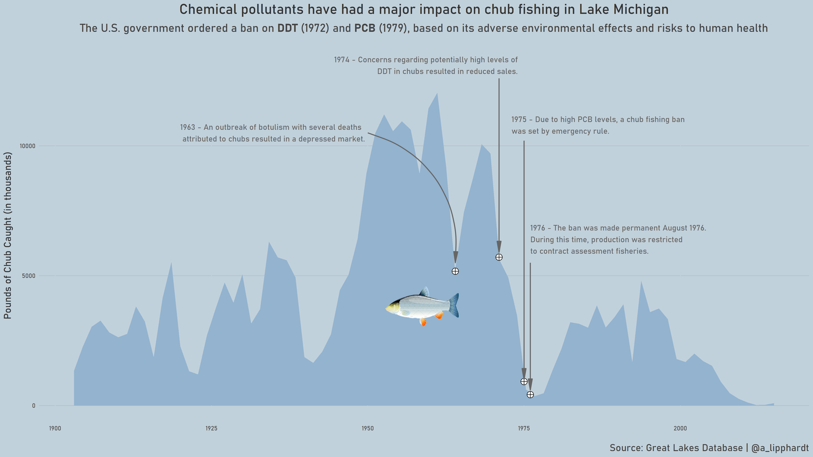

# TidyTuesday

Join the R4DS Online Learning Community in the weekly [#TidyTuesday](https://github.com/rfordatascience/tidytuesday) event!

Every week we post a raw dataset, a chart or article related to that dataset, and ask you to explore the data.

While the dataset will be “tamed”, it will not always be tidy! As such you might need to apply various R for Data Science techniques to wrangle the data into a true tidy format.
The goal of TidyTuesday is to apply your R skills, get feedback, explore other’s work, and connect with the greater #RStats community!
As such we encourage everyone of all skills to participate!

```{r setup, include=FALSE}

knitr::opts_chunk$set(echo = TRUE)

library("tidytuesdayR")
library("tidyverse")

library("stringdist")
library("glue")

library("pivottabler")

library("extrafont")
loadfonts(device = "win", quiet = TRUE)

library("broom")

library("patchwork")
library("viridis")
library("scales")

library("png")
library("grid")

library("ggtext")

library("Cairo")


```

# Loading the Weekly Dataset

Download the weekly data and make it available in the `fishing` and `stocked` objects.

[Great Lakes Fish Data](https://github.com/rfordatascience/tidytuesday/blob/master/data/2021/2021-06-08/readme.md)

```{r Load}

 # Loading Data for the First Time
# fishing <- readr::read_csv('https://raw.githubusercontent.com/rfordatascience/tidytuesday/master/data/2021/2021-06-08/fishing.csv')
# stocked <- readr::read_csv('https://raw.githubusercontent.com/rfordatascience/tidytuesday/master/data/2021/2021-06-08/stocked.csv')
# write_csv(fishing, 'fishing.csv')
# write_csv(stocked, 'stocked.csv')

 fishing <- read_csv('fishing.csv') %>% 
  rename("observed" = grand_total,
         "harvested" = values) %>%
  select(-comments)


 stocked <- read_csv('stocked.csv')

```


# Sample Data

Take an initial look at the format of the data available.

```{r Glimpse}

head(glimpse(fishing), 10)

head(glimpse(stocked), 10)

```

# Wrangling and Exploration

Get a list of all fish species. We can see that there is some cleaning that needs to be done as there are species such as Catfish with multiple spellings.

To pull a list of fish species with similar spellings, we can perform a self-join and calculate the Levenshtein distance between each pair of species name. From this, we can create a dataframe to perform cleanup to standardize species name by joining with the fishing dataset.

```{r fish_types}

types_of_fish = fishing %>%
  select(species) %>%
  unique()

types_of_fish

distance_fish = types_of_fish %>% 
  mutate(join = 1) %>%
  inner_join(types_of_fish %>% mutate(join = 1), by = "join") %>%
  select(-join) %>%
  mutate(distance = stringdist(species.x, species.y)) %>%
  filter(distance > 0 & distance < 4)

distance_fish

distance_fish = distance_fish[c(1,3,5,6,7,16,17,18),] %>%
  rename("preferred_name" = species.x, "mispelled_name" = "species.y") %>%
  select(-distance)

distance_fish

fishing = fishing %>%
  left_join(distance_fish, by = c("species" = "mispelled_name")) %>%
  mutate(species = case_when(
    !is.na(preferred_name) ~ preferred_name,
    TRUE ~ species
  )) %>%
  select(-preferred_name)


types_of_fish = fishing %>%
  select(species) %>%
  unique()

print.data.frame(types_of_fish)


```

It would also be useful to learn more about the regions field since the documentation notes some inconstency here. The Great Lakes is pictured below and consists of:

* Lake Superior (magenta)
* Lake Michigan (cyan)
* Lake Huron (green)
* Lake Eerie (yellow)
* Lake Ontario (red-orange)

The Great Lakes region of North America is a bi-national Canadian–American region that includes portions of the eight U.S. states of Illinois, Indiana, Michigan, Minnesota, New York, Ohio, Pennsylvania and Wisconsin as well as the Canadian province of Ontario.

Source: [Wikipedia](https://en.wikipedia.org/wiki/Great_Lakes_region)


Looking at unique (lake, region) pairs, it looks like the dataset provides both totals and subtotals for each lake. There are totals for the U.S. and Canada, as well as subtotals for each state. 

```{r regions}

regions = fishing %>%
  select(lake, region) %>%
  unique() 

print.data.frame(regions)


```

To perform a sanity check, we can run a some tabulations by region for each of the great lakes.

* **Superior:**: U.S. Total is approx the total of Wisconsin (WI), Michigan (MI), and Minnesota (MN)

* **Lake Michigan**: U.S. Total is approx the total of MI State Total and WI State Total. Wisconsin State Total is approx the total of Mich. Proper (WI) and Green Bay (WI). MI State Total is approx the total of Mich. Proper (MI) and Green Bay (MI).

* **Lake Huron**: Total Canada is approx the total of Huron Proper (HP), Georgian Bay, and North Channel. U.S. Total (MI) is approx the total of U.S. Huron Proper (HP) and U.S. Saginaw Bay (SB)

* **Lake Erie**: U.S. Total is approx the total of Ohio, Michigan, Pennsylvania, and New York subtotals.

* **Lake Ontario**: Only U.S. Total (NY) and Canada (ONT) totals

* **Saint Clair**: Only U.S. Total (MI) and Canada (ONT) totals


```{r region_sanity_check}

region_totals = function(tbl, selected_lake, selected_year){
  tbl %>% 
      filter(lake == selected_lake, year == selected_year) %>%
    drop_na(harvested) %>%
    group_by(region) %>%
    summarize(yield = round(sum(harvested))) %>%
    arrange(desc(yield))
}

lakes = c('Superior', 'Michigan', 'Huron', 'Erie', 'Ontario')

for(lake in lakes){
  print(glue("\n\nTotals and Subtotals for Lake {lake}:\n"))
  print(fishing %>% region_totals(lake, 2015))
}

print(glue("\n\nTotals and Subtotals for Lake Saint Clair:\n"))
print(fishing %>% region_totals('Saint Clair', 1896))
  
  
```

Based off of this information, it would be useful to create a variable to indicate the ordering of regions. The **regions.csv** file contains the order numbering for each (lake, region) pair. This is added to the fishing dataset. We can also pair this with the modulo operator to only pull grand totals for each Lake.

```{r region_order}

region_order = read_csv('regions.csv')

fishing = fishing %>% 
  left_join(region_order) %>%
  select(year, lake, region, region_order, species, observed, harvested) %>%
  arrange(year, lake, region_order, species)

fishing %>% filter(region_order %% 1 == 0) %>% distinct(lake, region)


# Sample Pivot Table of Yields by Year

# pt_data = fishing %>%
#   drop_na(species, harvested) %>%
#   filter(year > 2000) %>%
#   group_by(lake, region, region_order, year) %>%
#   summarize(yield = round(sum(harvested))) %>%
#   ungroup() %>%
#   mutate(region = paste0(as.character(region_order), ". " ,region)) %>%
#   arrange(region_order) %>%
#   select(-region_order)
# 
# pt = PivotTable$new()
# pt$addData(pt_data)
# pt$addColumnDataGroups("year", addTotal = FALSE)
# pt$addRowDataGroups("lake", 
#                     addTotal = FALSE,
#                     outlineBefore=list(groupStyleDeclarations=list(color="blue")))
# pt$addRowDataGroups("region", addTotal = FALSE)
# pt$defineCalculation(calculationName ="Total Yield", summariseExpression = "sum(yield)")
# pt$renderPivot()


```


Let's now look at the commercial fishing yields by lake over time. Now that we have **region_order** to filter on we can be assured that we will not be double counting sub-totals. LOESS smoothing is used to better show broad trends over time.

Based on this information it might be interesting to look at what is going on in certain lakes during a time period of considerable chagne. For example:

* Lake Huron from roughly 1875 thru 1925
* Lake Michigan from roughly 1960 thru 1990
* Lake Superior from roughly 1900 thru 1950

We can look at things like what species of fish were harvested or observed during this time, or perhaps what restrictions or policies were put in place, which may be determined from the comment field. 

```{r yields, fig.width=12, fig.height=12, warning=FALSE}

fishing %>%
  filter(region_order %% 1 == 0) %>%
  drop_na(species, harvested) %>%
  group_by(lake, year) %>%
  summarize(yield = round(sum(harvested)))  %>%
  arrange(desc(yield)) %>%
  ggplot(aes(x=year,y=yield,colour=lake)) +
  facet_grid(lake ~ ., scales="free") +
  theme_minimal() +
  geom_line(show.legend = FALSE) +
  geom_smooth(method = 'loess', formula=y~x, show.legend=FALSE)+
  labs(title = "Commercial Fishing in the Great Lakes Region",
       y = "Pounds of fish harvested (nearest thousand pounds)",
       x = "Year") +
  theme(text = element_text(family = "Bahnschrift"),
    axis.text.y = element_text(size = 6),
    strip.text.y = element_text(size=10))

```

First, let's start by looking at the largest spikes and drops in yields during the time periods for these lakes. We can do this by fitting a linear model for each species group and selecting the species with the largest or smallest coefficients. 

```{r spikes_drops, fig.width=12, fig.height=12, warning=FALSE}

plot_change = function(tbl, column, selected_lake, year_start, year_end, selected_color){
  
  # Grab segment for period of interest
  segment = tbl %>%
    filter(region_order %% 1 == 0,
           lake == selected_lake,
           year >= year_start & year <= year_end,
           !(species %in% c("Cisco and Chub"))) %>%
    drop_na(species, {{column}}) %>%
    group_by(species, year) %>%
    summarize(yield = round(sum({{column}})), .groups = "keep") %>%
    filter(yield != 0)
  
  if(nrow(segment) > 0){
  
    # Fit a linear model for each fish species
    segment_fits = segment %>%
      nest(data = -species) %>%
      mutate(fit = map(data, ~ lm(yield ~ year, data = .x))) %>%
      select(-data) %>%
      mutate(tidied = map(fit, tidy)) %>%
      unnest(tidied) %>%
      select(species, term, estimate) %>%
      filter(term == 'year') %>%
      select(-term) %>%
      ungroup()
    
    # Grab fish with the largest increases or decreases over the period of interest
    species_changes = bind_rows(slice_max(segment_fits, n=3,estimate), slice_min(segment_fits, n=3,estimate)) %>% arrange(desc(estimate))
    
    plot = species_changes %>%
      mutate(species = fct_reorder(species, estimate)) %>%
      ggplot(aes(x=species, y=estimate)) +
      geom_col(fill = selected_color, show.legend = FALSE) +
      theme_minimal() +
      coord_flip() +
      labs(title = glue("Change in Lake {selected_lake} ({year_start}-{year_end})"),
           x = "",
           y = "") +
      theme(text = element_text(family = "Bahnschrift"))    
    
    return(plot)
  }
  
  print(glue("Lake {selected_lake} for {year_start}-{year_end} returned no results"))
  
  return(NULL)

}

fishing %>% plot_change(harvested, "Huron", 1875, 1925, "#D95336") /
fishing %>% plot_change(harvested, "Michigan", 1960, 1990, "#3CB841") /
fishing %>% plot_change(harvested, "Superior", 1900, 1950, "#405FA1") 
  

```


We can then plot the production yields for these select species to get a better picture of what is happening over time.

## Production in Lake Huron (1875-1925)

Increases in Lake Trout, Carp, and Chubs – For this period there was (1) a large spike in Lake Trout largely due to Canadian production around 1880, (2) no reported catch for Carp before 1900 and then a sudden increase in U.S. production for carp around 1915, and (3) no reported catch for Chubs before 1900 followed by a up and down spike around 1905 and then a sudden sustained increase in 1925. Sudden spikes may point to changes in reporting or lifting bans/restrictions.

Decreases in Cisco, Yellow Perch, and Lake Whitefish – For this period there was (1) a strong and steady decline in the U.S. production of Cisco from 1905 thru 1960 after which U.S. catch is non-existent, (2) a steady decline in U.S. production of Yellow Perch from 1905 thru 1960, and (3) no reported catch in U.S. production prior to 1880 and a steady decline in both U.S. and Canadian production of Lake Whitefish between 1880 and  1950.

## Production in Lake Michigan (1960-1990)

Increases in Lake Whitefish, Alewife, and Rainbow Smelt – For this period there was (1) a steady increase in U.S. production of Lake Whitefish after a gap in reporting from 1950 to 1960, (2) no reported catch for Alewife prior to 1950 and a strong increase in U.S. production from 1960 to 1980, followed by a sharp drop, and (3) a slight increase with a notable spike around 1985 in U.S. production of Rainbow Smelt.
Decreases in Chubs, Coho Salmon, and Carp – For this period there was (1) a steady decline in U.S. production of Chubs between 1960 and 1900, (2) no reporting for Coho Salmon until around 1965 with a small appearance in U.S. production for a brief period between 1965 to 1970, and (3) a slight decrease in U.S. production of Carp between 1960 to 1990.

## Production in Lake Superior (1900-1950)

Increases in Cisco, Lake Trout, and Lake Whitefish – For this period there was (1) strong increase in U.S. production of Cisco, followed by a sharp drop around 1960, (2) a steady increase in U.S. production of Lake Trout between 1900 to 1950 followed by a sharp drop around 1960, and (3) a slight but steady increase in production of Lake Whitefish from 1925 to the present.

Decreases in Chubs, Suckers, and Northern Pike – For this period there was (1) an initial spike in U.S. production of Chubs around 1900 followed by sustained low production, (2) slight decrease in production of Suckers with inconsiderable production, and (3) slight decrease in production of Northern Pike with inconsiderable production.


```{r, fish_over_time, fig.width=12, fig.height=12}

huron_fish = c("Lake Trout", "Carp", "Chubs", "Lake Whitefish", "Yellow Perch", "Cisco")
michigan_fish = c("Lake Whitefish", "Alewife", "Rainbow Smelt", "Carp", "Coho Salmon", "Chubs")
superior_fish = c("Cisco", "Lake Trout", "Lake Whitefish", "Northern Pike", "Suckers", "Chubs")

plot_fish = function(tbl, column, selected_lake, fish){
  tbl %>%
    drop_na(species, {{column}}) %>%
    filter(species %in% fish, 
           lake == selected_lake, 
           region_order %% 1 == 0) %>%
    group_by(species, region, year) %>%
    summarize(yield = round(sum({{column}})), .groups = "keep") %>%
    filter(yield != 0) %>%
    ggplot(aes(x=year, y=yield)) +
    facet_wrap(~species) +
    scale_fill_viridis(discrete=TRUE) +
    geom_area(aes(fill = region)) +
    geom_smooth(method = 'loess', formula=y~x, show.legend=FALSE, se = FALSE) +
    labs(title = glue("Production in Lake {selected_lake}"),
       y = "Pounds harvested (thousands)",
       x = "Year",
       fill = "Region") +
    theme(text = element_text(family = "Bahnschrift"), plot.title = element_text(size = 16))    
}

fishing %>% plot_fish(harvested, "Huron", huron_fish) /
fishing %>% plot_fish(harvested, "Michigan", michigan_fish) /
fishing %>% plot_fish(harvested, "Superior", superior_fish)


```

Finally, we can look at comments for reporting according to species of interest. Here we filter comments related to Lakes and Species of interest to see if there is anything of note related to our previous findings.

## Lake Michigan Comments of Interest

*	1964  - **Chubs** - Several deaths attributed to botulism in Lake Michigan chubs resulted in a depressed market.
* 1971 - **Chubs** DDT scare on chubs resulted in reduced sales.
*	1975 – **Chubs** A Chub fishing ban, except for assessment purposes, was effected by emergency rule 18 July 1975 and was permanentlly established by August 1976;  Greatly reduced markets due to high PCB levels
* 1976 - **Carp** - High levels of PCBs in carp resulted in greatly reduced markets.
*	1976 –  **Chub** – The ban on chub fishing, except for assessment purposes, was permanentlly established by an administrative rule, 17 August 1976;  Greatly reduced markets due to high PCB levels
*	1977 –  **Chubs** – Sales restricted due to unacceptable levels of dieldrin


## Lake Superior Comments of Interest

*	1940-1947 – **Northern Pike** – Commercial fishing in MI prohibited
*	1967 – **Rainbow Smelt, Yellow Perch, Suckers and Cisco** – Drastic decline in Walleye resulted in increased production 


Additionally, of historic interest is the U.S. ban of DDT in 1972 (1) and PCB in 1979 (2).

1. [Dichlorodiphenyltrichloroethane (DDT) Factsheet](https://www.cdc.gov/biomonitoring/DDT_FactSheet.html)
2. [EPA - Learn About PCBs](https://www.epa.gov/pcbs/learn-about-polychlorinated-biphenyls-pcbs)

Given the strong trends for Lake Michigan, we'll focus on visualizing this information for this week's submission.


```{r comments, warning=FALSE}

comments <- read_csv('fishing.csv') 

huron_fish = c("Lake Trout", "Carp", "Chubs", "Lake Whitefish", "Yellow Perch", "Cisco", "Chub")
michigan_fish = c("Lake Whitefish", "Alewife", "Rainbow Smelt", "Carp", "Coho Salmon", "Chubs", "Chub")
superior_fish = c("Cisco", "Lake Trout", "Lake Whitefish", "Northern Pike", "Suckers", "Chubs", "Chub")

filter_comments = function(tbl, selected_lake, fish){

  fish = str_to_lower(fish)

  tbl %>% 
    drop_na(comments) %>%
    filter(lake == selected_lake,
           str_detect(str_to_lower(comments), pattern = paste0(fish, collapse = "|"))) %>%
    group_by(lake, comments) %>%
    summarize(start_year = min(year), end_year = max(year), duration = n_distinct(year)) %>%
    arrange(lake, start_year)
  
}

comments_of_interest = bind_rows(comments %>% filter_comments("Huron", huron_fish),
          comments %>% filter_comments("Michigan", michigan_fish),
          comments %>% filter_comments("Superior", superior_fish))


```


# Visualization(s)

Using your processed dataset, create your unique visualization(s).

```{r Visualize, results = FALSE, fig.width=16, fig.height=9, warning=FALSE}

sky_blue = "#C1D1DB"
sky_blue_lines = "#AFC5D0"
water = "#93B3CF"


chub = readPNG("chub.png") 


chubs = fishing %>%
  mutate(species = case_when(
    species == "Chubs" ~ "Chubs",
    TRUE ~ "Other"
  )) %>%
  filter(lake == "Michigan",
         region_order %% 1 == 0,
         year >= 1900,
         species == "Chubs") %>%  
  drop_na(species, harvested) %>%
  group_by(species, year) %>%
  summarize(yield = round(sum(harvested)), .groups = "keep") %>%
  ungroup()


year_highlighted = c(1964, 1971, 1975, 1976)

chubs_highlights = chubs %>%
  filter(year %in% year_highlighted)


plot =  chubs %>%
  ggplot(aes(x=year, y=yield)) +
  stat_smooth(formula = y ~ x,
              geom = 'area',
              method = 'loess',
              span = 0.05,
              fill = water) + 
  geom_point(data = chubs_highlights, shape=19, colour="white", size=4) +
  geom_point(data = chubs_highlights, shape=10, colour="black", size=4) +   
  theme_minimal() +

  # 1964 - Several deaths attributed to botulism in Lake Michigan 
   
  annotate(
    geom = "text", 
    x = 1920,
    y = 10500,
    hjust = 0,
    label = "1963 - An outbreak of botulism with several deaths\n attributed to chubs resulted in a depressed market.",
    color = "#666666",
    size = 4,
    family = "Bahnschrift"
  ) + 
   
  annotate(
    geom = "curve",
    size = 0.7,
    x = 1950,
    xend = 1964,    
    y = 10500,
    yend = 5500,
    colour = "#666666",    
    arrow = arrow(angle = 10, length = unit(0.03,"npc"), type = "closed", ends = "last"),
    curvature = -0.4,
    lty = 1
  ) + 
   
   # 1971 - DDT scare on chubs resulted in reduced sales
   
    annotate(
    geom = "text",
    x = 1974,
    y = 13100,
    label = "1974 - Concerns regarding potentially high levels of\nDDT in chubs resulted in reduced sales.",
    hjust = 1,
    color = "#666666",
    size = 4,
    family = "Bahnschrift"
  ) +
   
  annotate(
    geom = "segment",
    size = 0.7,
    x = 1971,
    xend = 1971,    
    y = 12600,
    yend = 5900,
    colour = "#666666",    
    arrow = arrow(angle = 10, length = unit(0.03,"npc"), type = "closed", ends = "last"),
    lty = 1
  ) +    
   
   # 1974 - The ban on chub fishing, except for assessment purposes, was permanentlly established by an administrative rule, 17 August 1976;  Greatly reduced markets due to high PCB levels 
   
    annotate(
    geom = "text",
    x = 1973,
    y = 10800,
    hjust = 0,
    label = "1975 - Due to high PCB levels, a chub fishing ban\nwas set by emergency rule.",
    color = "#666666",
    size = 4,
    family = "Bahnschrift"
  ) +
   
  annotate(
    geom = "segment",
    size = 0.7,
    x = 1975,
    xend = 1975,    
    y = 10200,
    yend = 1000,
    colour = "#666666",    
    arrow = arrow(angle = 10, length = unit(0.03,"npc"), type = "closed", ends = "last"),
    lty = 1
  ) +    
   
   
   # 1976 - The ban was made permanent August 1976. During this time, production was restricted to contract assessment fisheries
   
    annotate(
    geom = "text",
    x = 1976,
    y = 6400,
    hjust = 0,
    label = "1976 - The ban was made permanent August 1976.\nDuring this time, production was restricted\nto contract assessment fisheries.",
    color = "#666666",
    size = 4,
    family = "Bahnschrift"
  ) +   
   
     annotate(
    geom = "segment",
    size = 0.7,
    x = 1976,
    xend = 1976,    
    y = 5500,
    yend = 600,
    colour = "#666666",
    arrow = arrow(angle = 10, length = unit(0.03,"npc"), type = "closed", ends = "last"),
    lty = 1
  ) + 
      
   # Add Chub close to 1964 dates
   annotation_custom(grob = rasterGrob(chub, 
                                       interpolate=TRUE,
                                       just = "left",
                                       width = 2.5, 
                                       height = 1.7), 
                     xmin = 1950, xmax = 1955, ymin = 3000, ymax = 4600) +
   labs(x = "",
        y = "Pounds of Chub Caught (in thousands)",
        title = "Chemical pollutants have had a major impact on chub fishing in Lake Michigan",
        subtitle = "The U.S. government ordered a ban on **DDT** (1972) and **PCB** (1979), based on its adverse environmental effects and risks to human health",
        caption = "Source: Great Lakes Database | @a_lipphardt") +
  
   theme(text = element_text(family = "Bahnschrift", color = "#666666"),
        axis.title.y = element_text(size = 14, margin = margin(r=10), color = "#333333"),
        panel.grid = element_line(colour = sky_blue),
        panel.grid.major.y = element_line(colour = sky_blue_lines),
        panel.background = element_rect(fill = sky_blue, color = sky_blue),
        plot.background = element_rect(fill = sky_blue, color = sky_blue),
        plot.title = element_markdown(hjust=0.5, size = 20, color = "#333333", margin=margin(b=10)),
        plot.subtitle = element_markdown(hjust=0.5, size = 16, color = "#444444", margin = margin(b=20)),
        plot.caption = element_markdown(size = 14, color = "#444444", margin = margin(t = 5)))


```


# Saving Image(s)

Save your image for sharing. Be sure to use the `#TidyTuesday` hashtag in your post on twitter! 

```{r, warning=FALSE}

 #This will save your most recent plot
ggsave(plot = plot,
  filename = "chubs.png",
  width=16,
  height=9,
  type = "cairo",
  device = "png",
  dpi = 300)

```



