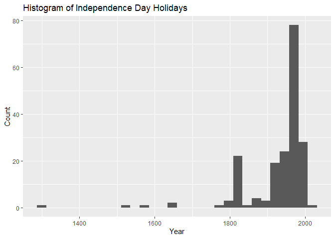
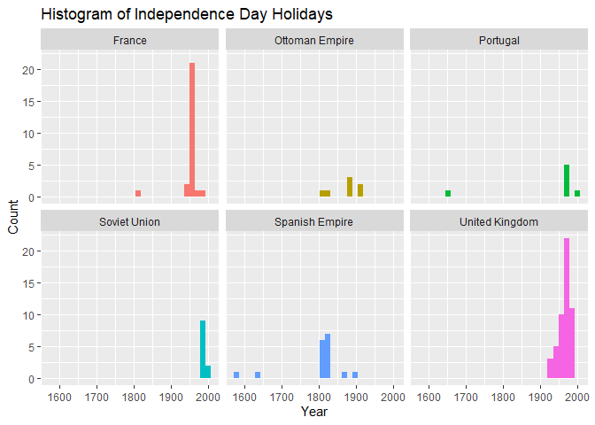

Independence Days
================
Developed by Anthony Lipphardt

# TidyTuesday

Join the R4DS Online Learning Community in the weekly
[\#TidyTuesday](https://github.com/rfordatascience/tidytuesday) event\!

Every week we post a raw dataset, a chart or article related to that
dataset, and ask you to explore the data.

While the dataset will be “tamed”, it will not always be tidy\! As such
you might need to apply various R for Data Science techniques to wrangle
the data into a true tidy format.

The goal of TidyTuesday is to apply your R skills, get feedback, explore
other’s work, and connect with the greater \#RStats community\!

As such we encourage everyone of all skills to participate\!

``` r
knitr::opts_chunk$set(echo = TRUE)

library(tidytuesdayR)
library(tidyverse)

library(lubridate)
library(scales)
library(glue)
library(ggtext)
library(Cairo)


library(extrafont)
loadfonts(device = "win", quiet = TRUE)
```

# Loading the Weekly Dataset

Download the weekly data and make it available in the `holidays` object.

[Independence
Days](https://github.com/rfordatascience/tidytuesday/blob/master/data/2021/2021-07-06/readme.md)

``` r
# Loading Data for the First Time
#holidays <- readr::read_csv('https://raw.githubusercontent.com/rfordatascience/tidytuesday/master/data/2021/2021-07-06/holidays.csv')
#write_csv(holidays, 'holidays.csv')

holidays <- read_csv('holidays.csv') 
```

    ## 
    ## -- Column specification --------------------------------------------------------
    ## cols(
    ##   country = col_character(),
    ##   date_parsed = col_date(format = ""),
    ##   weekday = col_character(),
    ##   day = col_double(),
    ##   month = col_character(),
    ##   name_of_holiday = col_character(),
    ##   date_of_holiday = col_character(),
    ##   year_of_event = col_double(),
    ##   independence_from = col_character(),
    ##   event_commemorated_and_notes = col_character(),
    ##   year = col_double(),
    ##   date_mdy = col_character()
    ## )

# Sample Data

Take an initial look at the format of the data available.

``` r
glimpse(holidays)
```

    ## Rows: 216
    ## Columns: 12
    ## $ country                      <chr> "Afghanistan", "Albania", "Algeria", "And~
    ## $ date_parsed                  <date> 1919-08-19, 1912-11-28, 1962-07-05, NA, ~
    ## $ weekday                      <chr> "Tuesday", "Thursday", "Thursday", NA, "T~
    ## $ day                          <dbl> 19, 28, 5, NA, 11, 1, 9, 28, 21, NA, 26, ~
    ## $ month                        <chr> "Aug", "Nov", "Jul", NA, "Nov", "Nov", "J~
    ## $ name_of_holiday              <chr> "Afghan Independence Day (Afghan Victory ~
    ## $ date_of_holiday              <chr> "August 19", "November 28", "July 5", NA,~
    ## $ year_of_event                <dbl> 1919, 1912, 1962, NA, 1975, 1981, NA, NA,~
    ## $ independence_from            <chr> "United Kingdom", "Ottoman Empire", "Fran~
    ## $ event_commemorated_and_notes <chr> "Anglo-Afghan Treaty of 1919 or Treaty of~
    ## $ year                         <dbl> 1919, 1912, 1962, NA, 1975, 1981, 1816, 1~
    ## $ date_mdy                     <chr> "August 19, 1919", "November 28, 1912", "~

# Wrangling and Exploration

Countries with no independence day

``` r
print.data.frame(holidays %>% filter(is.na(date_parsed)) %>% select(country))
```

    ##                        country
    ## 1                      Andorra
    ## 2                    Australia
    ## 3                       Bhutan
    ## 4                     Cameroon
    ## 5                       Canada
    ## 6  China, People's Republic of
    ## 7           China, Republic of
    ## 8                      Denmark
    ## 9                        Egypt
    ## 10                    Ethiopia
    ## 11                     Germany
    ## 12                       Italy
    ## 13                       Japan
    ## 14                        Laos
    ## 15               Liechtenstein
    ## 16                  Luxembourg
    ## 17            Marshall Islands
    ## 18                      Monaco
    ## 19                       Nepal
    ## 20                 New Zealand
    ## 21                       Palau
    ## 22                      Russia
    ## 23                  San Marino
    ## 24                       Spain
    ## 25                    Thailand
    ## 26                      Turkey
    ## 27                Vatican City

Count top countries for **independence\_from**

``` r
holidays %>% count(independence_from) %>% 
  filter(!is.na(independence_from)) %>% 
  slice_max(n=10, n)
```

    ## # A tibble: 12 x 2
    ##    independence_from                                                  n
    ##    <chr>                                                          <int>
    ##  1 United Kingdom                                                    51
    ##  2 France                                                            26
    ##  3 Spanish Empire                                                    17
    ##  4 Soviet Union                                                      11
    ##  5 Ottoman Empire                                                     7
    ##  6 Portugal                                                           7
    ##  7 Russian Soviet Federative Socialist Republic                       6
    ##  8 Spain                                                              4
    ##  9 Belgium                                                            3
    ## 10 Empire of Japan                                                    3
    ## 11 Russian Soviet Federative Socialist Republic and German Empire     3
    ## 12 SFR Yugoslavia                                                     3

``` r
top5_countries = holidays %>% count(independence_from) %>% 
  filter(!is.na(independence_from)) %>% 
  slice_max(n=5, n) %>%
  pull(independence_from)
```

Countries with multiple independence days

``` r
print.data.frame(holidays %>% count(country) %>% filter(n > 1))
```

    ##                     country n
    ## 1                   Armenia 2
    ## 2                Azerbaijan 2
    ## 3                  Bulgaria 2
    ## 4              Burkina Faso 2
    ## 5  Central African Republic 2
    ## 6                      Chad 2
    ## 7    Congo, Republic of the 2
    ## 8                    Cyprus 2
    ## 9            Czech Republic 2
    ## 10                  Ecuador 2
    ## 11                  Estonia 2
    ## 12                  Georgia 2
    ## 13                    India 2
    ## 14                   Latvia 2
    ## 15                Lithuania 2
    ## 16                  Morocco 2
    ## 17                   Norway 2
    ## 18                   Panama 2
    ## 19                    Qatar 2
    ## 20              South Korea 2
    ## 21                  Ukraine 2

Countries that have been independent for the longest

``` r
holidays %>% mutate(date = as.POSIXct(date_parsed), 
                    years_independent = lubridate::now() - date,
                    years_independent = as.numeric(years_independent, units = "days") %/% 365) %>%
  select(country, date, years_independent) %>%
  filter(!is.na(date)) %>% 
  slice_max(n=10, years_independent) 
```

    ## # A tibble: 10 x 3
    ##    country          date                years_independent
    ##    <chr>            <dttm>                          <dbl>
    ##  1 Switzerland      1291-07-31 19:03:58               730
    ##  2 Sweden           1523-06-05 19:03:58               498
    ##  3 Netherlands, The 1581-07-25 19:03:58               440
    ##  4 Portugal         1640-11-30 19:03:58               380
    ##  5 Oman             1650-11-17 19:03:58               370
    ##  6 United States    1776-07-03 19:03:58               245
    ##  7 France           1789-07-13 19:03:58               232
    ##  8 Haiti            1803-12-31 19:03:58               217
    ##  9 Serbia           1804-02-14 19:03:58               217
    ## 10 Ecuador          1809-08-09 19:03:58               212

Let’s look at a histogram of dates to see if there is any peculiar
clustering:

``` r
holidays %>% mutate(date = as.POSIXct(date_parsed)) %>% 
  ggplot(aes(y=date)) +
  geom_histogram() +
  coord_flip() +
  labs(y = "Year", x ="Count", title = "Histogram of Independence Day Holidays")
```

    ## `stat_bin()` using `bins = 30`. Pick better value with `binwidth`.

    ## Warning: Removed 27 rows containing non-finite values (stat_bin).

<!-- -->

Faceting on top 5 countries based on **independence\_from**

``` r
holidays %>% mutate(date = as.POSIXct(date_parsed)) %>% 
  filter(independence_from %in% top5_countries) %>%
  ggplot(aes(y=date, fill=independence_from)) +
  geom_histogram(show.legend=FALSE) +
  facet_wrap(~independence_from) +
  coord_flip() +
  labs(y = "Year", x ="Count", title = "Histogram of Independence Day Holidays")
```

    ## `stat_bin()` using `bins = 30`. Pick better value with `binwidth`.

<!-- -->

# Visualization

Let’s narrow in on what was happening with the Soviet Union in the late
1900s.

``` r
positions = c(-0.5, # Lithuania
              1,    # Latvia
              0.5,  # Georgia
              -1,   # Ukraine
              1,    # Moldova
              -0.5, # Kyrgyzstan
              0.5,  # Uzbekistan
              -0.75,# Tajikistan
              0.75, # Armenia
              -0.5, # Azerbaijan
              1)    # Kazakhstan


soviet = holidays %>%
  filter(independence_from == "Soviet Union") %>%
  arrange(date_parsed) %>%
  mutate(position = positions,
         date_parsed = as_date(date_parsed))

label_positions = c(20,   # Lithuania 
                    20,   # Latvia
                    -120, # Georgia
                    -120, # Ukraine
                    -120, # Moldova
                    -120, # Kyrgyzstan
                    -120, # Uzbekistan  
                    20,   # Tajikistan
                    20,   # Armenia 
                    20,   # Azerbaijan
                    20)   # Kazakhstan


timeline = soviet %>% ggplot(aes(x = date_parsed, y = position)) +
  
  geom_segment(aes(x=date_parsed, 
                   xend=date_parsed,
                   y=0, 
                   yend=position)) +
  
  geom_hline(yintercept = 0, size = 2) + 
  
  geom_segment(aes(x=date_parsed, 
                   xend=date_parsed+label_positions,
                   y=position, 
                   yend=position),
               alpha = 0.3) + 
  
  geom_textbox(aes(x = date_parsed + label_positions, 
                   y = position, 
                   label = glue("<strong>{country}</strong><br>{date_of_holiday}")),
               hjust = 0,
               halign = 0.5,
               width = unit(0.08, "npc"),
               size = 4,
               family = "Segoe UI",
               box.colour = "black",
               fill = "#F9F5CD",
               color = "black") +
  
  geom_point(aes(fill = country), colour = "black", pch = 21, size = 4, show.legend = FALSE)   +
  
  scale_x_date(limits = as_date(c("1990-01-01", "1992-12-31"))) +
  scale_y_continuous(limits = c(-1.1, 1.1)) + 
  
  theme_minimal() +
  
  labs(x="",
       y="",
       title = "Collapse of the Soviet Union",
       subtitle = glue("Between 1986 and 1991, Mikhail Gorbachev adopted policies of <strong>glasnost (openness)</strong> and <strong>perestroika (restructuring)</strong>, which opened the gates for public discussion surrounding independence. Lithuania was the first to declare independence and served as a model to other Soviet Union countries. Following a failed coup against Gorbachev in August, remaining countries quickly followed suit and claimed their independence, with the Soviet Union dissolving by December 1992."),
       caption = "<strong>Source:</strong> Wikipedia.org | <strong>Visualization:</strong> @a_lipphardt") +
    
  theme(axis.ticks.y = element_blank(),
        
        axis.text.y = element_blank(),
        
        axis.text.x = element_text(family = "Segoe UI Black",
                                             color = "#333333",
                                             size = 14),
        
        panel.grid = element_blank(),
        
        plot.title = element_textbox_simple(family = "Stencil",
                                            size = 20, 
                                            margin = margin(b= 20)),
        
        plot.subtitle = element_textbox_simple(family = "Palatino Linotype",
                                               size = 16,
                                               margin = margin(b = 20)),
        
        plot.caption = element_textbox_simple(family = "Segoe UI Semilight",
                                              size = 14,
                                              halign = 1,
                                              margin = margin(r = 10, t = 20))) 
```

# Saving Image(s)

Save your image for sharing. Be sure to use the `#TidyTuesday` hashtag
in your post on twitter\!

``` r
ggsave(plot = timeline,
       filename = "soviet-union-collapse.png",
       width=15,
       height=10,
       type = "cairo",
       device = "png",
       dpi = 300)
```


