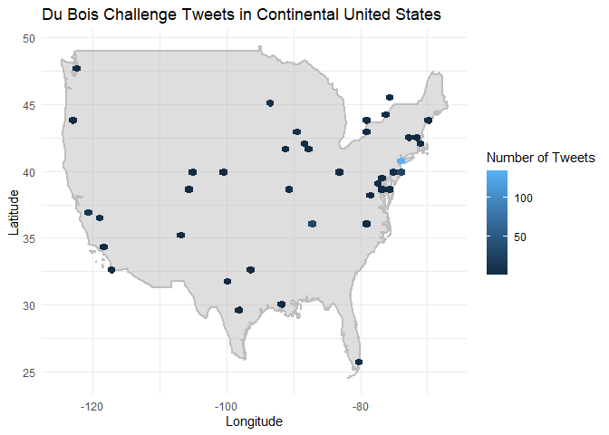
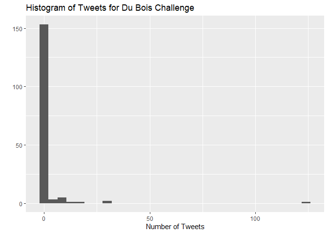
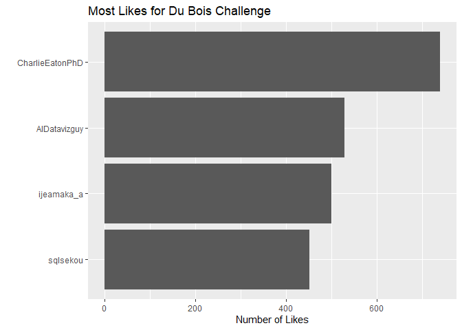
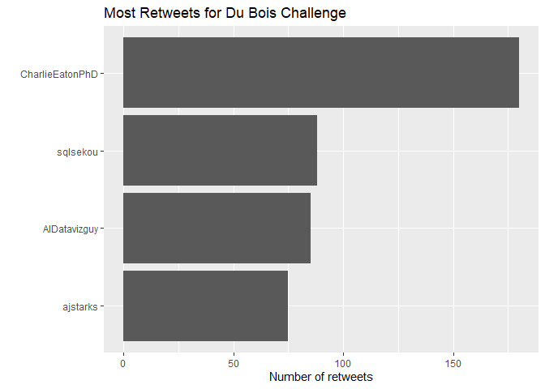
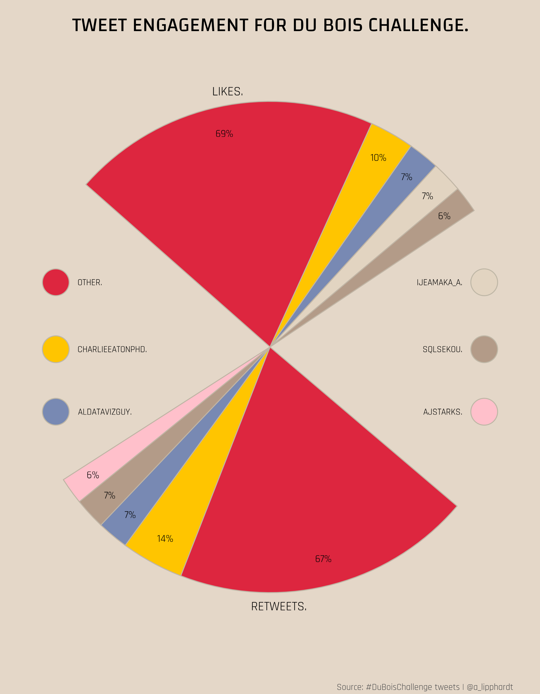

Du Bois and Juneteenth Revisited
================
Developed by Anthony Lipphardt

# TidyTuesday

Join the R4DS Online Learning Community in the weekly
[\#TidyTuesday](https://github.com/rfordatascience/tidytuesday) event\!

Every week we post a raw dataset, a chart or article related to that
dataset, and ask you to explore the data.

While the dataset will be “tamed”, it will not always be tidy\! As such
you might need to apply various R for Data Science techniques to wrangle
the data into a true tidy format. The goal of TidyTuesday is to apply
your R skills, get feedback, explore other’s work, and connect with the
greater \#RStats community\! As such we encourage everyone of all skills
to participate\!

# Loading the Weekly Dataset

Download the weekly data and make it available in the `tweets` object.

[Du Bois and Juneteenth
Revisited](https://github.com/rfordatascience/tidytuesday/blob/master/data/2021/2021-06-15/readme.md)

``` r
 # Loading Data for the First Time
#tuesdata <- tidytuesdayR::tt_load(2021, week = 25)
#tweets <- tuesdata$tweets
#write_csv(tweets, 'tweets.csv')

tweets <- read_csv('tweets.csv') %>% filter(!is.na(content))
```

    ## 
    ## -- Column specification --------------------------------------------------------
    ## cols(
    ##   datetime = col_datetime(format = ""),
    ##   content = col_character(),
    ##   retweet_count = col_double(),
    ##   like_count = col_double(),
    ##   quote_count = col_double(),
    ##   text = col_character(),
    ##   username = col_character(),
    ##   location = col_character(),
    ##   followers = col_double(),
    ##   url = col_character(),
    ##   verified = col_logical(),
    ##   lat = col_double(),
    ##   long = col_double()
    ## )

# Sample Data

Take an initial look at the format of the data available.

``` r
head(glimpse(tweets), 10)
```

    ## Rows: 444
    ## Columns: 13
    ## $ datetime      <dttm> 2021-05-07 11:42:29, 2021-05-06 16:14:46, 2021-05-06 16~
    ## $ content       <chr> "@sqlsekou You co-hosted the #DuBoisChallenge. That had ~
    ## $ retweet_count <dbl> 0, 0, 0, 0, 0, 0, 3, 0, 1, 1, 0, 0, 1, 0, 0, 1, 1, 0, 0,~
    ## $ like_count    <dbl> 1, 0, 0, 4, 11, 0, 58, 0, 1, 6, 5, 4, 5, 4, 4, 10, 0, 0,~
    ## $ quote_count   <dbl> 0, 0, 0, 0, 0, 0, 0, 0, 0, 0, 0, 0, 0, 0, 0, 0, 0, 0, 0,~
    ## $ text          <chr> "<a href=\"http://twitter.com/download/android\" rel=\"n~
    ## $ username      <chr> "AlDatavizguy", "AlDatavizguy", "AlDatavizguy", "AlDatav~
    ## $ location      <chr> "New York", "New York", "New York", "New York", "New Yor~
    ## $ followers     <dbl> 1113, 1113, 1113, 1113, 1113, 5413, 3097, 1113, 642, 111~
    ## $ url           <chr> "https://twitter.com/AlDatavizguy/status/139063312920387~
    ## $ verified      <lgl> FALSE, FALSE, FALSE, FALSE, FALSE, FALSE, FALSE, FALSE, ~
    ## $ lat           <dbl> 40.71273, 40.71273, 40.71273, 40.71273, 40.71273, 36.220~
    ## $ long          <dbl> -74.00602, -74.00602, -74.00602, -74.00602, -74.00602, -~

    ## # A tibble: 10 x 13
    ##    datetime            content     retweet_count like_count quote_count text    
    ##    <dttm>              <chr>               <dbl>      <dbl>       <dbl> <chr>   
    ##  1 2021-05-07 11:42:29 "@sqlsekou~             0          1           0 "<a hre~
    ##  2 2021-05-06 16:14:46 "#DuBoisCh~             0          0           0 "<a hre~
    ##  3 2021-05-06 16:14:45 "#DuBoisCh~             0          0           0 "<a hre~
    ##  4 2021-05-06 16:14:45 "Was doing~             0          4           0 "<a hre~
    ##  5 2021-04-30 18:48:18 "@ClintSmi~             0         11           0 "<a hre~
    ##  6 2021-04-30 14:41:53 "@johnspac~             0          0           0 "<a hre~
    ##  7 2021-04-22 15:01:44 "For #Port~             3         58           0 "<a hre~
    ##  8 2021-04-12 00:39:44 "@zanmuny ~             0          0           0 "<a hre~
    ##  9 2021-04-09 12:39:16 "Just lear~             1          1           0 "<a hre~
    ## 10 2021-04-08 22:00:21 "Honorable~             1          6           0 "<a hre~
    ## # ... with 7 more variables: username <chr>, location <chr>, followers <dbl>,
    ## #   url <chr>, verified <lgl>, lat <dbl>, long <dbl>

# Wrangling and Exploration

## Location

Examining available location data for tweets dataset. 59 of the 435
tweets are missing location data. 289 of the 376 tweets with location
data are from the United States. Of those remaining, we can create a
quick hex bin to get a sense of where tweets are coming from.

``` r
tweets %>%
  filter(is.na(location)) %>%
  count()
```

    ## # A tibble: 1 x 1
    ##       n
    ##   <int>
    ## 1    58

``` r
tweets_location = tweets %>%
  filter(!is.na(location),
         long > -150 & long < -50,
         lat > 22 & lat < 50)

world <- map_data("world")


world %>%
  filter(region == "USA",
         long > -150 & long < -50,
         lat > 22 & lat < 50) %>%
  ggplot() +
  geom_polygon(aes(x = long, y = lat, group = group), fill="grey", alpha = 0.5, col = "grey", size = 1) + 
  geom_hex(data = tweets_location, aes(x=long, y=lat), bins = 50) +
  theme_minimal() +
  labs(title = "Du Bois Challenge Tweets in Continental United States",
       fill = "Number of Tweets",
       y = "Latitude",
       x = "Longitude")
```

<!-- -->

## Usernames

Looking at the number of tweets per user. Standouts are the creators of
the WEB Du Bois challenge:  
@sqlsekou (32 tweets), @AlDatavizguy (125 tweets) and @ajstarks (30
tweets)

We can also look at users with the largest number of collective likes or
retweets.

``` r
tweets %>% count(username, sort = TRUE)
```

    ## # A tibble: 166 x 2
    ##    username            n
    ##    <chr>           <int>
    ##  1 AlDatavizguy      125
    ##  2 sqlsekou           32
    ##  3 ajstarks           30
    ##  4 CharlieEatonPhD    15
    ##  5 AsjadNaqvi         11
    ##  6 AdamMico1          10
    ##  7 DocKevinElder      10
    ##  8 manup4             10
    ##  9 lukestanke          8
    ## 10 Jasonforrestftw     7
    ## # ... with 156 more rows

``` r
tweets %>% count(username, sort = TRUE) %>%
  ggplot(aes(y=n)) +
  geom_histogram() +
  coord_flip() + 
  labs(title = "Histogram of Tweets for Du Bois Challenge", x = "", y = "Number of Tweets")
```

    ## `stat_bin()` using `bins = 30`. Pick better value with `binwidth`.

<!-- -->

``` r
most_likes = tweets %>% 
  group_by(username) %>%
  summarize(likes = sum(like_count)) %>%
  slice_max(likes, n = 4)

most_likes %>%
  ggplot(aes(x = fct_reorder(username, likes), y=likes)) +
  geom_col() +
  coord_flip() + 
  labs(title = "Most Likes for Du Bois Challenge", x = "", y = "Number of Likes")
```

<!-- -->

``` r
most_rt = tweets %>% 
  group_by(username) %>%
  summarize(rt = sum(retweet_count)) %>%
  slice_max(rt, n = 4)

most_rt %>%
  ggplot(aes(x = fct_reorder(username, rt), y=rt)) +
  geom_col() +
  coord_flip() + 
  labs(title = "Most Retweets for Du Bois Challenge", x = "", y = "Number of retweets")
```

<!-- -->

# Visualization(s)

Using your processed dataset, create your unique visualization(s).

CREDIT: [Original visualization from Christophe
Nicault](https://github.com/cnicault/tidytuesday/tree/master/2021/2021-08-Dubois-challenge)

``` r
# Includes specific to this visual

library(ggforce)
library(showtext)
```

    ## Loading required package: sysfonts

    ## Loading required package: showtextdb

``` r
library(glue)
```

    ## 
    ## Attaching package: 'glue'

    ## The following object is masked from 'package:dplyr':
    ## 
    ##     collapse

``` r
library(cowplot)
```

    ## 
    ## Attaching package: 'cowplot'

    ## The following object is masked from 'package:lubridate':
    ## 
    ##     stamp

    ## The following object is masked from 'package:patchwork':
    ## 
    ##     align_plots

``` r
font_add_google("Rajdhani", "rajdhani")
font_add_google("Changa", "changa")
showtext_opts(dpi = 320)
showtext_auto(enable = TRUE)

# Calculate percentages and bind into single data frame

like_pct = tweets %>% 
  select(username, like_count) %>%
  mutate(username = case_when(
    username %in% most_likes$username ~ username,
    TRUE ~ "Other"
  )) %>%
  group_by(username) %>%
  summarize(count = sum(like_count), .groups = "keep") %>%
  ungroup() %>%
  mutate(percent = round(count/sum(count)*100), stat = "Likes") %>%
  arrange(desc(percent)) %>%
  select(stat, username, percent)

rt_pct = tweets %>% 
  select(username, retweet_count) %>%
  mutate(username = case_when(
    username %in% most_rt$username ~ username,
    TRUE ~ "Other"
  )) %>%
  group_by(username) %>%
  summarize(count = sum(retweet_count), .groups = "keep") %>%
  ungroup() %>%
  mutate(percent = round(count/sum(count)*100), stat = "Retweets") %>%
  arrange(desc(percent)) %>%
  select(stat, username, percent)

stats = bind_rows(like_pct, rt_pct)


# Blank space between fans
blank = tibble(stat = c("Likes", "Retweets"), username = rep("blank",2), percent = rep(70,2))


# Order the colors according to Dubois and keep it for the two groups
colors = stats %>%
  bind_rows(blank) %>%
  mutate(username = fct_reorder(username, percent, .desc = TRUE),
         Color = as.character(as.numeric(username))) %>%
  select(username, Color) %>%
  distinct() 


# Format text to avoid rewriting manually with the line break
format_text <- function(username){
  ifelse(length(strsplit(as.character(username), " ")[[1]]) <= 2,
           glue("{username}."),
           glue("{word(username,1,2)}\n{word(username, 3, length(strsplit(as.character(username), ' ')[[1]]))}.")
         )
}

# Coordinate for the legend
coord <- tibble(x = c(-48, -48, -48, 48, 48, 48),
               y = c(15, 0, -14, 15, 0, -14))

# Legend with coordinate and text formated
legend_format <- colors %>%
  filter(Color != "1") %>%
  mutate(username = str_to_upper(username),
         username = map_chr(username, format_text)
         ) %>%
  bind_cols(coord)


# Palettes 
dubois_pal <- c("1" = NA, "2" = "#DD263F", "3" = "#FFC500", "4" = "#7889B3", "5" = "#E2D4C1", "6" = "#B39B88", "7" = "#ffc0cb")
dubois_col <- c("1" = NA, "2" = "#C0B5A5", "3" = "#C0B5A5", "4" = "#C0B5A5", "5" = "#C0B5A5", "6" = "#C0B5A5", "7" = "#C0B5A5")


# background & title
main <- ggplot() +
  labs(title = "TWEET ENGAGEMENT FOR DU BOIS CHALLENGE.") +
  theme(plot.background = element_rect(fill = "#E4D7C8", color = NA),
        panel.background = element_blank(),
        plot.title = element_text(family = "changa", size = 22, hjust = 0.5, margin = margin(15,0,0,0)))


# pie chart
chart <- stats %>%
  bind_rows(blank) %>% 
  left_join(colors) %>%
  arrange(desc(stat), Color) %>%
  mutate(ypos = cumsum(percent) - 0.5 * percent,
         label = scales::percent(percent, scale = 1, accuracy = 1),
         label = ifelse(Color == "1", NA, label)) %>%
  ggplot(aes(x=0, percent)) +
  geom_bar(aes(color = Color, fill = Color, group = stat), stat = "identity") +
  geom_text(aes(y = ypos, label = label), nudge_x = 0.35, family = "rajdhani", size = 4)+
  annotate("text", x = 0.5 , y = 278, label = "LIKES.", family = "rajdhani", size = 5)+
  annotate("text", x = 0.5 , y = 115, label = "RETWEETS.", family = "rajdhani", size = 5)+
  scale_fill_manual(values = dubois_pal) +
  scale_color_manual(values = dubois_col) +
  guides(fill = FALSE, color = FALSE) +
  coord_polar("y", start = pi/3.2) +
  theme_void()
```

    ## Joining, by = "username"

``` r
# legend
legend_plt <- legend_format %>%
  ggplot() +
  geom_circle(aes(x0 = x, y0 = y, r = 3, fill = Color), color = "#BFB7A6") +
  geom_text(data = head(legend_format,3),aes(x = x + 5, y = y, label = username), hjust = 0, family = "rajdhani", size = 3.5) +
  geom_text(data = tail(legend_format,3),aes(x = x - 5, y = y, label = username), hjust = 1, family = "rajdhani", size = 3.5) +
  scale_fill_manual(values = dubois_pal) +
  scale_x_continuous(limits = c(-55,55))+
  coord_fixed() +
  guides(fill = FALSE) +
  theme_void()

# assemble
final = ggdraw(main) + 
  draw_plot(chart, x = -0.1, y = -0.1, width = 1.2, height = 1.2) +
  draw_plot(legend_plt, x = 0, y = 0.35, width = 1, height = 0.3)+
  draw_text(x = 0.95, y = 0.01, text = "Source: #DuBoisChallenge tweets | @a_lipphardt", family = "rajdhani", size = 10, color = "grey30", hjust = 1)


ragg::agg_png(here::here("render", "dubois-v2.png"), res = 320, width = 8.25, height = 10.6, units = "in")

final
dev.off()
```


