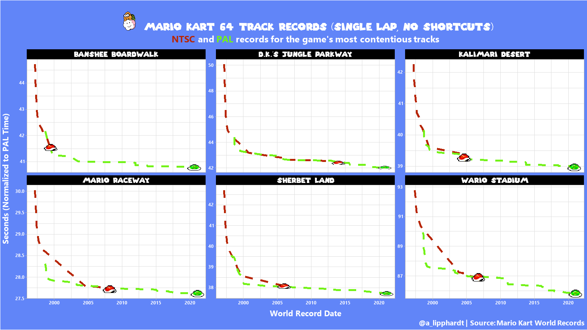

Mario Kart World Records
================
Developed by Anthony Lipphardt

# TidyTuesday

Join the R4DS Online Learning Community in the weekly
[\#TidyTuesday](https://github.com/rfordatascience/tidytuesday) event\!

Every week we post a raw dataset, a chart or article related to that
dataset, and ask you to explore the data.

While the dataset will be “tamed”, it will not always be tidy\! As such
you might need to apply various R for Data Science techniques to wrangle
the data into a true tidy format. The goal of TidyTuesday is to apply
your R skills, get feedback, explore other’s work, and connect with the
greater \#RStats community\! As such we encourage everyone of all skills
to participate\!

# Loading the Weekly Dataset

Download the weekly data and make it available in the `records` and
`drivers` objects.

[Mario Kart World
Records](https://github.com/rfordatascience/tidytuesday/blob/master/data/2021/2021-05-25/readme.md)

``` r
 # Loading Data for the First Time
 # tuesdata <- tidytuesdayR::tt_load(2021, week = 22)
 # records <- tuesdata$records
 # drivers <- tuesdata$drivers
 # 
 # write_csv(records, 'records.csv')
 # write_csv(drivers, 'drivers.csv')

 records <- read_csv('records.csv')
```

    ## 
    ## -- Column specification --------------------------------------------------------
    ## cols(
    ##   track = col_character(),
    ##   type = col_character(),
    ##   shortcut = col_character(),
    ##   player = col_character(),
    ##   system_played = col_character(),
    ##   date = col_date(format = ""),
    ##   time_period = col_character(),
    ##   time = col_double(),
    ##   record_duration = col_double()
    ## )

``` r
 drivers <- read_csv('drivers.csv')
```

    ## 
    ## -- Column specification --------------------------------------------------------
    ## cols(
    ##   position = col_double(),
    ##   player = col_character(),
    ##   total = col_double(),
    ##   year = col_double(),
    ##   records = col_double(),
    ##   nation = col_character()
    ## )

# Sample Data

Take an initial look at the format of the data available.

``` r
head(glimpse(records), 10)
```

    ## Rows: 2,334
    ## Columns: 9
    ## $ track           <chr> "Luigi Raceway", "Luigi Raceway", "Luigi Raceway", ...
    ## $ type            <chr> "Three Lap", "Three Lap", "Three Lap", "Three Lap",...
    ## $ shortcut        <chr> "No", "No", "No", "No", "No", "No", "No", "No", "No...
    ## $ player          <chr> "Salam", "Booth", "Salam", "Salam", "Gregg G", "Roc...
    ## $ system_played   <chr> "NTSC", "NTSC", "NTSC", "NTSC", "NTSC", "NTSC", "NT...
    ## $ date            <date> 1997-02-15, 1997-02-16, 1997-02-16, 1997-02-28, 19...
    ## $ time_period     <chr> "2M 12.99S", "2M 9.99S", "2M 8.99S", "2M 6.99S", "2...
    ## $ time            <dbl> 132.99, 129.99, 128.99, 126.99, 124.51, 122.89, 122...
    ## $ record_duration <dbl> 1, 0, 12, 7, 54, 0, 0, 27, 0, 64, 3, 0, 90, 132, 1,...

    ## # A tibble: 10 x 9
    ##    track type  shortcut player system_played date       time_period  time
    ##    <chr> <chr> <chr>    <chr>  <chr>         <date>     <chr>       <dbl>
    ##  1 Luig~ Thre~ No       Salam  NTSC          1997-02-15 2M 12.99S    133.
    ##  2 Luig~ Thre~ No       Booth  NTSC          1997-02-16 2M 9.99S     130.
    ##  3 Luig~ Thre~ No       Salam  NTSC          1997-02-16 2M 8.99S     129.
    ##  4 Luig~ Thre~ No       Salam  NTSC          1997-02-28 2M 6.99S     127.
    ##  5 Luig~ Thre~ No       Gregg~ NTSC          1997-03-07 2M 4.51S     125.
    ##  6 Luig~ Thre~ No       Rocky~ NTSC          1997-04-30 2M 2.89S     123.
    ##  7 Luig~ Thre~ No       Launs~ NTSC          1997-04-30 2M 2.87S     123.
    ##  8 Luig~ Thre~ No       Launs~ NTSC          1997-04-30 2M 2.78S     123.
    ##  9 Luig~ Thre~ No       Launs~ NTSC          1997-05-27 2M 2.25S     122.
    ## 10 Luig~ Thre~ No       Launs~ NTSC          1997-05-27 2M 2.21S     122.
    ## # ... with 1 more variable: record_duration <dbl>

``` r
head(glimpse(drivers), 10)
```

    ## Rows: 2,250
    ## Columns: 6
    ## $ position <dbl> 1, 1, 1, 1, 1, 1, 1, 1, 1, 1, 1, 1, 1, 1, 1, 1, 1, 1, 1, 1...
    ## $ player   <chr> "Penev", "Penev", "Penev", "Penev", "Penev", "Penev", "Pen...
    ## $ total    <dbl> 344, 344, 344, 344, 344, 344, 344, 344, 344, 344, 344, 344...
    ## $ year     <dbl> 1997, 1998, 1999, 2000, 2001, 2002, 2003, 2004, 2005, 2006...
    ## $ records  <dbl> NA, 181, 126, 14, 5, 11, 2, 5, NA, NA, NA, NA, NA, NA, NA,...
    ## $ nation   <chr> "Australia", "Australia", "Australia", "Australia", "Austr...

    ## # A tibble: 10 x 6
    ##    position player total  year records nation   
    ##       <dbl> <chr>  <dbl> <dbl>   <dbl> <chr>    
    ##  1        1 Penev    344  1997      NA Australia
    ##  2        1 Penev    344  1998     181 Australia
    ##  3        1 Penev    344  1999     126 Australia
    ##  4        1 Penev    344  2000      14 Australia
    ##  5        1 Penev    344  2001       5 Australia
    ##  6        1 Penev    344  2002      11 Australia
    ##  7        1 Penev    344  2003       2 Australia
    ##  8        1 Penev    344  2004       5 Australia
    ##  9        1 Penev    344  2005      NA Australia
    ## 10        1 Penev    344  2006      NA Australia

# Wrangling

Explore the data and process it into prepared dataframes for
visualization.

``` r
# Find most contentious track records by finding tracks with highest count of records
most_records = records %>%
  count(track, type, shortcut, system_played) %>%
  ungroup() %>%
  slice_max(n, n = 25)


# These tracks appear to be the most contentious
tracks = c("Sherbet Land", "Wario Stadium", "D.K.'s Jungle Parkway", "Mario Raceway", "Banshee Boardwalk", "Kalimari Desert")

# We'll filter the records to single lap, no shortcut and parse the datetime
select_records = records %>% 
  filter(track %in% tracks, 
         type == "Single Lap",
         shortcut == "No") %>%
  mutate(date = parse_date_time(date, "Y-m-d")) %>%
  select(track, player, system_played, date, time)
```

# Visualization(s)

Using your processed dataset, create your unique visualization(s).

``` r
# The most recent record will be marked with a koopa shell
green_shell = readPNG("green-shell.png")
red_shell = readPNG("red-shell.png") 

# Mario themed color palette
cornflower_blue = "#6185F8"
burnt_red = "#B72504"
lawn_green = "#73f218"

# Plot world records over time by most contentious tracks
mario_plot = select_records %>%
  ggplot(aes(x=date, y=time, color=system_played)) +
  geom_line(size = 2, linetype = "dashed", show.legend = FALSE) +
  facet_wrap(~track, scales="free_y") +

  scale_color_manual(values=c(burnt_red, lawn_green)) +
  
  labs(title = "Mario Kart 64 Track Records (Single Lap, No Shortcuts)",
       subtitle = glue::glue("<span style='color: {burnt_red};'>**NTSC**</span> and <span style='color: {lawn_green}'>**PAL**</span> records for the game's most contentious track records"),
       x = "World Record Date",
       y = "Seconds (Normalized to PAL Time)",
       caption = "@a_lipphardt | Source: Mario Kart World Records") +
  
  theme_light() +
  theme(plot.title = element_textbox_simple(family = "supermario", 
                                  color ="white", 
                                  halign = 0.5, 
                                  size = 20,
                                  margin = margin(t=15,b=10)),
        
        plot.subtitle = element_textbox_simple(family = "segoeuibold",
                                         color = "white", 
                                         halign = 0.5,
                                         size = 18,
                                         margin = margin(b=10)),
        
        plot.caption = element_textbox_simple(family = "segoeuibold",
                                              color = "white",
                                              size = 14,
                                              halign = 1,
                                              margin = margin(t=5)),
        
        plot.background = element_rect(fill = cornflower_blue),
        
        strip.text = element_text(family = "supermario", 
                                  color = "white",
                                  size = 14),
        
        strip.background = element_rect(fill = "black"),
        
        axis.title = element_text(family = "segoeuibold",
                                  color = "white", 
                                  face = "bold", 
                                  size = 16),
        
        axis.title.y = element_text(margin = margin(r = 10)),
        axis.title.x = element_text(margin = margin(t = 10)),        
        
        axis.text = element_textbox_simple(family = "segoeuibold",
                                           color = "white")) 

plot = mario_plot

# Add koopa shells to most recent track record for each track

for(selected_track in tracks){

  
  track_data = select_records %>% filter(track == selected_track)
  
  ntsc = select_records %>% filter(track == selected_track, system_played == 'NTSC')
  pal = select_records %>% filter(track == selected_track, system_played == 'PAL')
  
  plot = plot + layer(data = ntsc, 
        stat = StatIdentity, 
        position = PositionIdentity, 
        geom = ggplot2:::GeomCustomAnn,
        inherit.aes = TRUE, 
        params = list(grob = rasterGrob(red_shell, interpolate=FALSE,width = 2, height = 2),    
                      xmin = max(ntsc$date) - months(6), 
                      xmax = max(ntsc$date) + months(6), 
                      ymin = min(ntsc$time) - (max(ntsc$time)*0.0015), 
                      ymax = min(ntsc$time) + (max(ntsc$time)*0.0015)))

  plot = plot + layer(data = pal, 
        stat = StatIdentity, 
        position = PositionIdentity, 
        geom = ggplot2:::GeomCustomAnn,
        inherit.aes = TRUE, 
        params = list(grob = rasterGrob(green_shell, interpolate=FALSE,width = 2, height = 2), 
                      xmin = max(pal$date) - months(6), 
                      xmax = max(pal$date) + months(6), 
                      ymin = min(pal$time) - (max(pal$time)*0.0015), 
                      ymax = min(pal$time) + (max(pal$time)*0.0015)))  
}

plot
```

<!-- -->

# Saving Image(s)

Save your image for sharing. Be sure to use the `#TidyTuesday` hashtag
in your post on twitter\!

``` r
#This will save your most recent plot
ggsave(plot = plot,
  filename = "mario-world-records.png",
  width=16,
  height=9,
  type = "cairo",
  device = "png",
  dpi = 96)
```
