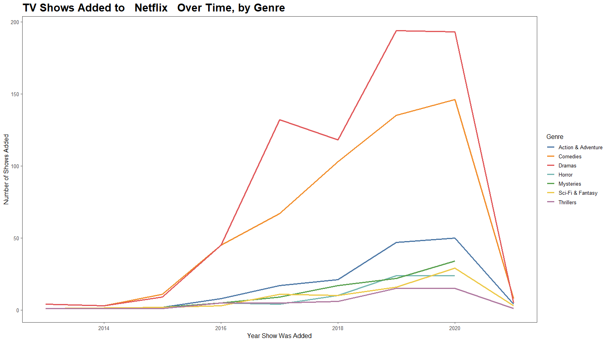

Netflix Shows
================
Anthony Lipphardt
2021-04-26

# TidyTuesday

Join the R4DS Online Learning Community in the weekly
[\#TidyTuesday](https://github.com/rfordatascience/tidytuesday) event\!

Every week we post a raw dataset, a chart or article related to that
dataset, and ask you to explore the data.

While the dataset will be “tamed”, it will not always be tidy\! As such
you might need to apply various R for Data Science techniques to wrangle
the data into a true tidy format. The goal of TidyTuesday is to apply
your R skills, get feedback, explore other’s work, and connect with the
greater \#RStats community\! As such we encourage everyone of all skills
to participate\!

# Loading the Weekly Dataset

Download the weekly data and make available in the `netflix` object.

[Netflix
Shows](https://github.com/rfordatascience/tidytuesday/blob/master/data/2021/2021-04-20/readme.md)

``` r
# Loading Data for the First Time
# tuesdata <- tidytuesdayR::tt_load('2021-04-20')
# netflix <- tuesdata$netflix
# write_csv(netflix, 'netflix.csv')

netflix <- read_csv('netflix.csv')
```

    ## 
    ## -- Column specification --------------------------------------------------------
    ## cols(
    ##   show_id = col_character(),
    ##   type = col_character(),
    ##   title = col_character(),
    ##   director = col_character(),
    ##   cast = col_character(),
    ##   country = col_character(),
    ##   date_added = col_character(),
    ##   release_year = col_double(),
    ##   rating = col_character(),
    ##   duration = col_character(),
    ##   listed_in = col_character(),
    ##   description = col_character()
    ## )

# Sample Data

Take an initial look at the format of the data available.

``` r
head(netflix, 10)
```

    ## # A tibble: 10 x 12
    ##    show_id type  title director cast  country date_added release_year rating
    ##    <chr>   <chr> <chr> <chr>    <chr> <chr>   <chr>             <dbl> <chr> 
    ##  1 s1      TV S~ 3%    <NA>     João~ Brazil  August 14~         2020 TV-MA 
    ##  2 s2      Movie 7:19  Jorge M~ Demi~ Mexico  December ~         2016 TV-MA 
    ##  3 s3      Movie 23:59 Gilbert~ Tedd~ Singap~ December ~         2011 R     
    ##  4 s4      Movie 9     Shane A~ Elij~ United~ November ~         2009 PG-13 
    ##  5 s5      Movie 21    Robert ~ Jim ~ United~ January 1~         2008 PG-13 
    ##  6 s6      TV S~ 46    Serdar ~ Erda~ Turkey  July 1, 2~         2016 TV-MA 
    ##  7 s7      Movie 122   Yasir A~ Amin~ Egypt   June 1, 2~         2019 TV-MA 
    ##  8 s8      Movie 187   Kevin R~ Samu~ United~ November ~         1997 R     
    ##  9 s9      Movie 706   Shravan~ Divy~ India   April 1, ~         2019 TV-14 
    ## 10 s10     Movie 1920  Vikram ~ Rajn~ India   December ~         2008 TV-MA 
    ## # ... with 3 more variables: duration <chr>, listed_in <chr>, description <chr>

# Wrangling

Explore the data and process it into prepared dataframes for
visualization.

``` r
netflix_shows_added_by_genre = netflix %>%
  
  # Keep only TV shows
  select(type, listed_in, date_added) %>%
  filter(type == "TV Show") %>%
  
  # Create an entry for each TV Show/Genre pairing
  mutate(listed_in = str_split(listed_in, ",")) %>%
  unnest(listed_in) %>%
  mutate(listed_in = str_trim(listed_in)) %>%
  
  # Retain TV Show specific categories
  filter(str_starts(listed_in, "TV"), listed_in != 'TV Shows') %>%
  mutate(listed_in = str_replace(listed_in, "TV ", "")) %>%
  
  # Parse year from date_added and remove NA dates
  mutate(year = year(parse_date_time(date_added, "b d, y"))) %>% 
  filter(!is.na(year)) %>%
  
  # Get number of of shows added for each genre-year pair
  group_by(listed_in, year) %>%
  summarise(n = n()) %>%
  
  # Convert year to POSIXct date for axis formatting
  mutate(year = parse_date_time(year, "y"))
```

    ## `summarise()` has grouped output by 'listed_in'. You can override using the `.groups` argument.

# Visualization(s)

Using your processed dataset, create your unique visualization(s).

``` r
  # Plot number of shows added per year, by genre
  plot1 = netflix_shows_added_by_genre %>%
  ggplot(aes(x=year)) +
  geom_line(aes(y=n, color = listed_in), size=1.2) +
  labs(title = "TV Shows Added to   Netflix   Over Time, by Genre",
       x = "Year Show Was Added",
       y = "Number of Shows Added",
       color = "Genre") + 
  
  # Additional formatting/themes
  scale_x_datetime(labels = date_format("%Y")) +
  theme_few() + 
  scale_color_tableau() +
  theme(plot.title = element_text(size=20, face="bold"))

  plot1
```

<!-- -->

# Saving Image(s)

Save your image for sharing. Be sure to use the `#TidyTuesday` hashtag
in your post on twitter\!

``` r
# This will save your most recent plot
ggsave(plot = plot1,
  filename = "netflix-shows-added-by-genre.png",
  width=16,
  height=9,
  device = "png")
```
