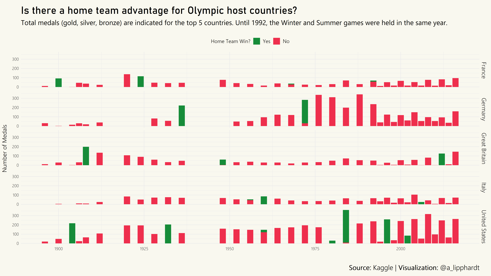

# TidyTuesday

Join the R4DS Online Learning Community in the weekly [#TidyTuesday](https://github.com/rfordatascience/tidytuesday) event!

Every week we post a raw dataset, a chart or article related to that dataset, and ask you to explore the data.

While the dataset will be “tamed”, it will not always be tidy! As such you might need to apply various R for Data Science techniques to wrangle the data into a true tidy format.

The goal of TidyTuesday is to apply your R skills, get feedback, explore other’s work, and connect with the greater #RStats community!

As such we encourage everyone of all skills to participate!

```{r setup, warning=FALSE, results = FALSE, message = FALSE}

knitr::opts_chunk$set(echo = TRUE)

library(tidytuesdayR)
library(tidyverse)

library(lubridate)
library(scales)
library(glue)
library(ggtext)
library(Cairo)


library(extrafont)
loadfonts(device = "win", quiet = TRUE)


```

# Loading the Weekly Dataset

Download the weekly data and make it available in the `olympics` object.

[Olympic Games](https://github.com/rfordatascience/tidytuesday/blob/master/data/2021/2021-07-27/readme.md)

```{r Load}

# Loading Data for the First Time
#tuesdata <- tidytuesdayR::tt_load(2021, week = 31)
#olympics <- tuesdata$olympics
#write_csv(olympics, 'olympics.csv')

olympics <- read_csv('olympics.csv')


```


# Sample Data

Take an initial look at the format of the data available.

```{r Glimpse}

glimpse(olympics)


```

# Wrangling and Exploration


Unique cities for Olympics

```{r categorical_counts}

categorical_count = function(tbl, column){
  tbl %>% count({{column}}, sort = TRUE)
}

print.data.frame(categorical_count(olympics, city))
write_csv(categorical_count(olympics, city), 'olympic-cities.csv')

categorical_count(olympics, team)


```

Let's focus on the top 10 medal earning teams and see which of those teams have hosted an Olympic Games.

```{r}

# Loading a file of city and home team pairs (source: wikipedia)
home_team_pairs = read_csv('city-home-team-pairs.csv')

# Recoding select team names

olympics = olympics %>%
  mutate(team_clean = case_when(
    str_detect(team, "United States") ~ "United States",
    str_detect(team, "France") ~ "France",
    str_detect(team, "Great Britain") ~ "Great Britain",
    str_detect(team, "Italy") ~ "Italy",
    str_detect(team, "Germany") ~ "Germany",
    str_detect(team, "Canada") ~ "Canada",
    str_detect(team, "Japan") ~ "Japan",
    str_detect(team, "Sweden") ~ "Sweden",
    str_detect(team, "Australia") ~ "Australia",
    str_detect(team, "Hungary") ~ "Hungary",
    TRUE ~ team
  ))

print.data.frame(categorical_count(olympics %>% filter(team != team_clean), team))

# Get top 5 teams
top5_teams = categorical_count(olympics, team) %>% slice_max(n = 5, n, with_ties = FALSE) %>% pull(team)

# Join on home team pairs data frame and flag medals where it was a home team win

olympics = olympics %>%
  left_join(home_team_pairs) %>%
  mutate(flag = case_when(
    team_clean == home_team ~ "Yes",
    TRUE ~ "No"
  ))

# How many medals were home team wins?
olympics %>% count(flag)


```


# Visualization

Now, lets visualize home team medals for top 10 countries:

```{r home_team_medals}


olympics = olympics %>%
  filter(team_clean %in% top5_teams,
         !is.na(medal))

host_wins = olympics %>%
  filter(team_clean %in% top5_teams) %>%
  select(year, team_clean, flag) %>%
  mutate(flag = as.factor(flag),
         flag = fct_rev(flag)) %>%
  ggplot(aes(x = year, fill = flag)) +
  geom_bar() +
  facet_grid(rows = vars(team_clean)) +
  theme_minimal() +
  scale_fill_manual(values = c("#168c39","#ee2f4d")) +
  labs(title = "Is there a home team advantage for Olympic host countries?",
       subtitle = "Total medals (gold, silver, bronze) are indicated for the top 5 countries. Until 1992, the Winter and Summer games were held in the same year.",
       caption = "<strong>Source:</strong> Kaggle | <strong>Visualization:</strong> @a_lipphardt",
       y = "Number of Medals",
       x = "",
       fill = "Home Team Win?") +
  theme(legend.position = "top",
        plot.title = element_textbox_simple(family = "Bahnschrift",
                                            halign = 0,
                                            size = 24,
                                            margin = margin(t=10,b=10)),
        
        plot.subtitle = element_textbox_simple(family = "Segoe UI",
                                            halign = 0,
                                            size = 16,
                                            margin = margin(b=20, 
                                                            r = 20)),
        
        plot.caption = element_textbox_simple(family = "Segoe UI Semilight",
                                              size = 16,
                                              halign = 1,
                                              margin = margin(r = 0, t = 20, b = 5)),
        legend.title = element_text(family = "Segoe UI Semilight", 
                                    size = 12),
        
        legend.text = element_text(family = "Segoe UI Semilight",
                                   size = 12),
        
        axis.text = element_text(family = "Segoe UI Semilight",
                                 size = 10),   
        
        axis.title.y = element_text(family = "Segoe UI Semilight",
                                 size = 14,
                                 margin = margin(r = 10)),
        
        strip.text = element_text(family = "Segoe UI Semilight",
                                  size = 14),
        
        plot.background = element_rect(fill = "#F9F8EF", color = "#F9F8EF")
        )

```


# Saving Image(s)

Save your image for sharing. Be sure to use the `#TidyTuesday` hashtag in your post on twitter! 

```{r save_plot, warning=FALSE}

ggsave(plot = host_wins,
       filename = "host-wins.png",
       width=16,
       height=9,
       type = "cairo",
       device = "png",
       dpi = 300)

```




