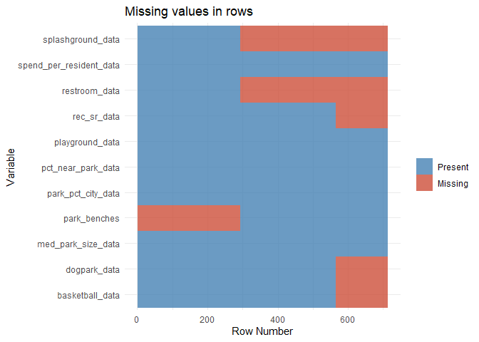

Park Access
================
Developed by Anthony Lipphardt

# TidyTuesday

Join the R4DS Online Learning Community in the weekly
[\#TidyTuesday](https://github.com/rfordatascience/tidytuesday) event\!

Every week we post a raw dataset, a chart or article related to that
dataset, and ask you to explore the data.

While the dataset will be “tamed”, it will not always be tidy\! As such
you might need to apply various R for Data Science techniques to wrangle
the data into a true tidy format.

The goal of TidyTuesday is to apply your R skills, get feedback, explore
other’s work, and connect with the greater \#RStats community\!

As such we encourage everyone of all skills to participate\!

``` r
knitr::opts_chunk$set(echo = TRUE)

library("tidytuesdayR")
library("tidyverse")
library("scales")
library("glue")
library("ggrepel")
library("ggtext")
library("Cairo")
library("extrafont")

loadfonts(device = "win", quiet = TRUE)
```

# Loading the Weekly Dataset

Download the weekly data and make it available in the `parks` object.

[Park
Access](https://github.com/rfordatascience/tidytuesday/tree/master/data/2021/2021-06-22)

``` r
 # Loading Data for the First Time
# tuesdata <- tidytuesdayR::tt_load(2021, week = 26)
# parks <- tuesdata$parks
# write_csv(parks, 'parks.csv')

parks <- read_csv('parks.csv') %>%
  mutate(park_pct_city_data = as.numeric(str_replace(park_pct_city_data, "%", "")),
         pct_near_park_data = as.numeric(str_replace(pct_near_park_data, "%", "")),
         spend_per_resident_data = as.numeric(str_replace(spend_per_resident_data, "\\$", "")))
```

    ## 
    ## -- Column specification --------------------------------------------------------
    ## cols(
    ##   .default = col_double(),
    ##   city = col_character(),
    ##   park_pct_city_data = col_character(),
    ##   pct_near_park_data = col_character(),
    ##   spend_per_resident_data = col_character(),
    ##   city_dup = col_character()
    ## )
    ## i Use `spec()` for the full column specifications.

# Sample Data

Take an initial look at the format of the data available.

``` r
head(glimpse(parks), 10)
```

    ## Rows: 713
    ## Columns: 28
    ## $ year                      <dbl> 2020, 2020, 2020, 2020, 2020, 2020, 2020, 20~
    ## $ rank                      <dbl> 1, 2, 3, 4, 5, 6, 7, 8, 9, 10, 11, 12, 13, 1~
    ## $ city                      <chr> "Minneapolis", "Washington, D.C.", "St. Paul~
    ## $ med_park_size_data        <dbl> 5.7, 1.4, 3.2, 2.4, 4.4, 4.9, 6.1, 1.3, 1.4,~
    ## $ med_park_size_points      <dbl> 26, 5, 14, 10, 20, 22, 28, 4, 4, 9, 3, 21, 9~
    ## $ park_pct_city_data        <dbl> 15, 24, 15, 11, 14, 18, 27, 21, 17, 10, 21, ~
    ## $ park_pct_city_points      <dbl> 38, 50, 39, 28, 36, 47, 50, 50, 45, 24, 50, ~
    ## $ pct_near_park_data        <dbl> 98, 98, 99, 99, 82, 90, 82, 100, 100, 98, 99~
    ## $ pct_near_park_points      <dbl> 98, 98, 99, 99, 74, 85, 73, 100, 100, 98, 99~
    ## $ spend_per_resident_data   <dbl> 319, 307, 219, 301, 190, 250, 215, 399, 162,~
    ## $ spend_per_resident_points <dbl> 100, 100, 100, 100, 100, 100, 100, 100, 92, ~
    ## $ basketball_data           <dbl> 3.5, 6.3, 7.7, 7.9, 8.7, 3.4, 17.4, 4.2, 3.8~
    ## $ basketball_points         <dbl> 47, 100, 100, 100, 100, 45, 100, 61, 53, 70,~
    ## $ dogpark_data              <dbl> 1.7, 2.0, 1.3, 3.5, 1.6, 5.8, 0.4, 4.1, 1.9,~
    ## $ dogpark_points            <dbl> 65, 81, 49, 100, 63, 100, 4, 100, 76, 35, 66~
    ## $ playground_data           <dbl> 4.1, 1.9, 4.0, 4.4, 4.9, 2.1, 4.3, 2.9, 4.0,~
    ## $ playground_points         <dbl> 73, 21, 72, 80, 94, 28, 77, 46, 70, 61, 27, ~
    ## $ rec_sr_data               <dbl> 2.3, 2.2, 1.7, 1.1, 1.5, 0.6, 1.7, 0.8, 0.9,~
    ## $ rec_sr_points             <dbl> 100, 100, 100, 76, 100, 38, 100, 52, 63, 100~
    ## $ restroom_data             <dbl> 2.9, 2.6, 3.2, 3.1, 3.2, 6.1, 3.2, 2.4, 1.0,~
    ## $ restroom_points           <dbl> 91, 80, 100, 97, 98, 100, 98, 75, 29, 73, 23~
    ## $ splashground_data         <dbl> 4.0, 4.1, 1.3, 2.2, 4.5, 2.1, 0.7, 1.0, 10.3~
    ## $ splashground_points       <dbl> 100, 100, 47, 81, 100, 79, 25, 36, 100, 100,~
    ## $ amenities_points          <dbl> 79.3, 80.3, 78.0, 89.0, 92.5, 65.0, 67.3, 61~
    ## $ total_points              <dbl> 341, 333, 330, 326, 323, 319, 318, 316, 306,~
    ## $ total_pct                 <dbl> 85.3, 83.3, 82.5, 81.5, 80.6, 79.8, 79.6, 78~
    ## $ city_dup                  <chr> "Minneapolis", "Washington, D.C.", "St. Paul~
    ## $ park_benches              <dbl> NA, NA, NA, NA, NA, NA, NA, NA, NA, NA, NA, ~

    ## # A tibble: 10 x 28
    ##     year  rank city        med_park_size_da~ med_park_size_poi~ park_pct_city_d~
    ##    <dbl> <dbl> <chr>                   <dbl>              <dbl>            <dbl>
    ##  1  2020     1 Minneapolis               5.7                 26               15
    ##  2  2020     2 Washington~               1.4                  5               24
    ##  3  2020     3 St. Paul                  3.2                 14               15
    ##  4  2020     4 Arlington,~               2.4                 10               11
    ##  5  2020     5 Cincinnati                4.4                 20               14
    ##  6  2020     6 Portland                  4.9                 22               18
    ##  7  2020     7 Irvine                    6.1                 28               27
    ##  8  2020     8 San Franci~               1.3                  4               21
    ##  9  2020     9 Boston                    1.4                  4               17
    ## 10  2020    10 Chicago                   2.2                  9               10
    ## # ... with 22 more variables: park_pct_city_points <dbl>,
    ## #   pct_near_park_data <dbl>, pct_near_park_points <dbl>,
    ## #   spend_per_resident_data <dbl>, spend_per_resident_points <dbl>,
    ## #   basketball_data <dbl>, basketball_points <dbl>, dogpark_data <dbl>,
    ## #   dogpark_points <dbl>, playground_data <dbl>, playground_points <dbl>,
    ## #   rec_sr_data <dbl>, rec_sr_points <dbl>, restroom_data <dbl>,
    ## #   restroom_points <dbl>, splashground_data <dbl>, splashground_points <dbl>,
    ## #   amenities_points <dbl>, total_points <dbl>, total_pct <dbl>,
    ## #   city_dup <chr>, park_benches <dbl>

# Wrangling and Exploration

Coverage is from 2012 through 2020, with 40 cities initially ranked and
increasing to close to 100 over time.

``` r
parks %>% count(year)
```

    ## # A tibble: 9 x 2
    ##    year     n
    ##   <dbl> <int>
    ## 1  2012    40
    ## 2  2013    50
    ## 3  2014    60
    ## 4  2015    75
    ## 5  2016    98
    ## 6  2017    99
    ## 7  2018    97
    ## 8  2019    97
    ## 9  2020    97

The most recent ParkScore index is based off four metrics: park access,
acreage, investment, and amenities. However, there is a high level of
missingness due to the fact that additional metrics were introduced over
time. Specifically, we can see that basketball, dogpark, and recreation
and senior centers were not tracked from 2012-2014. Restrooms and
splashgrounds were not initially tracked from 2012-2017. And finally,
number of benches was not tracked in 2018-2020.

``` r
parks %>% select(contains('_data'), park_benches) %>% 
  mutate(id = row_number()) %>%
  gather(-id, key = "key", value = "val") %>%
  mutate(isna = is.na(val)) %>%
  ggplot(aes(key, id, fill = isna)) +
  geom_raster(alpha = 0.8) +
  scale_fill_manual(name = "",
        values = c('steelblue', 'tomato3'),
        labels = c("Present", "Missing")) +
  labs(x = "Variable",
       y = "Row Number", title = "Missing values in rows") +
  coord_flip() + 
  theme_minimal()
```

<!-- -->

``` r
parks %>% filter(is.na(splashground_data)) %>% count(year)
```

    ## # A tibble: 6 x 2
    ##    year     n
    ##   <dbl> <int>
    ## 1  2012    40
    ## 2  2013    50
    ## 3  2014    60
    ## 4  2015    75
    ## 5  2016    98
    ## 6  2017    99

``` r
parks %>% filter(is.na(basketball_data)) %>% count(year)
```

    ## # A tibble: 3 x 2
    ##    year     n
    ##   <dbl> <int>
    ## 1  2012    40
    ## 2  2013    50
    ## 3  2014    60

``` r
parks %>% filter(is.na(park_benches)) %>% count(year)
```

    ## # A tibble: 3 x 2
    ##    year     n
    ##   <dbl> <int>
    ## 1  2018    97
    ## 2  2019    97
    ## 3  2020    97

# Visualization(s)

Let’s look and see what cities were reported in both 2012 and 2020. 37
of the 40 cities from the original 2012 report are in the 2020 report.
We can plot the top 10 cities with the largest gains/drops in median
park size.

``` r
compare_size = parks %>% filter(year == 2020) %>% 
  select(year, city, med_park_size_data, park_pct_city_data) %>%
  inner_join(by = c("city"), 
             parks %>% 
               filter(year == 2012) %>% 
               select(year, city, med_park_size_data, park_pct_city_data)) %>%
  mutate(park_size_2020 = med_park_size_data.x,
         park_size_2012 = med_park_size_data.y,
         park_pct_2020 = park_pct_city_data.x, 
         park_pct_2012 = park_pct_city_data.y,
         .keep = "unused") %>%
  select(-year.x, -year.y) %>%
  mutate(size_change = (park_size_2020 - park_size_2012)/park_size_2012,
         size_direction = case_when(size_change > 0 ~ "Increase", TRUE ~ "Decrease"),
         pct_change = (park_pct_2020 - park_pct_2012)/park_pct_2012,
         pct_direction = case_when(pct_change > 0 ~ "Increase", TRUE ~ "Decrease")) %>%
  arrange(desc(size_change))

print.data.frame(compare_size)
```

    ##              city park_size_2020 park_size_2012 park_pct_2020 park_pct_2012
    ## 1     Kansas City           11.7            3.3             9           8.6
    ## 2          Tucson            5.5            4.1             3           2.7
    ## 3       Nashville           16.7           12.9            11           5.9
    ## 4  Virginia Beach            5.2            4.1            18          15.9
    ## 5         Detroit            2.4            2.0             6           5.7
    ## 6        Columbus            7.7            6.6             8           8.1
    ## 7    Jacksonville            5.8            5.0            14           9.2
    ## 8         Chicago            2.2            2.0            10           8.5
    ## 9          Boston            1.4            1.3            17          15.8
    ## 10    Albuquerque            4.3            4.0            23          18.8
    ## 11         Dallas            7.7            7.2             9          10.7
    ## 12         Denver            6.7            6.3             8           6.0
    ## 13     Fort Worth            7.7            7.4             6           5.2
    ## 14     Louisville            7.5            7.3             8           6.7
    ## 15       Portland            4.9            4.8            18          16.2
    ## 16      San Diego            6.8            6.7            19          22.8
    ## 17       New York            1.1            1.1            21          19.6
    ## 18     Long Beach            3.2            3.2            10          10.3
    ## 19        Phoenix           14.6           14.6            15          14.2
    ## 20      Baltimore            0.8            0.8            10           9.5
    ## 21        Memphis           10.0           10.0             5           4.5
    ## 22        Atlanta            2.9            3.0             6           5.6
    ## 23     Sacramento            5.4            5.7             9           8.1
    ## 24        Houston            4.7            5.2            12          12.9
    ## 25    San Antonio           10.0           11.1            11           7.9
    ## 26           Mesa            2.8            3.2             4           2.6
    ## 27        Seattle            2.4            2.8            13          10.2
    ## 28         Austin            8.2           10.0            10          15.2
    ## 29   Philadelphia            3.0            3.7            13          13.0
    ## 30       San Jose            3.0            3.7            15          14.1
    ## 31        El Paso            2.8            3.7            19          18.0
    ## 32  Oklahoma City            5.0            6.7             5           5.6
    ## 33    Los Angeles            4.8            6.7            13          14.1
    ## 34  San Francisco            1.3            2.0            21          17.9
    ## 35      Milwaukee            4.6            7.3             9           9.2
    ## 36         Fresno            2.2            4.9             4           2.1
    ## 37      Las Vegas            1.1            7.9            20           3.5
    ##    size_change size_direction  pct_change pct_direction
    ## 1   2.54545455       Increase  0.04651163      Increase
    ## 2   0.34146341       Increase  0.11111111      Increase
    ## 3   0.29457364       Increase  0.86440678      Increase
    ## 4   0.26829268       Increase  0.13207547      Increase
    ## 5   0.20000000       Increase  0.05263158      Increase
    ## 6   0.16666667       Increase -0.01234568      Decrease
    ## 7   0.16000000       Increase  0.52173913      Increase
    ## 8   0.10000000       Increase  0.17647059      Increase
    ## 9   0.07692308       Increase  0.07594937      Increase
    ## 10  0.07500000       Increase  0.22340426      Increase
    ## 11  0.06944444       Increase -0.15887850      Decrease
    ## 12  0.06349206       Increase  0.33333333      Increase
    ## 13  0.04054054       Increase  0.15384615      Increase
    ## 14  0.02739726       Increase  0.19402985      Increase
    ## 15  0.02083333       Increase  0.11111111      Increase
    ## 16  0.01492537       Increase -0.16666667      Decrease
    ## 17  0.00000000       Decrease  0.07142857      Increase
    ## 18  0.00000000       Decrease -0.02912621      Decrease
    ## 19  0.00000000       Decrease  0.05633803      Increase
    ## 20  0.00000000       Decrease  0.05263158      Increase
    ## 21  0.00000000       Decrease  0.11111111      Increase
    ## 22 -0.03333333       Decrease  0.07142857      Increase
    ## 23 -0.05263158       Decrease  0.11111111      Increase
    ## 24 -0.09615385       Decrease -0.06976744      Decrease
    ## 25 -0.09909910       Decrease  0.39240506      Increase
    ## 26 -0.12500000       Decrease  0.53846154      Increase
    ## 27 -0.14285714       Decrease  0.27450980      Increase
    ## 28 -0.18000000       Decrease -0.34210526      Decrease
    ## 29 -0.18918919       Decrease  0.00000000      Decrease
    ## 30 -0.18918919       Decrease  0.06382979      Increase
    ## 31 -0.24324324       Decrease  0.05555556      Increase
    ## 32 -0.25373134       Decrease -0.10714286      Decrease
    ## 33 -0.28358209       Decrease -0.07801418      Decrease
    ## 34 -0.35000000       Decrease  0.17318436      Increase
    ## 35 -0.36986301       Decrease -0.02173913      Decrease
    ## 36 -0.55102041       Decrease  0.90476190      Increase
    ## 37 -0.86075949       Decrease  4.71428571      Increase

``` r
compare_size = compare_size %>% slice_max(abs(pct_change), n = 10)

max_size = max(compare_size$park_pct_2020)
min_size = min(compare_size$park_pct_2012)
  
plot = compare_size %>%
  ggplot() + 
  theme_void() + 
  
  # Year Labels
  geom_text(label="2012", x=0, y=max_size + 1.75,
            hjust=0.5,
            size=5,
            colour="#555555",
            family = "Segoe UI Semibold")  +
  geom_text(label="2020", x=9, y=max_size + 1.75,
            hjust=0.5,
            size=5,
            colour="#555555",
            family = "Segoe UI Semibold")  +    

  # Rect
  
  geom_rect(aes(xmin = 0, xmax = 9, ymin = min_size, ymax = max_size + 1.2), 
            fill = "white", 
            color = "#CCCCCC") +
  
  # Slope lines
  geom_segment(aes(x = 0,
                   xend = 9,
                   y = park_pct_2012,
                   yend = park_pct_2020,
                   color = size_direction),
               size=.75,
               show.legend = FALSE) +  
  
  # Points at end of each slope line
  geom_point(data = compare_size,
            aes(x=0,
                y=park_pct_2012,
                color = size_direction),
            size = 3,
            show.legend = FALSE) +  
  geom_point(data = compare_size,
            aes(x=9,
                y=park_pct_2020,
                color = size_direction),
            size = 3,
            show.legend = FALSE) +    
  
  # Text labels at end of each slope line
  geom_text_repel(data = compare_size,
            aes(label = glue("{city} ({park_pct_2012}%)"),
                x=-0.2,
                y=park_pct_2012),
            hjust=1,
            size=3.5,
            min.segment.length = 2,            
            direction = "y",
            family = "Segoe UI Light") +
  
  geom_text_repel(data = compare_size,
            aes(label = glue("{city} ({park_pct_2020}%)"),
                x=9.2,
                y=park_pct_2020),
            hjust=0,
            size=3.5,
            min.segment.length = 2,
            direction = "y",
            family = "Segoe UI Light") +  
  
  scale_x_continuous(limits = c(-2, 11)) + 
  scale_y_continuous(limits = c(min_size, max_size + 2)) +   
  scale_color_manual(values=c("#C63E2C", "#64C75F")) +
  
  labs(title = "Parkland as Percentage of City Area",
       subtitle = "<p>Select cities with the <em>greatest change in available parkland</em> are shown.<br><br><strong>Albuquerque, Jacksonville, Denver</strong>, and <strong>Nashville</strong> not only added to their available parkland, but exhibited an <span style='color: #64C75F'><strong>increase in median park size</strong></span>. Although <strong>Seattle, San Antonio, Mesa,</strong> and <strong>Fresno</strong> added additional parkland, they exhibited a <span style='color: #C63E2C'><strong>decrease in median park size</strong></span>.</p>",
        caption = "Source: The Trust for Public Land | @a_lipphardt") +
  
  theme(text = element_text(family = "Segoe UI Semibold", color = "#333333"),
        
        plot.title = element_markdown(size = 18, 
                                      hjust = 0.5, 
                                      margin = margin(t = 10, b= 10)),
        
        plot.subtitle = element_textbox_simple(size = 12,
                                               halign = 0.5,
                                               margin = margin(l = 5, r = 10),
                                               family = "Segoe UI"),
        
        plot.background = element_rect(fill = "#F1F3FF", 
                                       color = "#F3FEFE"),
        
        plot.caption = element_markdown(size = 12, 
                                        color = "#555555", 
                                        margin = margin(t = 10, b = 5, r = 5)))
```

# Saving Image(s)

Save your image for sharing. Be sure to use the `#TidyTuesday` hashtag
in your post on twitter\!

``` r
 #This will save your most recent plot
ggsave(plot = plot,
       filename = "parkland.png",
       width=8,
       height=10,
       type = "cairo",
       device = "png",
       dpi = 300)
```


