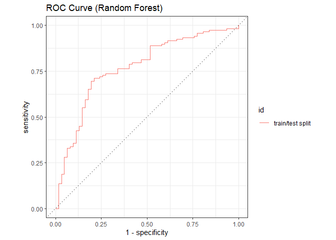
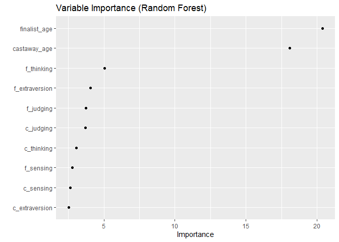
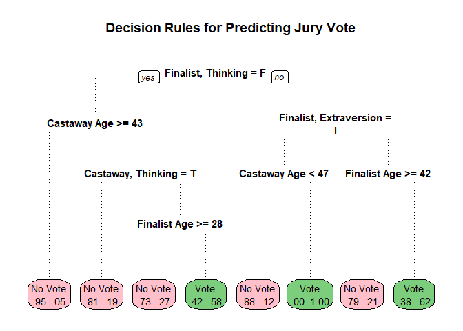

Survivor TV Show Data
================
Developed by Anthony Lipphardt

# TidyTuesday

Join the R4DS Online Learning Community in the weekly
[\#TidyTuesday](https://github.com/rfordatascience/tidytuesday) event\!

Every week we post a raw dataset, a chart or article related to that
dataset, and ask you to explore the data.

While the dataset will be “tamed”, it will not always be tidy\! As such
you might need to apply various R for Data Science techniques to wrangle
the data into a true tidy format. The goal of TidyTuesday is to apply
your R skills, get feedback, explore other’s work, and connect with the
greater \#RStats community\! As such we encourage everyone of all skills
to participate\!

# Loading the Weekly Dataset

Download the weekly data and make it available in the `castaways` and
`votes` objects.

[Survivor TV Show
Data](https://github.com/rfordatascience/tidytuesday/blob/master/data/2021/2021-06-01/readme.md)

``` r
 # Loading Data for the First Time
# castaways <- readr::read_csv('https://raw.githubusercontent.com/rfordatascience/tidytuesday/master/data/2021/2021-06-01/castaways.csv')
# votes <- readr::read_csv('https://raw.githubusercontent.com/rfordatascience/tidytuesday/master/data/2021/2021-06-01/jury_votes.csv')
# write_csv(castaways, 'castaways.csv')
# write_csv(votes, 'votes.csv')


# Cleanup on Russell H. to resolve matches between castaways and votes

 castaways <- read_csv('castaways.csv') %>% 
  mutate(castaway = str_trim(castaway),
         castaway = case_when(
           season == 19 & str_detect(castaway, "H.") ~ "Russell H.", 
           TRUE ~ castaway
         ))
```

    ## 
    ## -- Column specification --------------------------------------------------------
    ## cols(
    ##   season_name = col_character(),
    ##   season = col_double(),
    ##   full_name = col_character(),
    ##   castaway = col_character(),
    ##   age = col_double(),
    ##   city = col_character(),
    ##   state = col_character(),
    ##   personality_type = col_character(),
    ##   day = col_double(),
    ##   order = col_double(),
    ##   result = col_character(),
    ##   jury_status = col_character(),
    ##   original_tribe = col_character(),
    ##   swapped_tribe = col_character(),
    ##   swapped_tribe2 = col_character(),
    ##   merged_tribe = col_character(),
    ##   total_votes_received = col_double(),
    ##   immunity_idols_won = col_double()
    ## )

``` r
 votes <- read_csv('votes.csv') %>%
  mutate(castaway = str_trim(castaway),
         finalist = str_trim(finalist),
         castaway = case_when(
           season == 19 & str_detect(castaway, "H.") ~ "Russell H.", 
           TRUE ~ castaway
         ),
         finalist = case_when(
           season == 19 & str_detect(finalist, "H.") ~ "Russell H.", 
           TRUE ~ finalist
         ))
```

    ## 
    ## -- Column specification --------------------------------------------------------
    ## cols(
    ##   season_name = col_character(),
    ##   season = col_double(),
    ##   castaway = col_character(),
    ##   finalist = col_character(),
    ##   vote = col_double()
    ## )

# Sample Data

Take an initial look at the format of the data available.

``` r
head(glimpse(castaways), 10)
```

    ## Rows: 744
    ## Columns: 18
    ## $ season_name          <chr> "Survivor: Winners at War", "Survivor: Winners at~
    ## $ season               <dbl> 40, 40, 40, 40, 40, 40, 40, 40, 40, 40, 40, 40, 4~
    ## $ full_name            <chr> "Natalie Anderson", "Amber Mariano", "Danni Boatw~
    ## $ castaway             <chr> "Natalie", "Amber", "Danni", "Ethan", "Tyson", "R~
    ## $ age                  <dbl> 33, 40, 43, 45, 39, 43, 36, 44, 44, 35, 28, 39, 2~
    ## $ city                 <chr> "Edgewater", "Pensacola", "Shawnee", "Hillsboroug~
    ## $ state                <chr> "New Jersey", "Florida", "Kansas", "New Hampshire~
    ## $ personality_type     <chr> "ESTP", "ISFP", "ENFJ", "ISFP", "ESTP", "ESTJ", "~
    ## $ day                  <dbl> 2, 3, 6, 9, 11, 14, 16, 16, 18, 21, 23, 25, 28, 2~
    ## $ order                <dbl> 1, 2, 3, 4, 5, 6, 7, 8, 9, 10, 11, 12, 13, 14, 15~
    ## $ result               <chr> "1st voted out", "2nd voted out", "3rd voted out"~
    ## $ jury_status          <chr> NA, "1st jury member", "2nd jury member", "3rd ju~
    ## $ original_tribe       <chr> "Sele", "Dakal", "Sele", "Sele", "Dakal", "Sele",~
    ## $ swapped_tribe        <chr> NA, NA, NA, NA, NA, "Yara", "Sele", "Dakal", "Sel~
    ## $ swapped_tribe2       <chr> NA, NA, NA, NA, NA, NA, NA, NA, NA, NA, NA, NA, N~
    ## $ merged_tribe         <chr> NA, NA, NA, NA, NA, NA, NA, NA, NA, "Koru", "Koru~
    ## $ total_votes_received <dbl> 11, 6, 8, 4, 12, 4, 8, 2, 3, 14, 15, 12, 6, 9, 9,~
    ## $ immunity_idols_won   <dbl> 1, 0, 0, 0, 0, 0, 0, 0, 0, 0, 0, 0, 0, 1, 1, 1, 2~

    ## # A tibble: 10 x 18
    ##    season_name   season full_name   castaway   age city  state  personality_type
    ##    <chr>          <dbl> <chr>       <chr>    <dbl> <chr> <chr>  <chr>           
    ##  1 Survivor: Wi~     40 Natalie An~ Natalie     33 Edge~ New J~ ESTP            
    ##  2 Survivor: Wi~     40 Amber Mari~ Amber       40 Pens~ Flori~ ISFP            
    ##  3 Survivor: Wi~     40 Danni Boat~ Danni       43 Shaw~ Kansas ENFJ            
    ##  4 Survivor: Wi~     40 Ethan Zohn  Ethan       45 Hill~ New H~ ISFP            
    ##  5 Survivor: Wi~     40 Tyson Apos~ Tyson       39 Mesa  Arizo~ ESTP            
    ##  6 Survivor: Wi~     40 Rob Mariano Rob         43 Pens~ Flori~ ESTJ            
    ##  7 Survivor: Wi~     40 Parvati Sh~ Parvati     36 Los ~ Calif~ ENFJ            
    ##  8 Survivor: Wi~     40 Sandra Dia~ Sandra      44 Rive~ Flori~ ESTP            
    ##  9 Survivor: Wi~     40 Yul Kwon    Yul         44 Los ~ Calif~ INTJ            
    ## 10 Survivor: Wi~     40 Wendell Ho~ Wendell     35 Phil~ Penns~ INFJ            
    ## # ... with 10 more variables: day <dbl>, order <dbl>, result <chr>,
    ## #   jury_status <chr>, original_tribe <chr>, swapped_tribe <chr>,
    ## #   swapped_tribe2 <chr>, merged_tribe <chr>, total_votes_received <dbl>,
    ## #   immunity_idols_won <dbl>

``` r
head(glimpse(votes), 10)
```

    ## Rows: 909
    ## Columns: 5
    ## $ season_name <chr> "Survivor: Winners at War", "Survivor: Winners at War", "S~
    ## $ season      <dbl> 40, 40, 40, 40, 40, 40, 40, 40, 40, 40, 40, 40, 40, 40, 40~
    ## $ castaway    <chr> "Sarah", "Sarah", "Sarah", "Ben", "Ben", "Ben", "Denise", ~
    ## $ finalist    <chr> "Michele", "Natalie", "Tony", "Michele", "Natalie", "Tony"~
    ## $ vote        <dbl> 0, 0, 1, 0, 0, 1, 0, 0, 1, 0, 0, 1, 0, 1, 0, 0, 0, 1, 0, 0~

    ## # A tibble: 10 x 5
    ##    season_name              season castaway finalist  vote
    ##    <chr>                     <dbl> <chr>    <chr>    <dbl>
    ##  1 Survivor: Winners at War     40 Sarah    Michele      0
    ##  2 Survivor: Winners at War     40 Sarah    Natalie      0
    ##  3 Survivor: Winners at War     40 Sarah    Tony         1
    ##  4 Survivor: Winners at War     40 Ben      Michele      0
    ##  5 Survivor: Winners at War     40 Ben      Natalie      0
    ##  6 Survivor: Winners at War     40 Ben      Tony         1
    ##  7 Survivor: Winners at War     40 Denise   Michele      0
    ##  8 Survivor: Winners at War     40 Denise   Natalie      0
    ##  9 Survivor: Winners at War     40 Denise   Tony         1
    ## 10 Survivor: Winners at War     40 Nick     Michele      0

# Wrangling and Exploration

I wanted to see if the outcome of jury votes for a given castaway could
be predicted with some accuracy based on the limited predictors
available in the castaway dataset. I included age for all jury member
and finalist pairs, as well as the component parts of their respective
personality types(extraversion, sensing, thinking, judging).

``` r
####################################
#  Setup DF of predictors/outcome  #
####################################

# Obtain all pairs of castaways within each season, retaining age and personality types
castaway_pairs = castaways %>%
  inner_join(castaways, by = "season") %>%
  select(season, 
         castaway.x, 
         age.x, 
         personality_type.x, 
         castaway.y, 
         age.y, 
         personality_type.y) %>%
  rename(castaway = castaway.x,
         finalist = castaway.y,
         castaway_age = age.x,
         castaway_personality = personality_type.x,
         finalist_age = age.y,
         finalist_personality = personality_type.y) 


# Filter based on final jury votes
vote_pairs = castaway_pairs %>%
  left_join(votes %>% select(-season_name)) %>%
  drop_na() %>%
  unique()
```

    ## Joining, by = c("season", "castaway", "finalist")

``` r
# Create dummy variables for personality types and remove
# variables that are not predictor or outcome variables
survivor = vote_pairs %>%
  mutate(castaway_personality = str_split(castaway_personality, "", 4),
         finalist_personality = str_split(finalist_personality, "", 4)) %>%
  unnest_wider(castaway_personality, names_sep = "_") %>%
  unnest_wider(finalist_personality, names_sep = "_") %>%
  rename(c_extraversion = castaway_personality_1,
         c_sensing = castaway_personality_2,
         c_thinking = castaway_personality_3,
         c_judging = castaway_personality_4,
         f_extraversion = finalist_personality_1,
         f_sensing = finalist_personality_2,
         f_thinking = finalist_personality_3,
         f_judging = finalist_personality_4) %>%
  mutate_at(vars(matches("c_")), as.factor) %>%
  mutate_at(vars(matches("f_")), as.factor) %>%
  mutate(vote = case_when(vote == 1 ~ "Vote", TRUE ~ "No Vote"),
         vote = as.factor(vote)) %>%
  select(-season, -castaway, -finalist)
```

Using the tidymodels metapackage, I split the dataset into training and
test sets using an 80:20 split. For the purpose of model selecting, I
used 5-fold cross validation to test accuracy and ROC AUC for each
resample.

``` r
####################################
#  1. Train/Test Split and Folds   #
####################################

# Split into 80:20 train/test split
set.seed(1234)
survivor_split = initial_split(survivor, prop = 0.8)
train = training(survivor_split)
test = testing(survivor_split)

# 5-fold cross validation
folds = vfold_cv(train, strata = vote, v = 5)
```

Minimal feature engineering was used in this model. Component parts for
personality types are factors which essentially amount to 0 or 1 values.
The age fields for both castaway and finalist are numeric and were
centered and scaled to normalize the values. Additional steps that I
considered within this model were downsampling. However, given that the
model selection eventually settled on tree based random forest models, I
left this step off given that tree based models can handle class
imbalance.

``` r
#############################
#  2. Feature Engineering   #
#############################

survivor_recipe = recipe(formula = vote ~ ., data = train) %>% 
  step_normalize(all_numeric())
```

For model selection, I explored the use of 3 types of models: Random
Forest using the ranger package, Logistic Regression, and K-Nearest
Neighbors using the kknn package. Although it is not shown here, I
tested several potential values for KNN before settling on prediction
using k=9.

``` r
#############################
#  3. Model Specifications  #
#############################

# Random Forest

rf_spec = rand_forest(trees = 1000) %>% 
  set_mode("classification") %>% 
  set_engine("ranger") 

# Logistic Regression

logistic_spec = logistic_reg() %>% 
  set_mode("classification") %>% 
  set_engine("glm") 

# K-Nearest Neighbor (k = 9)

knn_spec = nearest_neighbor(neighbors=9) %>%
  set_mode("classification") %>%
  set_engine("kknn")
```

I then setup a workflow for each model specification using the minimal
feature engineering defined in the survivor\_recipe object. For each
model, I ran the workflow and collected default accuracy and ROC AUC
metrics and collected them into a tibble to compare the models. The
random forest model worked best on the training data with accuracy of
0.669 and ROC\_AUC value of 0.72.

``` r
#############################
#  4. Run Workflows         #
#############################

models = list("random_forest" = rf_spec, 
              "logistic_regression" = logistic_spec, 
              "knn_9" = knn_spec)
all_model_metrics = NULL

# For each model, run workflow, k-fold validation, and add model metrics to summary tibble
for(i in seq_along(models)){
  
  workflow = workflow() %>% 
    add_recipe(survivor_recipe) %>% 
    add_model(models[[i]]) 
  
  model_resamples = fit_resamples(workflow, resamples = folds)
  
  model_metrics = collect_metrics(model_resamples) %>% mutate(model = names(models)[i])
  
  all_model_metrics = rbind(all_model_metrics, model_metrics)
  
}
```

    ## Warning: package 'rlang' was built under R version 4.0.3

    ## Warning: package 'vctrs' was built under R version 4.0.5

``` r
all_model_metrics = all_model_metrics %>% select(model, .metric, mean, std_err)
all_model_metrics
```

    ## # A tibble: 6 x 4
    ##   model               .metric   mean std_err
    ##   <chr>               <chr>    <dbl>   <dbl>
    ## 1 random_forest       accuracy 0.669  0.0121
    ## 2 random_forest       roc_auc  0.720  0.0131
    ## 3 logistic_regression accuracy 0.606  0.0156
    ## 4 logistic_regression roc_auc  0.594  0.0134
    ## 5 knn_9               accuracy 0.634  0.0169
    ## 6 knn_9               roc_auc  0.620  0.0282

Since I decided to focus on the use of a random forest model, I
performed some hyperparameter tuning to find an optimal value for the
mtry and min\_n parameters. I ran 5-fold cross validation against all
combinations of the parameter grid and saved the best set of parameters
into the best\_auc variable. The best combination was mtry=8 and
min\_n=6, which resulted in an improved ROC\_AUC of 0.74.

``` r
####################################
#  5. Tune and Select Final Model  #
####################################

# Redefine model spec with tunable parameters for mtry and min_n
rf_spec_tuned = rand_forest(trees = 1000,              
                      mtry = tune(),
                      min_n = tune()) %>% 
  set_mode("classification") %>% 
  set_engine("ranger") 

# Select 5 levels for each parameter (25 total parameter combinations)
rf_grid = grid_regular(
  mtry(range = c(2, 10)),
  min_n(range = c(2, 8)),
  levels = 5
)

# Setup workflow with tuned specification of RF model
workflow = workflow() %>% 
  add_recipe(survivor_recipe) %>% 
  add_model(rf_spec_tuned) 

# Run K-Fold Cross validation against workflow using tuning grid
rf_tuned_rs = tune_grid(
  workflow,
  resamples = folds,
  grid = rf_grid
)

# Collect metrics for all folds and sort from best to worst
collect_metrics(rf_tuned_rs) %>%
  filter(.metric == "roc_auc") %>%
  arrange(desc(mean))
```

    ## # A tibble: 25 x 8
    ##     mtry min_n .metric .estimator  mean     n std_err .config              
    ##    <int> <int> <chr>   <chr>      <dbl> <int>   <dbl> <chr>                
    ##  1     8     6 roc_auc binary     0.740     5  0.0148 Preprocessor1_Model19
    ##  2     8     5 roc_auc binary     0.740     5  0.0145 Preprocessor1_Model14
    ##  3     8     8 roc_auc binary     0.739     5  0.0145 Preprocessor1_Model24
    ##  4    10     8 roc_auc binary     0.739     5  0.0148 Preprocessor1_Model25
    ##  5     6     8 roc_auc binary     0.738     5  0.0154 Preprocessor1_Model23
    ##  6    10     5 roc_auc binary     0.738     5  0.0144 Preprocessor1_Model15
    ##  7     6     6 roc_auc binary     0.737     5  0.0157 Preprocessor1_Model18
    ##  8    10     6 roc_auc binary     0.736     5  0.0155 Preprocessor1_Model20
    ##  9     6     5 roc_auc binary     0.734     5  0.0161 Preprocessor1_Model13
    ## 10     8     3 roc_auc binary     0.733     5  0.0172 Preprocessor1_Model09
    ## # ... with 15 more rows

``` r
# Return tibble with best parameters based on roc_auc
best_auc = select_best(rf_tuned_rs, "roc_auc")
```

With optimal parameters, I updated the random forest model based on this
combination of parameters and ran the last\_fit method to fit based on
the training data and run on the test set. The results (ROC AUC of
0.768) were comparable to the results under cross-validation (0.74),
which supports that the results may be generalizable to new data. When
looking at the confusion matrix, we can see that the model does well in
predicting when a jury member will NOT vote for a given finalist.
However, the model only does slightly better than 50/50 guessing when
predicting who the jury member WILL vote for, successfully predicting
votes about 60% of the time.

``` r
# Update tuned model specification with best parameters
final_rf = finalize_model(
  rf_spec_tuned,
  best_auc
)

final_rf
```

    ## Random Forest Model Specification (classification)
    ## 
    ## Main Arguments:
    ##   mtry = 8
    ##   trees = 1000
    ##   min_n = 6
    ## 
    ## Computational engine: ranger

``` r
# Fit on test data and collect metrics

final_rf %>%
  last_fit(preprocessor = survivor_recipe,
           split = survivor_split) %>%
  collect_metrics()
```

    ## # A tibble: 2 x 4
    ##   .metric  .estimator .estimate .config             
    ##   <chr>    <chr>          <dbl> <chr>               
    ## 1 accuracy binary         0.722 Preprocessor1_Model1
    ## 2 roc_auc  binary         0.769 Preprocessor1_Model1

``` r
# ROC Curve

final_rf %>%
  last_fit(preprocessor = survivor_recipe,
           split = survivor_split) %>%
  collect_predictions() %>% 
  group_by(id) %>%
  roc_curve(vote, `.pred_No Vote`) %>%
  autoplot() +
  labs(title = "ROC Curve (Random Forest)")
```

<!-- -->

``` r
# Confusion Matrix

final_rf %>%
  last_fit(preprocessor = survivor_recipe,
           split = survivor_split) %>%
  collect_predictions() %>%
  conf_mat(vote, .pred_class) %>%
  autoplot(type = "heatmap") + 
  labs(title = "Confusion Matrix (Random Forest)")
```

<!-- -->

We can also fit the model using the importance parameter to obtain
variable importance scores. Here, we select ‘impurity’ for gini
importance. The resulting plot shows which variables in the model have
the highest predictive power in classifying a vote. For this particular
model, the age of the juror (castaway\_age) and finalist (finalist\_age)
are found to have the highest importance.

``` r
# Fit model on the test data, using Gini Impurity for feature importance

final_rf %>%
  set_engine("ranger", importance = "impurity") %>%
  fit(vote ~ .,
    data =  bake(prep(survivor_recipe), new_data = test)
  ) %>%
  vip(geom = "point") +
  labs(title = "Variable Importance (Random Forest)")
```

<!-- -->

The random forest model is comprised of 1000 different trees which
contribute a vote towards the final prediction. Each tree may have its
own different set of decision rules. We can refit a single decision tree
model to see what the rules for one sample tree might look like. Here,
we can see that this particular tree places the most importance on
whether a finalist makes decisions based primarily on feelings over
logic. From there, you can answer a series of yes/no rules to arrive a a
rule. Several of the rules are based on castaway/juror or final age. It
can also be observed from the tree that terminal nodes or leaves for the
‘No Vote’ category have very good purity, whereas the nodes for ‘Vote’
have moderate purity.

``` r
# Create decision tree for purpose of plot

dt_model = decision_tree(tree_depth = 4, min_n = 8) %>% 
              set_engine('rpart') %>% 
              set_mode('classification')

dt_workflow = workflow() %>%
  add_recipe(recipe(formula = vote ~ ., data = train)) %>%
  add_model(dt_model)

dt_fit = dt_workflow %>%
  fit(data = test) %>%
  pull_workflow_fit()

split.fun <- function(x, labs, digits, varlen, faclen)
{

  labs <- gsub(pattern="c_t", replacement = "Castaway, T", x = labs, fixed = TRUE)
  labs <- gsub("c_s", "Castaway, S", labs)
  labs <- gsub("finalist_age", "Finalist Age", labs)
  labs <- gsub("f_e", "Finalist, E", labs)
  labs <- gsub("f_t", "Finalist, T", labs)
  labs <- gsub("castaway_age", "Castaway Age", labs)
  
  for(i in 1:length(labs)) {
    # split labs[i] into multiple lines
    labs[i] <- paste(strwrap(labs[i], width = 25), collapse = "\n")
  }
  
  return(labs)
}

# Generate decision tree plot using custom split function for readable labels
prp(dt_fit$fit, 
    roundint = FALSE, 
    type = 0, 
    extra = 4, 
    fallen.leaves = TRUE,
    branch.lty = 3,
    box.palette = c("pink", "palegreen3"),
    split.fun = split.fun,
    varlen = 0,
    main = "Decision Rules for Predicting Jury Vote") 
```

<!-- -->

Running some basic stats on age. Median age of castaways is 30 and the
oldest cast member is 75. It would be interesting to look further at the
distribution of cast members as well as how age often plays a part in
final jury votes.

By pulling a list of castaways that made it to the final jury vote and
cross referencing it with the finalists, it can be observed that for 35
of the 40 jury votes (85%), the jury voted for a younger castaway.

``` r
castaways %>% summarize(min_age = min(age), mean_age = mean(age), median_age = median(age), max_age = max(age))
```

    ## # A tibble: 1 x 4
    ##   min_age mean_age median_age max_age
    ##     <dbl>    <dbl>      <dbl>   <dbl>
    ## 1      18     33.4         30      75

``` r
# Return the oldest castaway from the final 3 for each season
finalists = castaways %>% group_by(season) %>% slice_max(n=3,order) %>% slice_max(n=1,age)

# Return the winner for each season of Survivor
winners = castaways %>% filter(result == "Sole Survivor")

# Filter to finalists where the jury opted for a younger castaway
younger_winners = finalists %>% anti_join(winners)
```

    ## Joining, by = c("season_name", "season", "full_name", "castaway", "age", "city", "state", "personality_type", "day", "order", "result", "jury_status", "original_tribe", "swapped_tribe", "swapped_tribe2", "merged_tribe", "total_votes_received", "immunity_idols_won")

``` r
# Proportion of finalists where jury opted for a younger castaway
nrow(younger_winners)/nrow(finalists)
```

    ## [1] 0.8536585

# Visualization(s)

Using your processed dataset, create your unique visualization(s).

``` r
title_font = "Showcard Gothic"
text_font = "Bahnschrift"

####################################
#               Title              #
####################################

title_text <- data.frame(
        x = 0.5,
        y = 0.5,
        label = c("Outwit • Outplay • Outlast"))

title = ggplot() +
  geom_textbox(data = title_text,
               aes(x, y, label = label),
               box.size = 0, 
               box.colour=NA,
               colour = "#333333",
               family = title_font,
               size = 10,
               width = unit(1, "npc"),
               fill = NA,
               halign = 0.5, 
               valign = 1
        ) +
        scale_x_continuous(limits=c(0, 1), expand=c(0,0)) +
        scale_y_continuous(limits=c(-1,1), expand=c(0,0)) + 
        theme_void()+
        theme(text = element_text(color="#333333"), 
              plot.title = element_textbox_simple(),
              plot.background = element_rect(fill = "#FDF6E4", color = "#FDF6E4"),
              panel.background = element_rect(fill = "#FDF6E4", color = "#FDF6E4"))


####################################
#        Oldest Sole Survivors     #
####################################


oldest_winners = castaways %>% filter(result == "Sole Survivor") %>%
  arrange(desc(age)) %>%
  slice_max(n=3, age) %>%
  select(castaway, season, season_name, age, city, state, personality_type, immunity_idols_won, total_votes_received) %>%
  mutate(photo = c("S17_Bob_Crowley.jpg", "S40_Tony_Vlachos.jpg", "S40_Denise_Stapley.jpg")) %>%
  mutate(text = glue::glue("<p><span style='text-align:center;'></span></p><p><span style='font-family:{text_font}; font-size: 18pt; color: #333333;'>{castaway} ({age})</span></p><p><span style='font-family:{text_font}; font-size: 10pt; color: #333333;'><strong>{season_name}<br />Personality Type: {personality_type}</strong></style></p>"))


oldest_winner_text <- data.frame(
        x = c(0.01, 0.32, 0.63),
        y = c(0, 0, 0),
        label = c(oldest_winners$text[1], oldest_winners$text[2], oldest_winners$text[3]) 
)

# Display in 8:4 aspect ratio for best fit

oldest_winners_plot = ggplot() +
  geom_textbox(data = oldest_winner_text,
               aes(x,y,label=label),
               box.colour = NA,
               fill = NA,
               width = unit(0.28, "npc"),
               vjust = 0.5,
               hjust = 0) +
  theme_void() +
  scale_x_continuous(limits=c(0, 1), expand=c(0,0)) +
  scale_y_continuous(limits=c(-0.5, 0.5), expand=c(0,0)) +
  labs(title = "The Show's Oldest <em>Sole Survivors</em>") +
  theme(plot.title = element_markdown(size=20, 
                                      color = "#333333",
                                      family = text_font,
                                      padding = margin(t = 10, b = 5),
                                      face = "bold"),
        plot.background = element_rect(fill = "#FDF6E4", color = "#FDF6E4"),
        panel.background = element_rect(fill = "#FDF6E4", color = "#FDF6E4")
        )


###########################################
#  Age Distribution (Violin or Boat Oar?) #
###########################################

# Display in 8:4 aspect ratio for best fit

age_dist_plot = ggplot(data = castaways, aes(x=season, y=age, group = season)) +
  geom_violin(fill = "#AF8B4A") +
  geom_point(data = castaways %>% group_by(season) %>% slice_max(n=3,order),
             color = "#0DC28F") +
  geom_point(data = castaways %>% filter(result == "Sole Survivor"),
             color = "#C20D40",
             size = 2) +
  theme_minimal() +
  scale_y_continuous(limits=c(15, 80)) +
  labs(title = "Age of Castaways",
       subtitle = glue::glue("<span style='color: #C20D40'><strong>Sole survivor</strong></span> and <span style='color: #0DC28F'><strong>first or second runner ups</strong></span> are indicated for each season.<br/>In <strong>35 out of 40</strong> final jury votes, <strong>younger castaways</strong> won the title of sole survivor."),
       y = 'Age',
       x = 'Season',
       caption = "Source: survivoR Package | @a_lipphardt") +
  theme(plot.title = element_markdown(size=20, 
                                      color = "#333333",
                                      family = text_font,
                                      face = "bold",
                                      padding = margin(t = 10, b = 5)),
        plot.subtitle = element_markdown(color = "#333333",
                                         size = 14),
        plot.background = element_rect(fill = "#FDF6E4", color = "#FDF6E4"),
        axis.text = element_text(family = text_font),
        axis.title = element_text(family = text_font),
        axis.title.y = element_text(margin = margin(r = 10)),
        axis.title.x = element_text(margin = margin(t = 10)),
        plot.caption = element_markdown(
          family = text_font,
          size = 10,
          halign = 0.5
        )
        ) +
  
  # Annotation for Bob (57)
  
  annotate(
    geom = "text", 
    x = 14, y = 70, 
    label = "Bob (57)",
    color = "black",
    size = 3.5,
    family = text_font
  ) + 
  annotate(
    geom = "curve",
    size = 0.5,
    x = 16,
    y = 70,
    xend = 17, 
    yend = 62,
    arrow = arrow(angle = 20, length = unit(0.05,"npc"), type = "closed", ends = "last"),
    curvature = -0.3,
    lty = 2
  ) + 
  
  # Annotation for Tony (45)
  
  annotate(
    geom = "text", 
    x = 37, y = 70, 
    label = "Tony (45)",
    color = "black",
    size = 3.5,
    family = text_font
  ) + 
  annotate(
    geom = "curve",
    size = 0.5,
    x = 38.8,
    y = 70,
    xend = 40, 
    yend = 49,
    arrow = arrow(angle = 20, length = unit(0.05,"npc"), type = "closed", ends = "last"),
    curvature = -0.25,
    lty = 2
  )  + 
  
  # Annotation for Denise (41)
  
  annotate(
    geom = "text", 
    x = 22, y = 70, 
    label = "Denise (41)",
    color = "black",
    size = 3.5,
    family = text_font
  ) + 
  annotate(
    geom = "curve",
    size = 0.5,
    x = 24,
    y = 70,
    xend = 25, 
    yend = 43,
    arrow = arrow(angle = 20, length = unit(0.05,"npc"), type = "closed", ends = "last"),
    curvature = -0.4,
    lty = 2
  )  

layout <- c(
        area(t = 1,
             b = 2,
             l = 1,
             r = 8),
        area(t = 2,
             b = 5,
             l = 1,
             r = 8),
        area(t = 6,
             b = 9,
             l = 1,
             r = 8))

plot = title + oldest_winners_plot + age_dist_plot + plot_layout(design = layout)
```


# Saving Image(s)

Save your image for sharing. Be sure to use the `#TidyTuesday` hashtag
in your post on twitter\!

``` r
#This will save your most recent plot
ggsave(plot = plot,
  filename = "survivor.png",
  width=8,
  height=10.5,
  type = "cairo",
  device = "png",
  dpi = 300)
```
