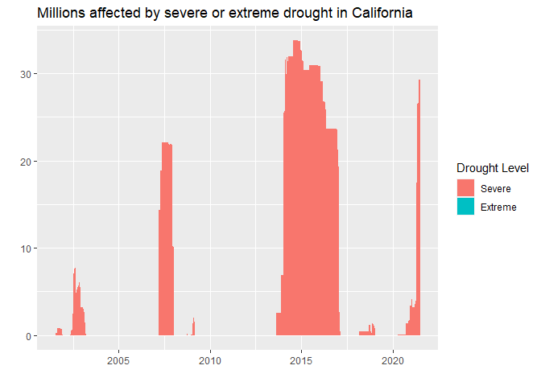

US Droughts
================
Developed by Anthony Lipphardt

# TidyTuesday

Join the R4DS Online Learning Community in the weekly
[\#TidyTuesday](https://github.com/rfordatascience/tidytuesday) event\!

Every week we post a raw dataset, a chart or article related to that
dataset, and ask you to explore the data.

While the dataset will be “tamed”, it will not always be tidy\! As such
you might need to apply various R for Data Science techniques to wrangle
the data into a true tidy format.

The goal of TidyTuesday is to apply your R skills, get feedback, explore
other’s work, and connect with the greater \#RStats community\!

As such we encourage everyone of all skills to participate\!

``` r
knitr::opts_chunk$set(echo = TRUE)

library(tidytuesdayR)
library(tidyverse)

library(lubridate)
library(scales)
library(glue)
library(ggtext)
library(Cairo)
library(viridis)

library(extrafont)
loadfonts(device = "win", quiet = TRUE)
```

# Loading the Weekly Dataset

Download the weekly data and make it available in the `drought` object.

[U.S.
Droughts](https://github.com/rfordatascience/tidytuesday/blob/master/data/2021/2021-07-20/readme.md)

``` r
# Loading Data for the First Time
# tuesdata <- tidytuesdayR::tt_load(2021, week = 30)
# drought <- tuesdata$drought
# write_csv(drought, 'drought.csv')

drought <- read_csv('drought.csv')
```

    ## 
    ## -- Column specification --------------------------------------------------------
    ## cols(
    ##   map_date = col_double(),
    ##   state_abb = col_character(),
    ##   valid_start = col_date(format = ""),
    ##   valid_end = col_date(format = ""),
    ##   stat_fmt = col_double(),
    ##   drought_lvl = col_character(),
    ##   area_pct = col_double(),
    ##   area_total = col_double(),
    ##   pop_pct = col_double(),
    ##   pop_total = col_double()
    ## )

# Sample Data

Take an initial look at the format of the data available.

``` r
glimpse(drought)
```

    ## Rows: 325,728
    ## Columns: 10
    ## $ map_date    <dbl> 20210713, 20210713, 20210713, 20210713, 20210713, 20210713~
    ## $ state_abb   <chr> "AK", "AK", "AK", "AK", "AK", "AK", "AK", "AK", "AK", "AK"~
    ## $ valid_start <date> 2021-07-13, 2021-07-13, 2021-07-13, 2021-07-13, 2021-07-1~
    ## $ valid_end   <date> 2021-07-19, 2021-07-19, 2021-07-19, 2021-07-19, 2021-07-1~
    ## $ stat_fmt    <dbl> 1, 1, 1, 1, 1, 1, 1, 1, 1, 1, 1, 1, 1, 1, 1, 1, 1, 1, 1, 1~
    ## $ drought_lvl <chr> "None", "D0", "D1", "D2", "D3", "D4", "None", "D0", "D1", ~
    ## $ area_pct    <dbl> 74.35, 25.65, 0.00, 0.00, 0.00, 0.00, 74.35, 25.65, 0.00, ~
    ## $ area_total  <dbl> 433133.18, 149435.11, 0.00, 0.00, 0.00, 0.00, 433133.18, 1~
    ## $ pop_pct     <dbl> 33.91, 66.09, 0.00, 0.00, 0.00, 0.00, 33.91, 66.09, 0.00, ~
    ## $ pop_total   <dbl> 240644.16, 468985.84, 0.00, 0.00, 0.00, 0.00, 240644.16, 4~

# Wrangling and Exploration

Counts for categorical variables. There appears to be observations for
all states, plus DC and Puerto Rico.

``` r
categorical_count = function(tbl, column){
  tbl %>% count({{column}}, sort = TRUE)
}

print.data.frame(categorical_count(drought, state_abb))
```

    ##    state_abb    n
    ## 1         AK 6264
    ## 2         AL 6264
    ## 3         AR 6264
    ## 4         AZ 6264
    ## 5         CA 6264
    ## 6         CO 6264
    ## 7         CT 6264
    ## 8         DC 6264
    ## 9         DE 6264
    ## 10        FL 6264
    ## 11        GA 6264
    ## 12        HI 6264
    ## 13        IA 6264
    ## 14        ID 6264
    ## 15        IL 6264
    ## 16        IN 6264
    ## 17        KS 6264
    ## 18        KY 6264
    ## 19        LA 6264
    ## 20        MA 6264
    ## 21        MD 6264
    ## 22        ME 6264
    ## 23        MI 6264
    ## 24        MN 6264
    ## 25        MO 6264
    ## 26        MS 6264
    ## 27        MT 6264
    ## 28        NC 6264
    ## 29        ND 6264
    ## 30        NE 6264
    ## 31        NH 6264
    ## 32        NJ 6264
    ## 33        NM 6264
    ## 34        NV 6264
    ## 35        NY 6264
    ## 36        OH 6264
    ## 37        OK 6264
    ## 38        OR 6264
    ## 39        PA 6264
    ## 40        PR 6264
    ## 41        RI 6264
    ## 42        SC 6264
    ## 43        SD 6264
    ## 44        TN 6264
    ## 45        TX 6264
    ## 46        UT 6264
    ## 47        VA 6264
    ## 48        VT 6264
    ## 49        WA 6264
    ## 50        WI 6264
    ## 51        WV 6264
    ## 52        WY 6264

``` r
categorical_count(drought, stat_fmt)
```

    ## # A tibble: 1 x 2
    ##   stat_fmt      n
    ##      <dbl>  <int>
    ## 1        1 325728

``` r
categorical_count(drought, drought_lvl)
```

    ## # A tibble: 6 x 2
    ##   drought_lvl     n
    ##   <chr>       <int>
    ## 1 D0          54288
    ## 2 D1          54288
    ## 3 D2          54288
    ## 4 D3          54288
    ## 5 D4          54288
    ## 6 None        54288

Let’s check for missing values in numerical columns. It looks like only
**area\_total** and **pop\_total** have missing values. Missing values
only seem to occur for observations where a state was in extreme or
exceptional drought. There doesnt seem to be any pattern with which
there are missing values in those columns

``` r
summary(drought %>% select(where(is.numeric)))
```

    ##     map_date           stat_fmt    area_pct        area_total    
    ##  Min.   :20010717   Min.   :1   Min.   :  0.00   Min.   :     0  
    ##  1st Qu.:20060716   1st Qu.:1   1st Qu.:  0.00   1st Qu.:     0  
    ##  Median :20110716   Median :1   Median :  0.00   Median :     0  
    ##  Mean   :20111032   Mean   :1   Mean   : 22.98   Mean   : 17008  
    ##  3rd Qu.:20160714   3rd Qu.:1   3rd Qu.: 39.64   3rd Qu.: 17557  
    ##  Max.   :20210713   Max.   :1   Max.   :100.00   Max.   :582568  
    ##                                                  NA's   :3215    
    ##     pop_pct         pop_total       
    ##  Min.   :  0.00   Min.   :       0  
    ##  1st Qu.:  0.00   1st Qu.:       0  
    ##  Median :  0.00   Median :       0  
    ##  Mean   : 22.42   Mean   : 1387939  
    ##  3rd Qu.: 34.38   3rd Qu.:  897934  
    ##  Max.   :101.80   Max.   :37253956  
    ##                   NA's   :3612

``` r
drought %>%
  filter(is.na(area_total) | is.na(pop_total)) %>%
  select(-map_date, -stat_fmt) %>%
  count(drought_lvl)
```

    ## # A tibble: 1 x 2
    ##   drought_lvl     n
    ##   <chr>       <int>
    ## 1 D4           3617

``` r
drought %>% count(drought_lvl)
```

    ## # A tibble: 6 x 2
    ##   drought_lvl     n
    ##   <chr>       <int>
    ## 1 D0          54288
    ## 2 D1          54288
    ## 3 D2          54288
    ## 4 D3          54288
    ## 5 D4          54288
    ## 6 None        54288

``` r
drought %>%
  select(area_total, pop_total) %>%
  filter(area_total == 0 | pop_total == 0)
```

    ## # A tibble: 176,342 x 2
    ##    area_total pop_total
    ##         <dbl>     <dbl>
    ##  1          0         0
    ##  2          0         0
    ##  3          0         0
    ##  4          0         0
    ##  5          0         0
    ##  6          0         0
    ##  7          0         0
    ##  8          0         0
    ##  9          0         0
    ## 10          0         0
    ## # ... with 176,332 more rows

Which states were most frequently in a period of extreme drought?

``` r
drought %>% 
  filter(drought_lvl %in% c("D3", "D4"), area_total > 0) %>%
  count(state_abb, sort = TRUE)
```

    ## # A tibble: 51 x 2
    ##    state_abb     n
    ##    <chr>     <int>
    ##  1 TX          693
    ##  2 NM          586
    ##  3 CO          551
    ##  4 AZ          548
    ##  5 NV          519
    ##  6 KS          509
    ##  7 CA          472
    ##  8 OK          469
    ##  9 WY          446
    ## 10 MT          438
    ## # ... with 41 more rows

``` r
drought %>% 
  filter(state_abb == "CA", drought_lvl %in% c("D3", "D4")) %>%
  mutate(pop_total = case_when(
    is.na(pop_total) ~ 0,
    TRUE ~ pop_total
  ),
  drought_lvl = recode(drought_lvl, D3 = "Severe", D4 = "Extreme"),
  drought_lvl = fct_rev(drought_lvl)) %>%
  ggplot(aes(x=valid_start, y = pop_total/1000000)) +
  geom_area(aes(fill = drought_lvl)) +
  labs(title = "Millions affected by severe or extreme drought in California",
       y = "",
       x = "",
       fill = "Drought Level")
```

<!-- -->

# Visualization

Using a heatmap to show extended periods of severe drought in the U.S.

``` r
heatmap = drought %>% filter(drought_lvl %in% c("D3", "D4"),
                   valid_start >= "2002-01-01",
                   valid_start <= "2020-12-31") %>%
  mutate(pop_total = case_when(
    is.na(pop_total) ~ 0,
    TRUE ~ pop_total
  ),
  state_abb = fct_rev(state_abb)) %>%
  group_by(state_abb, valid_start) %>%
  summarize(pop_total_severe = sum(pop_total)/1000000, .groups = "keep") %>%
  # mutate(valid_start = parse_date_time(valid_start, "%Y-%m-%d"),
  #        year = year(valid_start)) %>%

  ggplot(aes(x = valid_start, y = state_abb)) +
  geom_tile(aes(fill = pop_total_severe), alpha = 0.9) +
  # geom_segment(data = as_tibble(seq(2001,2021)), aes(x=value, xend=value, y = "WY", yend = "AK")) +

  scale_x_date(date_breaks = "1 years", date_labels = "%Y") +
    guides(fill = guide_colorbar(title.position = "top")) +
  scale_fill_viridis(option = "rocket") + 

  theme_minimal() +
  theme(legend.position = "top") +
  
  labs(x = "", 
       y = "", 
       fill = "Population in millions",
       title = "Millions impacted by severe or extreme drought",
       subtitle = "California (pop. 39.5 million) experienced an extended period from 2014 thru 2016, in which more than 70% of it's population was affected by severe drought.",
       caption = "<strong>Source:</strong> U.S. Drought Monitor | <strong>Visualization:</strong> @a_lipphardt") +
  
  theme(plot.title = element_textbox_simple(family = "Segoe UI Semibold",
                                            halign = 0.5,
                                            size = 24,
                                            margin = margin(t=10,b=10)),
        
        plot.subtitle = element_textbox_simple(family = "Segoe UI Semilight",
                                            halign = 0.5,
                                            size = 16,
                                            margin = margin(b=20, 
                                                            t = 5,
                                                            l = 5, 
                                                            r = 5)),
        
        plot.caption = element_textbox_simple(family = "Segoe UI Semilight",
                                              size = 14,
                                              halign = 1,
                                              margin = margin(r = 10, t = 20, b = 5)),
        
        legend.title = element_text(family = "Segoe UI Semilight",
                                              size = 12),
        
        legend.text = element_text(family = "Segoe UI Semilight",
                                              size = 12),
        
        axis.text = element_text(family = "Segoe UI Semilight",
                                              size = 10),
        

        panel.grid.major.x = element_line(color = "#333333"),
        panel.grid.minor.x = element_blank()) 
```

# Saving Image(s)

Save your image for sharing. Be sure to use the `#TidyTuesday` hashtag
in your post on twitter\!

``` r
ggsave(plot = heatmap,
       filename = "drought-heatmap.png",
       width=16,
       height=12,
       type = "cairo",
       device = "png",
       dpi = 400)
```


